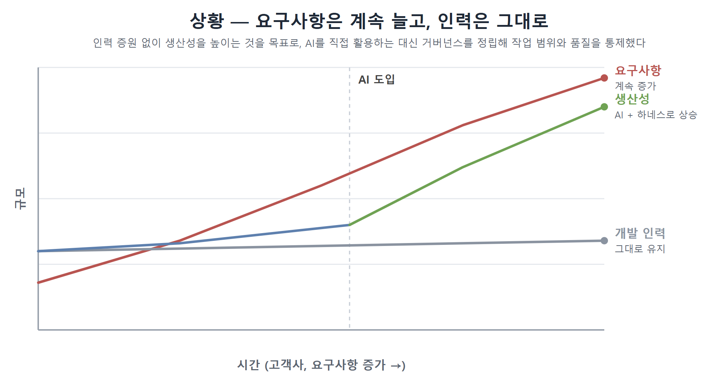
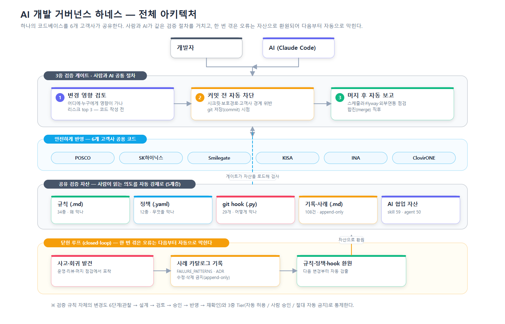
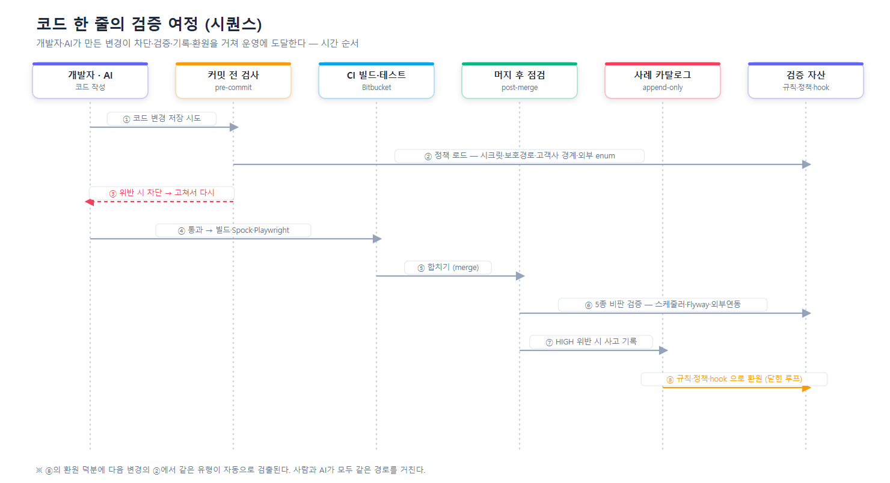
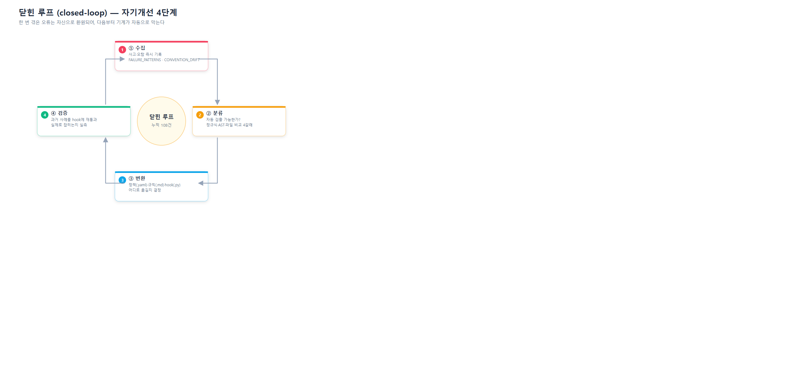
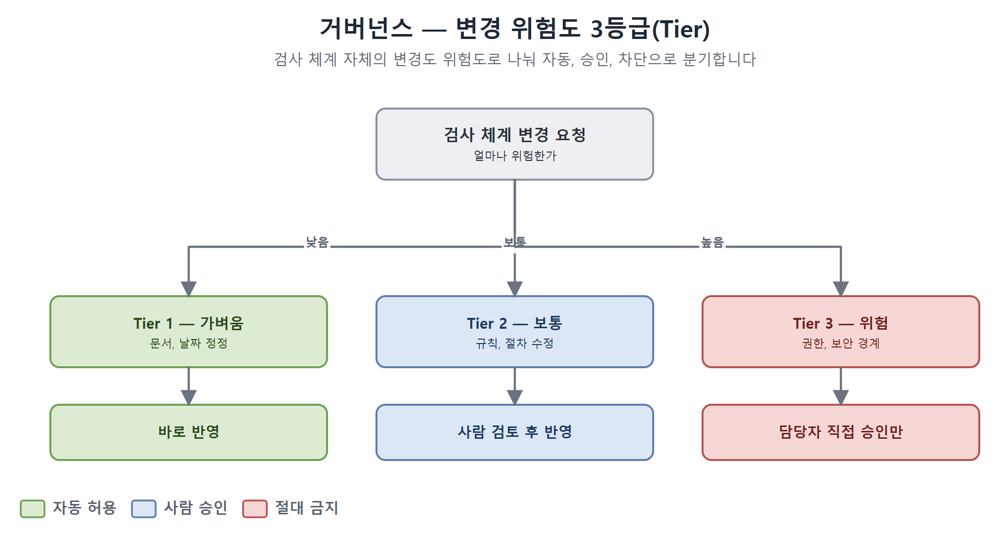
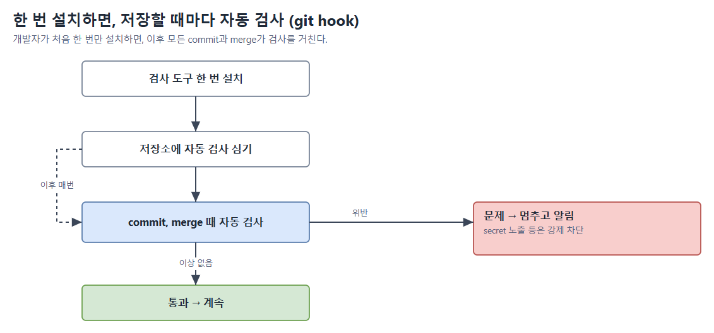
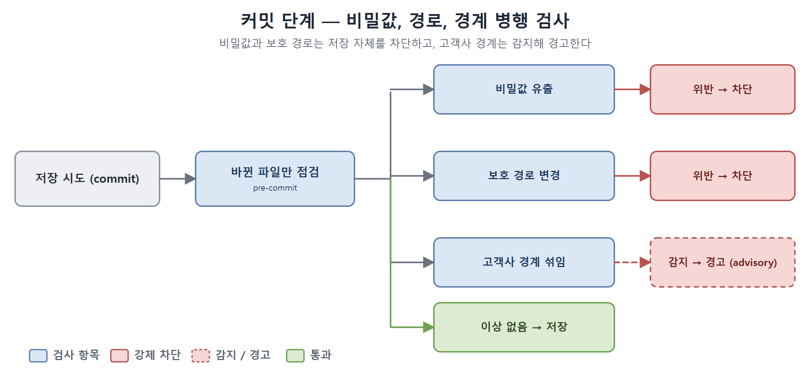

# AI 기반 개발·변경 검증 자동화 (상세본)

> 6개 고객사가 **하나의 코드베이스**를 함께 쓰는 환경에서, 사람을 더 뽑는 대신 AI(Claude Code)로 개발 생산성을 올렸습니다. 다만 AI가 만든 변경이 사고로 이어지지 않도록 **코드 작성 전·저장할 때·합친 직후** 세 시점에서 자동으로 검사하고, 한 번 겪은 문제를 다시 검사 규칙으로 되돌려 다음부터 자동으로 막히게 만드는 검증 체계를 직접 설계·구현했습니다.

> **먼저 용어 정리** (면접관이 처음 봐도 이해되도록, 이 문서에서만 통하는 말은 풀어 씁니다)
>
> | 말 | 쉬운 뜻 |
> |----|--------|
> | **하네스(harness)** | AI에게 "지킬 규칙 · 쓸 도구 · 작업 순서"를 미리 정해 주는 **설정 묶음**. 같은 AI라도 하네스가 있으면 회사 규칙대로 움직입니다. |
> | **닫힌 루프(closed-loop)** | 결과가 다시 입력으로 돌아오는 구조. *사고 → 기록 → 규칙 반영 → 자동 차단 → 또 발견* 이 끊김 없이 돌면서 **쓸수록 똑똑해집니다**. |
> | **git hook** | git이 *저장(commit)·병합(merge)* 같은 특정 순간에 **자동으로 실행하는 검사 스크립트**. |
> | **advisory(경고형)** | 막지 않고 **경고만** 하는 검사. (반대는 강제 차단) |
> | **append-only** | **추가만** 되고 수정·삭제는 막은 기록 방식. 과거 근거가 사라지지 않습니다. |
> | **회귀(regression)** | 새 변경 때문에 **기존 기능이 깨지는 것**. |
>
> 수치는 별도 표기가 없으면 2026-05-29, 작업 브랜치 기준 **코드에서 직접 센 실측값**입니다. 시계열로 늘어나는 항목(점검 보고서·스냅샷·회차 기록)은 측정 시점에 따라 증가합니다.

---

## 1. 30초 요약

| 구분 | 내용 |
|------|------|
| **포지션** | 개발 생산성·플랫폼 엔지니어링 성격의 사내 도구. Java/Spring 백엔드 업무를 기반으로 자동화 영역을 단독 설계·구현 |
| **문제** | 6개 고객사 단일 코드베이스에서 AI가 만든 변경이 고객사 경계·외부 시스템 기준·컨벤션을 깨면 5개 고객사 배포로 전파 |
| **핵심 설계** | "왜 막나(규칙·34종)" / "무엇을 막나(정책·12종)" / "어떻게 막나(검사 스크립트·29개)"를 세 계층으로 분리. 6단계 통제 + 닫힌 루프 |
| **대표 결과** | 누적 108건 사례를 자동 검출 자산으로 전환. 고객사 경계 위반은 저장 시점 자동 차단, 합친 뒤 7종 자동 점검 |
| **기여** | 자동화 영역(`.claude/`, `scripts/ai/`) 커밋의 82.7%를 단독 작성·운영 |
| **기술** | Python(표준 라이브러리), Git Hook, YAML, Bitbucket Pipeline |

---

## 2. 추진 배경

### 무엇을 만드는 회사인가

ClovirONE은 OpenStack·VMware·Kubernetes·Ansible을 통합 관리하는 **프라이빗 클라우드 플랫폼**입니다. 같은 코드베이스를 6개 고객사(POSCO, SK하이닉스, Smilegate, KISA, INA, ClovirONE)가 함께 씁니다. 고객사별로 다른 부분만 별도 모듈로 끼워 넣는 구조이고, 고객사마다 자원 관리 방식과 외부 시스템 연동 기준이 다릅니다.

### 상황 — 인력은 그대로인데, 고객사와 요구사항은 계속 늘었다

고객사가 늘수록 요구사항도 함께 늘었습니다. 각 고객사가 서로 다른 자원 모델·승인 흐름·이벤트 정책·과금(빌링) 구조를 요구했기 때문입니다. 반면 개발 인력은 그만큼 늘릴 수 없었습니다. 인력을 더 뽑지 않고 이 격차를 메우는 현실적인 방법은 **AI 도구(Claude Code)로 개발 생산성 자체를 끌어올리는 것**이었습니다.

### 문제 — 단일 코드베이스에 AI를 "무작정" 넣을 수는 없었다

프라이빗 클라우드 제품이라, 고객사 도메인이 달라질 때마다 **자원을 쓰는 목적·과금 구조·외부 시스템(Jenkins·VMware·GitLab 등) 연동 기준**이 달라집니다. 그런데 이 6개 고객사가 **하나의 코드베이스**를 함께 봅니다. 이런 환경에서 AI가 만든 변경을 무작정 반영하면:

- 한 고객사용 분기가 공통 코드에 섞이면 다른 5개 고객사 배포로 그대로 전파됩니다.
- 외부 시스템 실제 동작과 어긋난 코드가 들어가면 운영 사고로 노출됩니다.
- 회사 컨벤션을 안 따르면 다른 사람이 유지보수하기 어려워집니다.
- 예전에 겪은 오류도 사람 기억에만 기대면 다시 들어옵니다.

즉 생산성을 올리려 넣은 AI가, 통제 장치 없이는 오히려 6개 고객사 전체로 사고를 퍼뜨리는 통로가 됩니다.

### 해법 — 검사로 끝나지 않고, 결과를 되먹이는 거버넌스

그래서 단순히 "AI에게 규칙을 알려주는 설정 묶음"에 그치지 않고, **발견된 오류를 검사 규칙으로 되돌려 같은 실수가 다음부터 자동으로 막히게 만드는 닫힌 루프** 구조로 설계했습니다.

### 왜 기존 도구로는 안 됐나

SonarQube·Checkstyle 같은 정적 분석 도구는 일반 코드 품질(빈 값 처리, 복잡도, 스타일)은 잘 잡지만, **고객사 경계·외부 시스템 연동 기준·내부 운영 컨벤션·AI 작업 흐름** 같은 우리 고유 영역은 다루지 못합니다. 또 정책이 자주 바뀌어야 하는데 도구를 다시 빌드·배포해야 하는 점도 맞지 않았습니다. 그래서 기존 도구를 **대체하지 않고**, 프로젝트 특화 검증을 보완하는 체계를 직접 만들었습니다.

---

## 3. 내 역할

자동 검증 체계의 **구조를 설계하고 핵심 부분을 직접 구현**했습니다. 자동화 영역(`.claude/`, `scripts/ai/`) 커밋의 **82.7%**를 직접 작성·운영했습니다(같은 영역 기여자 6명 중 본인 외 5명).

- 정책 파일(YAML) 12종 설계
- 검증 규칙 문서 34종 작성
- 자동 검사 스크립트(git hook) 29개 구현 (Python 표준 라이브러리만 사용)
- 발견된 오류를 정책·규칙·검사 스크립트로 옮기는 절차 설계
- 자기개선 회차(cycle) 운영 — 누적 15회를 정량 기록
- "현재 상태"를 매번 다시 재느라 시간 낭비하지 않도록, 측정 대상마다 유효기간을 둔 측정 정책 설계
- 통제 단계(관찰 → 설계 → 검토 → 승인 → 반영 → 재확인) 정립
- 개발자 코드 리뷰 반영, 잘못 잡힌 사례(오탐) 정정

---

## 4. 전체 아키텍처

위 그림이 전체입니다. 핵심은 세 가지입니다.

1. **3중 검증 게이트(사람·AI 공통)** — 코드 작성 전 *영향 검토*, 저장(커밋) 시 *위반 자동 차단*, 합친(머지) 직후 *자동 점검 보고*. AI도 사람과 똑같은 세 관문을 지납니다.
2. **공유 검증 자산(5계층)** — 규칙·정책·검사 스크립트·사례 기록·AI 협업 자산. 게이트가 이 자산을 불러와 검사합니다.
3. **닫힌 루프** — 사고가 발견되면 기록되고, 검사 규칙으로 반영되어 다음부터 자동으로 잡힙니다.

아래에서 이 구조를 ① 동작 흐름(시간 순서) ② 진화 흐름(자기개선) ③ 정적 구조(무엇으로 만들어졌나) ④ 사용·개발 흐름 ⑤ 통제(거버넌스) ⑥ 자동 실행 방식 순서로 풉니다.

### 4.1 동작 흐름 — 코드 한 줄의 검증 여정

AI나 사람이 코드 한 줄을 바꿨을 때, 어떤 관문을 거쳐 운영에 도달하는지를 **시간 순서**로 보여줍니다.

- 저장 시도(①) → 검사 스크립트가 정책을 불러와 위반을 점검(②) → 위반이면 차단하고 고치게 함(③).
- 통과하면 빌드·테스트(④) → 합치기(⑤) → 합친 직후 스케줄러·DB 마이그레이션·외부 연동 등을 다시 점검(⑥).
- 심각한 문제는 사례로 기록(⑦)되고, 규칙·정책·검사 스크립트로 **되먹임(⑧)** 되어, 다음 변경의 ②에서 같은 유형이 자동으로 걸러집니다.

### 4.2 진화 흐름 — 한 번 겪은 오류는 다음부터 자동으로

오류가 발견되면 **1회성 수정으로 끝내지 않고** 4단계를 거칩니다.

1. **수집** — 사례를 기록(append-only). 발견 즉시, 다음 작업으로 넘어가기 전에.
2. **분류** — 자동으로 잡을 수 있는지 4갈래로 판정: ⓐ 자동 검출 가능 ⓑ 변경은 감지되지만 정확한 값은 사람만 앎 ⓒ 코드만으론 판단 불가(외부 시스템 등) ⓓ 잘못 잡은 것(오탐).
3. **변환** — 정책(데이터로 표현 가능) / 규칙(사람 판단 근거) / 검사 스크립트(자동 검출) / 사람 확인 단계 중 어디로 옮길지 결정.
4. **검증** — 만든 자산을 과거 사례에 다시 통과시켜 실제로 잡히는지 확인. 오탐이 나면 즉시 보정.

누적 **108건**(사고·회귀 기록 75 + 컨벤션 불일치 33)이 모두 이 절차를 거쳐 자산이 됐습니다.

**실제 사례 2건**

| 사례 | 무슨 일이었나 → 어떻게 자산이 됐나 |
|------|--------------------------------|
| 스케줄러 안전장치 누락 | 예약 실행 코드 42개 중 11개만 오류 보호가 돼 있었음(나머지는 실패가 조용히 묻힘) → 어노테이션 위치와 본문의 보호 블록 유무를 자동 판정하는 검사로 변환 → 이후 새 예약 코드는 누락이 자동 검출 |
| 외부 시스템 불일치 | 내부 코드가 Jenkins 실제 지원 항목과 어긋난 채 운영에 노출 → 처음엔 자동 검사를 넣었으나, "코드만 봐도 이해되는 게 좋은 코드"라는 개발자 피드백으로 자동 검사를 거두고 **"사람에게 먼저 질의"** 규칙으로 전환 → 같은 유형 조사가 3턴에서 1턴으로 단축(대표 사례 기준). *자동화가 항상 정답은 아님*을 보여 준 사례 |

### 4.3 정적 구조 — 무엇으로 만들어져 있고 어떻게 연결되나

검증 체계는 다섯 계층으로 이뤄져 있습니다.

| 계층 | 자산 | 자료 형식 | 수량 |
|------|------|----------|------|
| A | 기록·보관 (사례·결정·점검 이력) | .md/.yaml (append-only·시계열) | 사례 108 + 결정 기록 16 + 점검 보고서 39 + 스냅샷 28 + 회차 15 |
| B | 검증 규칙 (사람이 읽는 의도) | .md | 34종 |
| C | 정책 (데이터 선언) | .yaml | 12종 |
| D | 자동 검사 스크립트 | .py (git hook) | 29개 |
| E | AI 협업 자산 | 작업 절차서 59 · 역할별 작업자 50 | — |

이 구조의 핵심은 **"왜·무엇을·어떻게"의 분리**입니다.

- **의도(규칙 .md)** 는 왜 막는지를 사람이 읽고 판단합니다.
- **데이터(정책 .yaml)** 는 무엇을 막는지(고객사·경로·등급 목록)를 담습니다. 신규 고객사가 들어오면 **여기 한 블록만 추가**합니다.
- **실행(검사 스크립트 .py)** 는 어떻게 막는지를 담당하며, 정책이 바뀌어도 코드를 건드리지 않아 안정적입니다.

이 분리 덕분에 신규 고객사·신규 규칙을 추가할 때 바뀌는 파일이 보통 1~2개로 끝납니다.

저장소 안에서는 세 영역으로 나뉩니다 — `.claude/`(거버넌스 자산), `scripts/ai/`(검사 실행 엔진), `docs/ai/`(영구 증거·사례). 한 영역 안에서 자산을 추가·폐기할 수 있어 서로 영향이 적습니다.

### 4.4 사용·개발 흐름 — 사람과 AI가 같은 절차를 거친다

사람도 쓰고 AI도 씁니다. AI가 코드를 만들기 전에 **세 가지를 강제**합니다.

- **마음대로 관문을 건너뛰지 못하게** — "이 정도면 안전"이라는 혼자 판단을 막기 위해, 코드 작성 전에 영향 검토를 자동으로 띄웁니다(사용자가 명시적으로 "건너뛰기"를 말한 경우만 예외).
- **컨벤션 자동 점검** — 의심 패턴 11종 중 4종(예: 미완성 표시 주석, 빈 메시지 키 등)은 정규식으로 작성 단계에서 자동 검출합니다. 나머지 7종은 코드 구조 분석이 필요해 사람 확인 단계로 둡니다.
- **모르는 건 사람에게** — 외부 시스템 실제 계약은 코드만으로 알 수 없으니, 추측 대신 사용자에게 먼저 확인합니다.

덕분에 AI 결과물은 저장(커밋) 단계에 닿기 전에 이미 영향 검토와 컨벤션 점검을 마친 상태가 됩니다.

### 4.5 통제(거버넌스) — 위험도에 따라 자동/사람/금지로 나눈다

검증 체계 자체도 바뀝니다. 정책 한 줄 수정, 새 검사 추가, 보호 경로 변경은 위험도가 제각각이라 **3개 등급**으로 나눠 처리합니다.

- **1등급(자동 허용)** — 문서·날짜 정정처럼 가벼운 변경. 바로 반영.
- **2등급(사람 승인 필요)** — 규칙·작업 절차 수정. 검토와 승인을 거침.
- **3등급(절대 자동 금지)** — 권한·보안 경계를 건드리는 변경. 담당자 직접 승인만 가능.

2등급 변경은 임의로 통과시키지 않고 **6단계(관찰 → 설계 → 검토 → 승인 → 반영 → 재확인)** 를 거치며, "만든 사람과 검토하는 사람을 분리"하는 원칙을 둡니다.

### 4.6 자동 실행 방식 — 어떻게 자동으로 코드를 검사하나

git에는 *저장(commit)·병합(merge)* 같은 순간에 정해진 스크립트를 자동 실행하는 기능(git hook)이 있습니다. 개발자가 **처음 한 번만 설치 스크립트를 실행**하면, 이후 모든 저장·병합이 이 검사들을 자동으로 거칩니다.

내부적으로는 **여러 개의 Python 검사를 차례로 불러 주는 짧은 실행 스크립트**가 한 개 있고, 그 스크립트가 검사들을 순서대로 돌립니다. 검사는 두 가지 모드로 동작합니다 — **강제 차단**(비밀값 노출처럼 명백한 위반은 저장 자체를 막음)과 **경고형(advisory)**(막지는 않고 경고만 남김). 새 검사를 추가할 때도 설치 스크립트에 한 줄만 더하면 됩니다.

검사가 실제 코드를 잡는 방법은 세 가지입니다 — ① **정규식**(특정 텍스트 패턴), ② **괄호 짝 세기**(메서드 본문을 떼어내 보호 블록 유무 확인), ③ **변경 파일만 골라 검사**(git이 알려 주는 바뀐 파일만 보므로 전체 빌드보다 빠름). 이 방식의 장점은 (개발자가 별도 도구를 돌릴 필요 없음 · 변경분만 봐서 빠름 · 새 검사 추가가 쉬움 · 정책과 검사 로직이 분리돼 정책만 바꾸면 됨)입니다.

---

## 5. 핵심 해결 과정 5가지

각 항목은 *문제 → 검토한 선택지 → 선택 이유 → 만든 것 → 검증 시점 → 실패 처리 → 결과* 로 봅니다.

### 5.1 "왜·무엇을·어떻게"의 3계층 분리

- **문제** — 사고 패턴을 검사 코드에 직접 박으면, 신규 고객사를 추가할 때마다 검사 코드 자체를 고쳐야 했습니다. 여럿이 함께 쓰는 환경에서 검사 코드를 바꾸면 모두에게 영향이 가 변경이 느려집니다.
- **선택지** — (a) 검사 코드에 조건문으로 직접 박기 (b) SonarQube 커스텀 규칙 (c) 의도(.md)·데이터(.yaml)·실행(.py) 3계층 분리 → **채택**.
- **이유** — (a)는 고객사가 늘 때마다 코드 수정 → 모두에게 영향. (b)는 우리 고유 정책을 표현하기 어렵고 정책 바꿀 때마다 도구 재빌드. (c)는 **정책 한 블록만 추가**하면 되고 검사 코드는 그대로라 다른 사람에게 영향이 없습니다.
- **검증 시점 / 실패 처리** — 저장·병합 시점에 검사 스크립트가 정책을 불러와 점검. 위반이면 차단 또는 경고.
- **결과** — 신규 고객사·규칙 추가 시 바뀌는 파일이 1~2개로 줄었습니다.

### 5.2 저장(커밋) 시점 고객사 경계 자동 차단

- **문제** — 공통 코드에 `if (고객사 == "특정사")` 같은 분기가 섞이면 6개 고객사 모두에 전파됩니다. 비밀값(키·토큰·비밀번호)이 코드 이력에 한 번 들어가면 교체 전까지 노출 위험이 남습니다.
- **선택지** — (a) CI(빌드) 단계 검사 (b) 위반 시 자동 수정 (c) 저장 시점 차단 → **채택**.
- **이유** — (a)는 이미 올라간 뒤라 되돌리는 비용이 큼. (b)는 비즈니스 의도가 담긴 영역을 잘못 고치면 회귀가 더 큼. (c)는 **변경 파일만** 보고 가장 이른 시점(아직 안 퍼진 시점)에 막을 수 있고, 비밀값 노출처럼 명백한 위반은 강제 차단까지 가능합니다.
- **결과** — 6개 고객사 × plugin × 모듈 매핑을 정책에 선언해, 저장 직전 경계 침범·비밀값·보호 경로 변경을 함께 검사합니다.

### 5.3 변경 영향 미리보기 (작성 전 강제)

- **문제** — 영향 범위를 모른 채 구현으로 직진하면, 한 파일 변경이 전 고객사로 퍼진 뒤에야 문제를 발견합니다.
- **만든 것** — 코드 작성 전에 *① 영향 모듈 ② 영향 고객사 ③ 함께 바뀔 것(테스트·문서·외부 연동) ④ 위험 top 3 ⑤ 진행 확인* 다섯 가지를 강제로 정리하게 했습니다. "영향을 특정할 수 없음"은 허용하지 않고 실제로 찾게 합니다.
- **결과** — AI가 "이 정도면 안전"이라고 혼자 판단하고 직진하던 패턴이 차단됐습니다. 위험 등급에 따라 바로 진행 / 대안 비교 / 사람 승인 대기로 갈립니다.

### 5.4 합친 직후 자동 점검 보고

- **문제** — 다른 사람 코드를 합친 직후, 빠진 안전장치·중복·실수가 사람 검토 전에 묻힙니다.
- **만든 것** — 병합 직후 자동으로 7종을 점검해 보고서를 만듭니다(예: 예약 코드 안전장치 누락, DB 마이그레이션 번호 중복, 화면 다국어 누락 등). 이미 합쳐진 변경이라 **차단은 하지 않고**, 정리할 일을 후속 작업으로 연결합니다.
- **결과** — 위반이 보고서에만 남아 잊히는 일이 줄었습니다. (검사 슬롯은 8개이고, 그중 1개는 위 4.2 사례처럼 자동 검사를 거두면서 현재 7개가 활성입니다.)

### 5.5 외부 시스템 계약은 추측 대신 사람에게 먼저 질의

- **문제** — AI가 작성한 코드의 외부 시스템 연동 정의(예: Jenkins가 받는 작업 종류 목록)가 외부 실제 지원과 어긋난 채 합쳐진 사례가 있었습니다. AI가 코드만 보고 가설을 키우며 여러 턴을 소모했습니다.
- **선택지** — (a) AI가 코드로 추측 (b) 외부 문서 자동 크롤링·동기화 (c) 사람 확인 게이트 → **채택**.
- **이유** — (a)는 추측을 사실처럼 격상해 잘못된 가설을 키움. (b)는 시스템마다 문서가 다르고, 운영자만 아는 비공식 변경을 못 잡음. (c)는 운영자가 실제를 알고 있어 추측 오류가 없습니다.
- **결과** — 외부 연동 정의가 관여하는 작업은 **코드 추측을 멈추고 사람에게 먼저 묻게** 했습니다. 같은 유형 조사가 3턴 → 1턴으로 단축(대표 사례 기준). 답을 못 받으면 결론을 "추정" 상태로 표시하고, 다른 작업의 입력으로 쓰지 않습니다.

---

## 6. 결과

- 고객사 경계 위반을 **저장 시점에 자동 차단** — 퍼지기 전에 막음
- 합친 직후 **7종 자동 점검 보고서** 자동 생성
- 누적 **108건**을 1회성 수정이 아니라 **재사용 가능한 검출 자산**으로 전환
- 규칙 34 · 정책 12 · 검사 스크립트 29 · AI 협업 자산(절차서 59 · 작업자 50) 운영
- "현재 상태"를 매번 다시 재지 않도록, 측정 대상 12종에 유효기간을 둬 컨텍스트 비용 폭증 차단

---

## 7. 기술적 의사결정 (요지)

- **표준 라이브러리만 사용** — 검사 스크립트는 외부 의존성 없이 Python 표준 라이브러리만 씁니다. 설치가 가볍고, 다른 사람 환경에서 그대로 돕니다.
- **정책은 데이터(YAML), 검사는 코드(PY)로 분리** — 정책이 바뀌어도 코드를 재배포하지 않습니다.
- **합친 뒤 검사는 차단하지 않음** — 이미 일어난 병합을 되돌릴 수 없으므로, 막는 대신 보고하고 후속 작업으로 연결합니다.
- **자동화하지 않는 판단** — 외부 시스템 계약처럼 코드로 알 수 없는 영역은 일부러 자동화에서 빼고 사람에게 맡깁니다.

---

## 8. 한계 · 향후 계획

**한계 (정직하게)**
- "리뷰 시간 N분 절감" 같은 투자수익(ROI) 수치는 별도 측정 체계가 없어 정량화하지 못했습니다.
- 저장 시점 검사 중 일부만 강제 차단이고 나머지는 경고 단계입니다.
- 일부 검사는 정규식 기반이라 코드 구조가 복잡한 경우를 놓칠 수 있습니다(이런 항목은 사람 확인으로 둠).

**향후 계획**
- 강제 차단 범위를 사고 이력 기반으로 점진 확대
- 측정 대상 17종 중 미선언 5종을 정책에 추가
- 점검 결과 시계열을 지표로 모아 효과를 정량화

---

## 9. 부록

### 9.1 자산 분포 (실측)

| 자산 | 수량 |
|------|------|
| 검증 규칙(.md) | 34 |
| 정책(.yaml) | 12 |
| 검사 스크립트(.py, git hook) | 29 |
| AI 작업 절차서 | 59 |
| 역할별 AI 작업자 | 50 |
| 사례 기록(사고·회귀 75 + 컨벤션 불일치 33) | 108 |
| 의사결정 기록 | 16 |
| Gradle 모듈 | 15 |
| 고객사 | 6 |

### 9.2 사례 108건 분류 (요약)

약 10종 카테고리로 분류합니다 — 테스트 공백, 범위 누락, 컨벤션 불일치, AI 환각, 도구 사용성, 외부 계약, 설계 결정, 고객사 경계, 스키마 회귀, 프로토타입 불일치. 각 사례는 *발견 일자 / 카테고리 / 재현 경로 / 임시 조치 / 자동 검출 가능성* 을 기록하며, 추가만 되고 수정·삭제는 막습니다(append-only).

### 9.3 멀티테넌트(6개 고객사) 범위

공통 코드를 6개 고객사가 공유하고, 다른 부분만 별도 모듈(plugin 4개)과 설정 파일로 분리합니다. 고객사 경계 매핑(6개 고객사 × 모듈)을 정책에 선언해, 저장 시점 검사가 경계 침범을 자동으로 잡습니다.

---

> 빠른 스캔용은 **요약본_AI자동화.md**, 원본 전체(설계 판단·코드·사례 추적 포함)는 **포트폴리오_AI자동화.md** 를 참고하세요.
