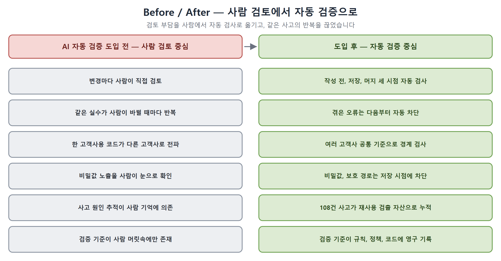

# AI 기반 개발, 변경 검증 자동화 (요약본)

> 여러 고객사가 **하나의 코드베이스**를 함께 쓰는 환경에서, 사람을 더 뽑는 대신 AI(Claude Code)로 개발 생산성을 올렸습니다. 다만 AI가 만든 변경이 사고로 이어지지 않도록 **코드 작성 전, 저장할 때, 합친 직후** 세 시점에서 자동으로 검사하고, 한 번 겪은 문제를 다시 검사 규칙으로 되돌려 **다음부터 자동으로 막히게** 만드는 검증 체계를 직접 설계, 구현했습니다.

> **용어 두 가지만 먼저** — 이 문서는 면접관이 처음 봐도 이해되도록 썼습니다.
> - **하네스(harness)**: AI에게 "지켜야 할 규칙, 쓸 수 있는 도구, 작업 순서"를 미리 정해 주는 **설정 묶음**입니다. 같은 AI라도 하네스가 있으면 회사 규칙대로 움직입니다.
> - **Closed-loop**: 결과가 다시 입력으로 돌아오는 구조입니다. 여기서는 *"사고 발견 → 기록 → 검사 규칙으로 반영 → 다음엔 자동 차단 → 또 새 사고 발견"* 이 끊기지 않고 돌면서, **검사 규칙이 쌓여 같은 유형의 실수는 다음부터 자동으로 막히는** 것을 말합니다.
>
> 수치는 별도 표기가 없으면 2026-05-29, 작업 브랜치 기준 **코드에서 직접 센 실측값**입니다.

---

## 1. 30초 요약

| 구분 | 내용 |
|------|------|
| **한 일** | 여러 고객사가 함께 쓰는 공용 코드베이스에서, AI(Claude Code)가 만든 코드 변경을 자동으로 검증하고 사고를 스스로 줄여가는 **검증 체계(거버넌스)**를 단독 설계, 구현 (Java/Spring 백엔드 업무와 병행) |
| **문제** | AI가 만든 변경이 한 고객사용 분기, 외부 시스템 불일치, 컨벤션 위반을 담으면 **나머지 고객사들 배포로 그대로 전파** |
| **핵심 설계** | 검증을 세 계층으로 분리 — **규칙**(왜 막나: 의도·근거, 34종) / **정책**(무엇을 기준으로: 고객사·경계 데이터, 12종) / **검사 스크립트**(어떻게 막나: 자동 실행, 29개). 검사로 끝내지 않고, 발견된 오류를 다시 규칙·정책으로 되돌리는 **Closed-loop** 구조 |
| **대표 결과** | 누적 **108건**의 사고, 불일치 사례를 자동 검출 자산으로 전환. 비밀값과 보호 경로 침범은 **저장 시점에 차단**, 고객사 경계 위반은 **자동 감지(경고)**, 합친 뒤에는 **7종 자동 점검 보고** |
| **기여** | 자동화 영역(`.claude/`, `scripts/ai/`) 커밋의 **82.7%**를 단독 작성, 운영 |
| **기술** | Python(표준 라이브러리), Git Hook, YAML, Bitbucket Pipeline |

---

## 2. 왜 만들었나

### 상황 — 인력은 그대로인데, 고객사와 요구사항은 계속 늘었다

고객사가 늘수록 요구사항도 함께 늘었습니다. 고객사마다 자원 모델, 승인 흐름, 이벤트 정책, 과금(빌링) 구조가 달랐기 때문입니다. 반면 개발 인력은 그만큼 늘릴 수 없었습니다. 인력을 더 뽑지 않고 이 격차를 메우는 현실적인 방법은 **AI로 개발 생산성 자체를 끌어올리는 것**이었습니다.

### 문제 — 단일 코드베이스에 AI를 "무작정" 넣을 수는 없었다

이 제품은 프라이빗 클라우드 제품이라, 고객사 도메인이 달라질 때마다 **자원을 쓰는 목적, 과금 구조, 외부 시스템(Jenkins, VMware, GitLab 등) 연동 기준**이 달라집니다. 그런데 이들 고객사가 **하나의 코드베이스**를 함께 봅니다. 이 상태에서 AI 결과를 그대로 반영하면, 한 고객사용 분기가 공통 코드에 섞여 **다른 고객사들 배포로 전파**되거나, 외부 시스템과 어긋난 코드가 운영 사고로 노출됩니다.

### 해법 — 검사로 끝나지 않고, 결과를 되먹이는 거버넌스

그래서 단순히 "AI에게 규칙을 알려주는 설정"에 그치지 않고, **발견된 오류를 검사 규칙으로 되돌려 같은 실수가 다음부터 자동으로 막히게 만드는 Closed-loop** 구조로 설계했습니다.

---

## 3. 전체 구조 한눈에

- **3중 검증 게이트(사람, AI 공통)**: ① 코드 작성 전 *영향 검토* → ② 저장(커밋) 시 *위반 자동 차단* → ③ 합친(머지) 직후 *자동 점검 보고*. AI도 사람과 똑같은 세 관문을 거칩니다.
- **공유 검증 자산(5계층)**: 규칙(.md) / 정책(.yaml) / 자동 검사 스크립트(.py) / 사례 기록(.md) / AI 협업 자산(작업 절차서, 역할별 작업자). 게이트가 이 자산을 불러와 검사합니다.
- **Closed-loop**: 사고가 발견되면 기록 → 검사 규칙으로 반영 → 다음 변경부터 자동 검출. 검사 체계 자체의 변경도 *관찰 → 설계 → 검토 → 승인 → 반영 → 재확인* 6단계로 통제합니다.

---

## 4. 핵심 해결 5가지

1. **"왜, 무엇을, 어떻게"를 세 파일로 분리** — 규칙(왜), 정책(무엇), 검사 스크립트(어떻게)를 나눠서, 신규 고객사가 들어와도 **정책 파일 한 블록만 추가**하면 됩니다. 검사 스크립트(코드)는 건드리지 않으니 다른 사람 작업에 영향이 없습니다.
2. **저장(커밋) 시점 자동 차단** — 비밀값 노출과 보호 경로(배포·CI 설정처럼 함부로 바꾸면 안 되는 파일) 변경은 **저장 자체를 막고**, 고객사 경계 침범은 **자동 감지해 경고**합니다. 문제가 코드 이력에 들어가 퍼지기 전이 가장 싼 시점입니다.
3. **변경 영향 미리보기** — 코드를 쓰기 전에 *어디에, 누구에게 영향이 가나, 위험 top 3* 를 강제로 정리하게 합니다. AI가 "이 정도면 안전"이라고 혼자 판단하고 직진하는 것을 막습니다.
4. **합친 직후 7종 자동 점검 보고** — 다른 사람 코드를 합친 직후, 빠진 안전장치, 중복, 실수를 자동으로 점검해 보고서를 만듭니다. (이미 합쳐진 변경이라 차단은 하지 않고, 정리할 일을 후속 작업으로 연결합니다.)
5. **모르는 건 추측하지 않고 사람에게 먼저 묻기** — 외부 시스템이 실제로 무엇을 지원하는지는 코드만으로 알 수 없습니다. 추측해서 잘못된 가설을 키우는 대신 **사람에게 먼저 확인**하게 했습니다. *"자동화가 항상 정답은 아니다"* 를 보여 준 사례입니다.

---

## 5. Closed-loop — 한 번 겪은 오류는 다음부터 자동으로

누적 **108건**(사고, 회귀 기록 75 + 컨벤션 불일치 33)이 모두 *수집 → 분류 → 변환 → 검증* 4단계를 거쳐 규칙, 정책, 검사 스크립트 중 한 곳으로 옮겨졌습니다.

- **사례 1 (스케줄러 안전장치 누락)**: 예약 실행 코드 42개 중 31개에 오류 보호 블록이 빠져 있어 실패가 조용히 묻히던 것을 발견 → 자동 검사로 만들어, 이후 새 예약 코드는 보호 누락이 자동으로 잡힙니다.
- **사례 2 (외부 시스템 불일치)**: 내부 코드가 Jenkins 실제 지원과 어긋난 채 운영에 노출된 사례 → "자동 검사"가 아니라 **"사람에게 먼저 질의"** 규칙으로 바꿔, 같은 유형 조사가 3턴에서 1턴으로 줄었습니다(대표 사례 기준).

---

## 6. 결과, 기여, 한계

**결과**
- 비밀값, 보호 경로 침범은 **저장 시점에 차단**, 고객사 경계 위반은 **자동 감지(경고)**
- 합친 직후 **7종 자동 점검 보고서**(예: 예약 코드 안전장치 누락, DB 마이그레이션 번호 중복, 화면 다국어 누락) 자동 생성
- 누적 **108건**을 1회성 수정이 아니라 **재사용 가능한 검출 자산**으로 전환
- 규칙 34종, 정책 12종, 자동 검사 스크립트 29개, AI 협업 자산(작업 절차서 59개, 작업자 역할 정의 50개)을 운영 중

**기여** — 자동화 영역 커밋의 **82.7%**를 단독 작성, 운영(같은 영역 기여자 6명 중 본인 외 5명). 설계와 핵심 구현을 단독 주도했습니다.

**한계 (정직하게)** — "리뷰 시간 N분 절감" 같은 투자수익(ROI) 수치는 별도 측정 체계가 없어 정량화하지 못했습니다. 자동 차단은 일부 항목만 강제 차단이고 나머지는 경고 단계입니다. 이런 한계는 다음 단계 과제로 두고 있습니다.

---

> 더 자세한 설계 판단, 코드, 사례 추적은 **상세본_AI자동화.md** 를, 원본 전체는 **포트폴리오_AI자동화.md** 를 참고하세요.
