# AI 기반 개발 및 변경 검증 자동화

## 1. 한 줄 요약

여러 고객사가 한 코드베이스를 함께 쓰는 환경에서, 인력을 충원하는 대신 AI 도구(Claude Code 등)로 개발 생산성을 높이는 방향을 골랐습니다. 다만 단일 코드베이스에 AI를 무작정 도입하면 한 고객사용 변경이 여러 고객사 전체로 사고를 퍼뜨릴 수 있어, **단순히 검사만 하는 하네스가 아니라 — 발견된 오류를 검증 자산으로 되돌려 같은 실수가 다음부터 자동으로 막히게 만드는 Closed-loop 자기개선 거버넌스**를 직접 만들었습니다. AI가 만든 결과를 개발 단계, 커밋 단계, 머지 단계에서 자동으로 검사하고, 그 결과를 다시 규칙, 정책, git hook으로 환원합니다.

### 30초 요약

| 구분 | 내용 |
|------|------|
| **포지션** | 개발 생산성, 플랫폼 엔지니어링 성격의 사내 도구. Java/Spring 백엔드 개발 업무를 하면서, AI가 만든 코드를 자동 검증하는 영역을 단독으로 설계하고 구현 |
| **문제** | 여러 고객사가 단일 코드베이스를 공유하는 환경에서, AI가 만든 변경이 고객사 경계, 외부 시스템 연동 기준, 코드 컨벤션을 깨면 다른 고객사 배포로 그대로 전파 |
| **핵심 설계** | 검증을 세 계층으로 분리 — 규칙 문서(왜 막나: 의도·근거, MD 34종) / 정책 파일(무엇을 기준으로: 고객사·경계 데이터, YAML 12종) / 자동 실행 스크립트(어떻게 막나: git hook Python 29개). 발견된 오류를 다시 규칙과 정책으로 되돌리는 **Closed-loop**를 6단계 거버넌스로 운영 |
| **대표 결과** | 누적 108건 사례를 자동 검출 자산으로 환원. 비밀값과 보호 경로 침범은 커밋 시점에 차단, 고객사 경계 위반은 자동 감지(경고), 머지 후에는 8종(7 활성) 자동 점검으로 보고 |
| **기여** | 자동화 영역(`.claude/`, `scripts/ai/`) 커밋의 82.7%를 단독으로 작성하고 운영 (2026-05-29 기준) |
| **기술** | Python(표준 라이브러리), Git Hook, YAML, Bitbucket Pipeline |

> 측정 수치는 별도 표기가 없으면 **2026-05-29, 작업 브랜치 `고객사B-cmdb-ipband-resource` 기준 실측값**입니다. 시계열로 늘어나는 항목(머지 점검 보고서, 스냅샷, cycle)은 측정 시점에 따라 증가합니다.

> **용어 (한 번만 정리)** — 본문에 반복되는 내부 용어입니다.
> - **하네스(harness)**: AI에게 "지켜야 할 규칙, 쓸 수 있는 도구, 작업 순서"를 미리 정해 주는 설정 묶음.
> - **rule NN**: 사내 검증 규칙 문서(`.claude/rules/` 디렉터리)의 번호. 규칙 하나는 R1~Rn 세부 항목으로 구성됩니다(예: `rule 96`은 "외부 시스템 연동 기준 확인" 규칙).
> - **skill**: AI 도구(Claude Code)에서 자동·수동으로 호출하는 정형화된 작업 절차.
> - **hook**: git 단계(커밋·머지 등)마다 자동 실행되는 검사 스크립트.
> - **Tier**: 변경 위험도(1~3)·문서 보존 중요도(0~3)·자동 수정 신뢰도(A~C)를 나누는 등급. 이름만 같을 뿐 §4.6에서 보듯 서로 독립된 분류입니다.
> - **Closed-loop**: 발견된 오류를 규칙·정책으로 되돌려 다음부터 자동으로 막는 되먹임 구조.

---

## 2. 추진 배경

### 무엇을 만드는 회사인가

이 제품은 OpenStack, VMware, Kubernetes, Ansible을 통합 관리하는 프라이빗 클라우드 플랫폼입니다. 같은 코드베이스를 여러 고객사(고객사 A~F)가 함께 씁니다.

고객사별로 다른 부분만 별도 모듈로 분리해 끼워 넣는 plugin 구조입니다. 고객사마다 자원 관리 방식이 다르고, 외부 시스템(Jenkins, VMware, GitLab 등) 연동 기준도 다릅니다.

### 상황 — 인력은 그대로인데, 고객사와 요구사항은 계속 늘었다

고객사가 늘수록 요구사항도 함께 늘었습니다. 각 고객사가 서로 다른 자원 모델, 승인 흐름, 이벤트 정책, 빌링 구조를 요구했기 때문입니다. 반면 개발 인력은 그만큼 늘릴 수 없었습니다.

인력을 충원하지 않고 이 격차를 메우는 현실적인 방법은 **AI 도구(Claude Code 등)로 개발 생산성 자체를 끌어올리는 것**이었습니다. 사람 수를 늘리는 대신, 한 사람이 AI와 함께 더 많은 변경을 안전하게 처리하게 만드는 방향입니다.

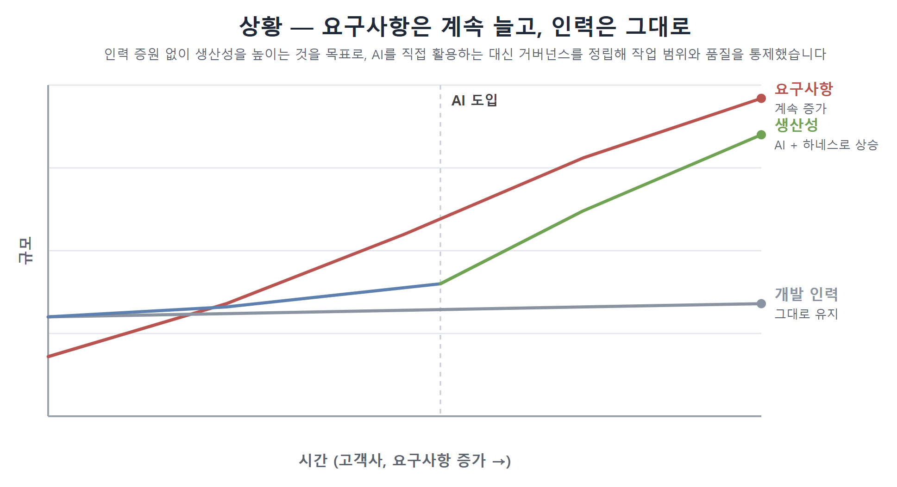

> 인력(회색)은 충원 없이 수평을 유지합니다. 요구사항(빨강)은 고객사, 기능 증가로 가파르게 올라갑니다. 그 격차를 그대로 두면 적체와 품질 저하로 이어집니다. AI 도입 이후 생산성(파랑)이 인력 선 위로 올라가며 그 격차를 메우는 것이 이 프로젝트의 출발점입니다.

### 문제 — 단일 코드베이스에 AI를 "무작정" 도입할 수는 없었다

문제는 이 제품이 **프라이빗 클라우드 제품**이라는 점에서 시작됩니다. 고객사 도메인이 달라질 때마다 **자원을 사용하려는 목적, 빌링 구조, 외부 시스템 연동 기준**이 달라집니다. 그런데 이들 고객사가 **하나의 코드베이스**를 함께 바라봅니다.

이런 환경에서 AI가 만든 변경을 무작정 반영하면 곧바로 사고로 이어집니다.

- 한 고객사용 분기가 공통 영역에 섞이면 다른 고객사들 배포로 그대로 전파됩니다.
- 외부 시스템(Jenkins, VMware, GitLab 등) 실제 계약과 어긋난 코드가 들어가면 운영 사고로 노출됩니다.
- 회사 코드 컨벤션을 따르지 않으면 다른 사람이 유지보수하기 어려워집니다.
- 이전에 발견된 오류도 사람 기억에만 의존하면 다시 들어옵니다.

즉 생산성을 올리려고 도입한 AI가, 통제 장치 없이는 오히려 여러 고객사 전체로 사고를 퍼뜨리는 통로가 됩니다. 그래서 **AI를 위한 거버넌스 체계**가 먼저 필요했습니다.

### 그래서 — 단순 하네스가 아니라 "Closed-loop 자기개선 거버넌스"

이 프로젝트는 단순히 AI에게 규칙을 알려주는 설정 묶음(하네스)이 아닙니다. **발견된 오류를 다시 검증 자산으로 되돌려, 같은 실수가 다음부터 자동으로 막히게 만드는 Closed-loop 구조의 자기개선 거버넌스**입니다.

- 검증 의도(규칙 .md) / 데이터(정책 .yaml) / 실행(git hook .py)을 세 계층으로 분리해, 신규 고객사, 신규 규칙이 들어와도 검증 코드를 건드리지 않고 데이터만 갱신합니다.
- AI가 코드를 만들기 전(영향 검토), 저장할 때(커밋 차단), 합친 직후(머지 보고)의 세 시점에서 자동으로 검사합니다.
- 한 번 겪은 사고는 사례 카탈로그에 기록되고, 규칙, 정책, hook으로 환원되어 다음 변경부터 자동 검출됩니다. 거버넌스 자체의 변경도 6단계 파이프라인(관찰 → 설계 → 검토 → 승인 → 반영 → 재확인)과 3중 Tier로 통제합니다.

이 "사고 → 기록 → 자산화 → 자동 차단 → 다시 관찰"의 Closed-loop가 이 시스템을 단순 하네스와 구분 짓는 핵심입니다. (이 닫는 과정은 §4 동작, 진화 흐름에서 자세히 다룹니다.)

### 왜 기존 도구로는 안 됐나

SonarQube와 Checkstyle 같은 정적 분석 도구는 일반 코드 품질 검사(null 체크, 복잡도, 스타일)는 잘 합니다. 하지만 이 제품 고유의 검증 영역은 다룰 수 없었습니다.

- 여러 고객사 plugin 경계
- 외부 시스템(Jenkins, VMware, GitLab) 연동 기준 불일치
- 내부 운영 컨벤션
- AI 작업 흐름의 영향 검토 게이트

또한 정책이 자주 갱신되어야 하는데, 도구 자체를 다시 빌드해서 배포해야 한다는 점도 맞지 않았습니다. CI 단계 검사는 PR 빌드 시점에 동작해서 이미 검증 비용이 누적된 후였습니다.

그래서 기존 도구를 **대체하지 않고**, 프로젝트 특화 검증을 보완하는 시스템으로 직접 설계했습니다.

---

## 3. 내 역할

자동 검증 시스템의 **구조를 설계하고 핵심 부분을 직접 구현**했습니다. 자동화 영역(`.claude/`, `scripts/ai/`) 커밋 110개 중 91개(**82.7%**)를 직접 작성하고 운영했습니다(2026-05-29 작업 브랜치 기준, 같은 영역 기여자는 본인 포함 6명).

주요 작업:

- 정책 파일(YAML) 12종 설계
- 검증 규칙 문서 34종 작성
- 자동 실행 스크립트(git hook) 29개 구현 (Python)
- 발견된 오류 사례를 정책 파일, 검증 규칙, 자동 실행 스크립트로 옮기는 절차 설계
- 자기개선 회차(cycle, 검증 체계를 한 차례 점검·개선하는 단위) 운영 — 누적 15회(cycle-001~015). 초기 2회는 보관용(archive), 활성 로그 13건(cycle-003~015)을 시계열로 정량 추적
- 측정 lifecycle 정책 설계 — 매번 전수 측정하지 않도록, 측정 대상 17종 중 12종에 유효 기간(TTL)과 재측정 조건(무효화 trigger)을 `measurement-targets.yaml`에 선언(나머지 5종은 추가 예정)
- 6단계 거버넌스 파이프라인 정립 — 관찰(observer) → 설계(architect) → 검토(reviewer) → 승인(governor) → 반영(updater) → 재확인(verifier)
- 개발자 코드 리뷰 반영, 잘못 잡힌 사례(오탐) 정정

---

## 4. 전체 아키텍처

아키텍처를 여덟 가지 관점으로 나눠 설명합니다. 같은 시스템을 다른 각도에서 본 것이며, **진입 → 전개 → 검출 → 환원** 순서로 읽으면 전체 흐름이 한눈에 들어옵니다.

| 단계 | 관점(절) | 답하는 질문 |
|------|------|-------------|
| **진입** | **4.8 워크플로우 호출** | 사용자가 AI를 어떻게 호출하고, AI는 자산 109개(agent 50 + skill 59)에서 무엇을 골라 쓰나? |
| 진입 | **4.3 정적 구조** | 무엇으로 만들어져 있나? 어떤 파일이 어떻게 연결되나? |
| **전개** | **4.5 개발 흐름** | AI가 코드를 만들어가는 과정은 어떻게 통제되나? |
| 전개 | **4.4 사용 흐름** | 사람과 AI가 이 시스템을 어떻게 쓰나? |
| **검출** | **4.1 동작 흐름** | 한 코드 변경이 커밋과 머지 단계에서 어떻게 검증되나? |
| 검출 | **4.7 자동 실행 메커니즘** | hook 29개가 어떻게 자동 트리거되고 코드를 검출하나? |
| **환원** | **4.2 진화 흐름** | 한 번 발견된 오류가 어떻게 카탈로그에 저장되고 다음에 자동으로 잡히게 되나? |
| 환원 | **4.6 거버넌스 흐름** | 자동 허용, 사람 승인, 절대 자동 금지를 어떻게 분기하나? |

번호는 작업 순서대로 매겨졌지만, 위 표의 진입 → 전개 → 검출 → 환원 순서로 읽으면 시스템의 전체 라이프사이클이 한 흐름으로 보입니다. 이 절에서는 번호 순서(4.1 → 4.7 → 4.8)로 설명합니다.

먼저 전체 구조를 한눈에 봅니다. 입력(사람과 AI의 변경)이 3중 검증 게이트를 거쳐 결과로 나오고, 모든 게이트는 아래 공유 검증 자산을 불러와 검사하며, 발견된 사례는 다시 자산으로 환원됩니다.

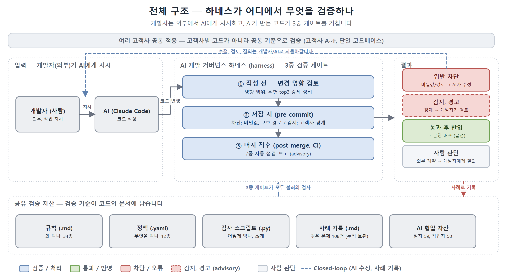

---

### 4.1 동작 흐름 — 한 코드 변경이 어떤 단계를 거치나

AI와 함께 코드 한 줄을 바꿨을 때 어떤 검증을 거쳐 운영에 도달하는지를 시간 순서로 보여줍니다.

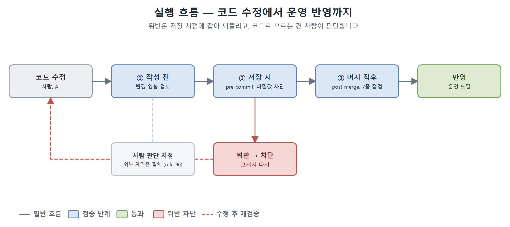

<details>
<summary>Mermaid 코드 (클릭하여 열기)</summary>

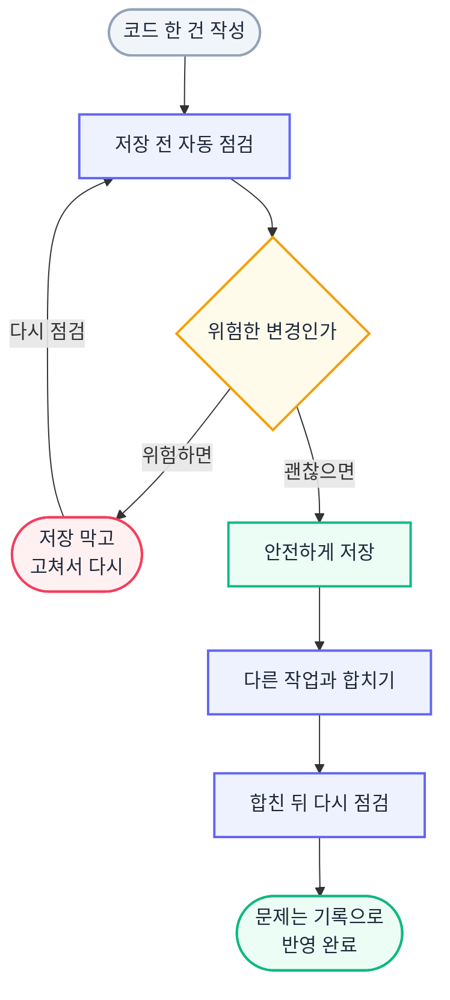
```mermaid
flowchart TD
    START(["코드 한 건 작성"]):::start
    CHECK["저장 전 자동 점검"]:::act
    JUDGE{"위험한 변경인가"}:::gate
    BLOCK(["저장 막고<br/>고쳐서 다시"]):::stop
    SAVE["안전하게 저장"]:::ok
    MERGE["다른 작업과 합치기"]:::act
    RECHECK["합친 뒤 다시 점검"]:::act
    DONE(["문제는 기록으로<br/>반영 완료"]):::ok

    START --> CHECK
    CHECK --> JUDGE
    JUDGE -- "위험하면" --> BLOCK
    BLOCK -- "다시 점검" --> CHECK
    JUDGE -- "괜찮으면" --> SAVE
    SAVE --> MERGE
    MERGE --> RECHECK
    RECHECK --> DONE

    classDef start fill:#F1F5F9,stroke:#94A3B8,color:#1E293B,stroke-width:2px
    classDef act   fill:#EEF2FF,stroke:#6366F1,color:#1E293B,stroke-width:2px
    classDef ok    fill:#ECFDF5,stroke:#10B981,color:#1E293B,stroke-width:2px
    classDef gate  fill:#FFFBEB,stroke:#F59E0B,color:#1E293B,stroke-width:2px
    classDef stop  fill:#FFF1F2,stroke:#F43F5E,color:#1E293B,stroke-width:2px
    classDef ext   fill:#F0F9FF,stroke:#0EA5E9,color:#1E293B,stroke-width:2px
```

</details>

---

### 4.2 진화 흐름 — 한 번 발견된 오류가 어떻게 다음부터 자동으로 잡히나

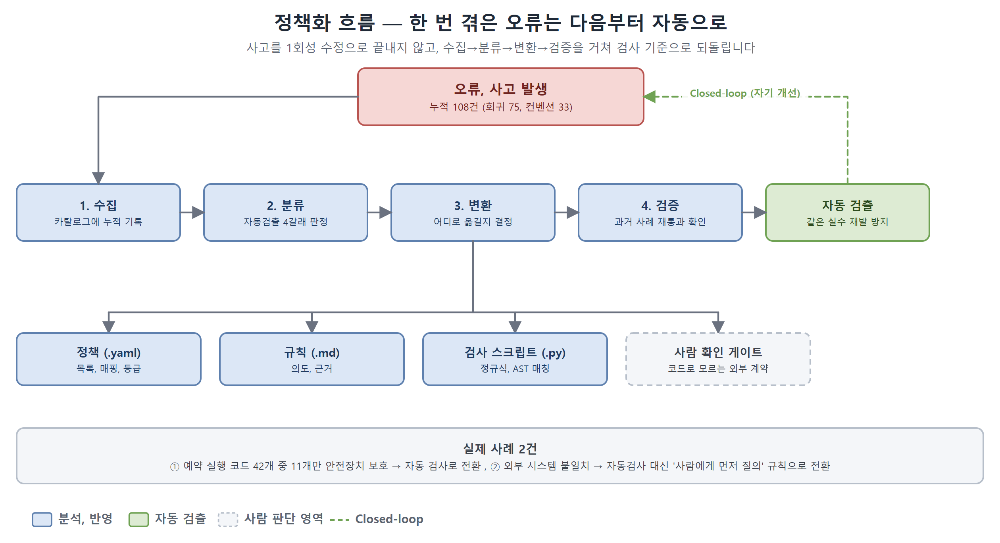

핵심은 **한 번 발견된 오류가 1회성 수정으로 끝나지 않는다**는 점입니다. 위 흐름이 실제로 어떻게 운영되는지 4단계로 풀어 설명합니다.

#### 1단계 — 수집: 사례 카탈로그에 기록

오류가 발견되면 즉시 사례 카탈로그(FAILURE_PATTERNS.md 또는 CONVENTION_DRIFT.md)에 기록합니다. 추가만 가능하고 수정이나 삭제는 금지된 형태(append-only)입니다.

- **누가 기록하나**: 사고를 발견한 사람 또는 AI 세션이 직접 기록 (rule 95 R3 "의심 발견 시 드러내기 의무"가 강제)
- **언제 기록하나**: 발견 즉시. 다음 작업으로 넘어가기 전. 이걸 놓치면 다음 단계로 이어지지 않아 같은 사고가 반복됨
- **무엇을 기록하나**: 발견 일자 / 카테고리 (test-gap, scope-miss, ai-hallucination 등) / 재현 경로 / 임시 조치 / 자동 검출 가능성 1차 판정
- **누락 방지**: 오탐이라도 일단 기록 후 분류 단계에서 판정. 기록 누락 자체가 사고로 간주됨

#### 2단계 — 분류: 자동 검출 가능 여부 4갈래 판정

기록된 사례를 네 갈래로 분류합니다.

| 분류 | 판정 기준 | 다음 단계 |
|------|-----------|----------|
| 자동 검출 가능 | 정규식, AST 분석, 파일 비교 중 하나로 패턴 매칭 가능 | 3단계 변환으로 |
| 부분 가능 | 변경 사실은 자동 감지, 정확한 값은 사람만 앎 | hook(자동 감지) + 사람 질의 게이트(정확한 값) |
| 자동 판단 불가 | 외부 시스템 실제 계약, 비즈니스 의도 등 | 사람 확인 단계로만 처리 |
| 오탐(false positive)이었음 | 잘못 잡힌 경우 | 기존 규칙을 수정하거나 폐기 |

분류 기준이 모호한 경우는 사용자 확인을 거칩니다.

#### 3단계 — 변환: 정책 vs 규칙 vs hook 중 어디로 갈지 결정

| 옮길 곳 | 어떤 사례를 넣나 | 예시 |
|---------|------------------|------|
| 정책(YAML) | 데이터로 표현 가능한 경우 (목록, 매핑, 등급) | 신규 고객사 추가, 신규 보호 경로 등록 |
| 규칙(MD) | 사람이 의사결정 시 참고할 의도와 근거 | "왜 이 영역을 보호하는가" 같은 정책 의도 |
| git hook(Python) | 자동 검출 가능한 패턴 | 정규식이나 AST 매칭으로 staged 파일 검사 |
| 사람 확인 게이트 | 코드만으로 답할 수 없는 영역 | 외부 시스템 실제 계약 (rule 96) |

#### 4단계 — 검증: 만든 자산이 실제로 같은 유형을 잡는지 확인

- 자산 추가 후, 과거 사례 파일을 hook에 다시 통과시켜 검출되는지 확인
- 가능한 경우 신규 사례를 시뮬레이션해 hook 반응 확인
- 오탐이 발생하면 즉시 보정 또는 폐기 (1단계로 다시 들어가는 피드백)

#### 실제 사례 추적 2건

위 4단계가 실제로 어떻게 작동했는지 두 사례로 추적합니다.

**사례 1 — 스케줄러 try-catch 누락 (2026-04-17)**

| 단계 | 내용 |
|------|------|
| 수집 | 운영 점검 중 `@Scheduled` 메서드 42개 중 11개만 try-catch로 보호되고 있음을 확인. 나머지는 실패가 조용히 묻히는 위험(silent fail)이 있어 FAILURE_PATTERNS.md에 "스케줄러 silent fail" 카테고리로 기록 |
| 분류 | "자동 검출 가능"으로 판정 — `@Scheduled` 어노테이션 위치 + 메서드 본문의 try 블록 존재 여부를 정규식 + 중괄호 매칭으로 판정 가능 |
| 변환 | 규칙 1개(rule 92 R8 "try-catch 의무") + git hook 2개에 반영. `pre_commit_scheduler_guard.py`(커밋 단계 advisory 차단) / `post_merge_incoming_review.py`의 검사 a(머지 후 보고서) |
| 검증 | 기존 42개 스케줄러를 hook에 통과시켜 미보호 31개 검출 확인. 이후 신규 `@Scheduled` 메서드 추가 시 자동 검출 작동 |

**사례 2 — 외부 시스템 enum 불일치 (2026-04-23)**

| 단계 | 내용 |
|------|------|
| 수집 | `CustomActionPhaseType.DAY_1 = [PRE_OS]` enum이 Jenkins 파이프라인 실제 지원 `{redfish, linux, windows, esxi}`와 어긋난 채 운영에 노출. AI가 코드만 보고 가설을 늘려가다 3턴 추론 끝에 사용자가 외부 계약을 알려주면서 발견. FAILURE_PATTERNS.md에 "external-contract-unverified" 카테고리로 기록 |
| 분류 | "부분 가능"으로 판정 — enum 변경 사실은 자동 감지 가능하지만, 외부 시스템이 실제로 어떤 값을 지원하는지는 외부 시스템 운영자만 알 수 있음 |
| 변환 | 처음에는 enum origin 주석을 자동 검사하는 항목(머지 후 점검 스크립트 `post_merge_incoming_review.py` 안의 검사 슬롯, 코드명 c)을 넣었습니다. 그러나 "코드만 봐도 이해 가능한 게 좋은 코드"라는 개발자 피드백으로 origin 주석 의무(rule 96 R1)를 폐기하면서 검사 c를 **비활성화**했습니다. 대신 외부 계약 확인은 규칙(rule 96 R2/R3/R4)으로 옮겨, **코드 작성 전 사용자에게 외부 계약을 먼저 질의**하는 사람 게이트로 의무화했습니다 |
| 검증 | 사람 질의 게이트로 전환한 뒤 같은 유형 조사가 3턴 → 1턴으로 단축(대표 사례 1건 기준, 통계적 표본 아님). 자동 origin 검사를 retired한 것은 "자동화가 항상 정답은 아니다"라는 판단의 사례 — 코드만으로 알 수 없는 영역은 사람에게 맡기는 것이 더 빠르고 정확 |

이 두 사례가 "수집 → 분류 → 변환 → 검증" 4단계가 실제로 작동한 증거입니다. 누적 108건(FAILURE_PATTERNS 75 + CONVENTION_DRIFT 33)이 모두 이 절차를 거쳐 정책 YAML 12종 / 검증 규칙 34종 / git hook 29개 중 한 곳 이상으로 환원됐습니다(한 사례가 여러 곳에 반영되기도 합니다).

#### 카탈로그 저장 형식 (append-only)

수집 단계(1단계)에서 사례는 두 카탈로그 파일에 텍스트 형식으로 영구 저장됩니다. **수정과 삭제 금지(append-only)** 가 원칙입니다.

**FAILURE_PATTERNS.md 실제 entry 예시** (2026-05-20 Vue 2 reserved prefix 사례):

```markdown
### 2026-05-20 — vue-reserved-prefix — Vue 2가 `_` prefix data 제외 → ReferenceError
- **발견 경로**: 자원등록 SUB-4 UI 통합 후 사용자 브라우저 검증
- **근본 원인**: Vue 2 내부 정책, instance proxy에서 `_` prefix 제외.
  mixin 메서드는 정상(직접 참조), template에 노출되면 ReferenceError 발생
- **영향**: 자원등록 페이지 진입 시 렌더 실패, Playwright spec 7/8 FAIL
- **해결**: commit 9e714a1886 — template `v-if="_loading"` → `v-if="loading"` 전환
- **재발 방지**: template v-if 변수명 확인 체크리스트 추가
```

**CONVENTION_DRIFT.md 실제 entry 예시** (DRIFT-004):

```markdown
## DRIFT-004: CODE_CONVENTION.md의 TDD 명시 vs 실제 테스트 커버리지 부족
| 발견일 | 심각도 | 상태 | 위치 |
| 2026-04-15 | 높음 | 미해결 | CODE_CONVENTION.md, qa/ |
**현상**: TDD 명시 vs 실제 커버리지 gap
**영향**: 향후 회귀 테스트 기준 불명확
**재검토 조건**: 커버리지 목표 설정 시
```

**카테고리 분류**: 약 10종(test-gap, scope-miss, convention-drift, ai-hallucination, tool-ergonomics, external-contract, design-decision, cross-customer, schema-regression, prototype-drift). 각 entry는 카테고리 태그가 헤딩에 포함됩니다.

**Append-only 강제**: 카탈로그 파일은 새 entry 추가만 가능하고, 기존 entry는 수정하거나 삭제할 수 없습니다. 사후 이해가 바뀌면 새 entry로 보완합니다.

#### 자기개선 cycle 정량화 추적

이 4단계 절차는 추상적 흐름이 아니라 **실제 cycle log로 정량 추적**되고 있습니다. `docs/ai/harness/cycle-*.md`에 cycle-003 ~ cycle-015 활성 로그 13건이 기록되어 있고, 초기 cycle-001과 002는 `docs/ai/archive/`로 분리되어 누적 15회입니다.

**cycle-015 메타데이터 (2026-04-21 실제 cycle)**:

```yaml
cycle: "015"
started_at: "2026-04-21T02:45:00+09:00"
ended_at: "2026-04-21T04:00:00+09:00"
wallclock_minutes: 75
token_estimate_k: 1800
files_changed: 50
new_rules: 0
new_skills: 0
drift_detected: 0
failures_recorded: 0
drift_resolution_days: 0
reviewer_veto_rate: 0.0
```

각 cycle은 **6단계 거버넌스 파이프라인**(§4.6, observer → architect → reviewer → governor → updater → verifier)을 거치며, 결과를 위 메타데이터로 정량화합니다. 누적 cycle log를 시계열로 보면 drift 감지 수, 신규 hook 추가, reviewer veto 비율 같은 지표가 변화합니다.

#### 측정 lifecycle — AI 컨텍스트 비용 폭증 차단

진화 흐름이 작동하려면 AI가 "현재 상태"를 정확히 알아야 합니다. DB 스키마, 모듈 구조, API 목록, i18n 키 같은 정보를 매번 전수 측정하면 컨텍스트 비용이 폭증하고, 반대로 캐시만 쓰면 stale한 정보로 잘못된 코드를 만듭니다.

**해결 방법**: 측정 대상마다 **TTL(유효 기간) + 무효화 trigger**를 정책 파일(`measurement-targets.yaml`)에 미리 선언해 두고, AI는 매번 새로 판단하지 않습니다. 측정 대상은 17종을 설계했고 그중 12종을 현재 yaml에 선언했습니다(나머지 5종은 신설 예정).

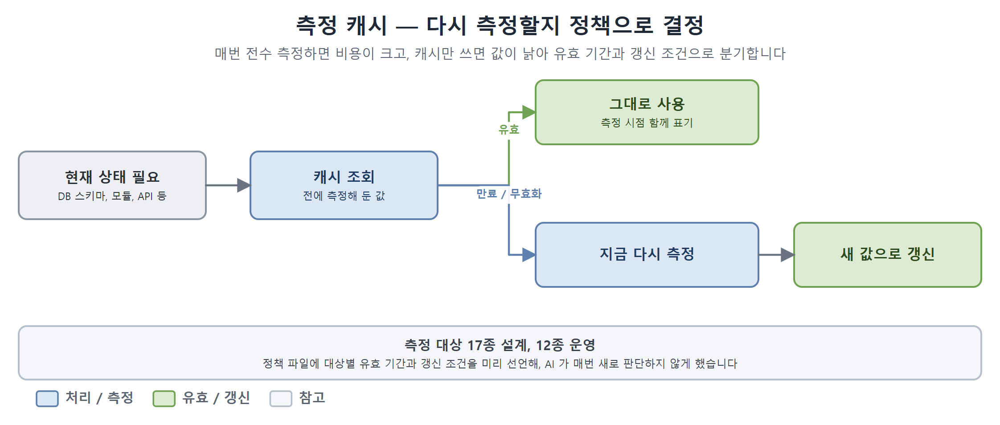

<details>
<summary>Mermaid 코드 (클릭하여 열기)</summary>

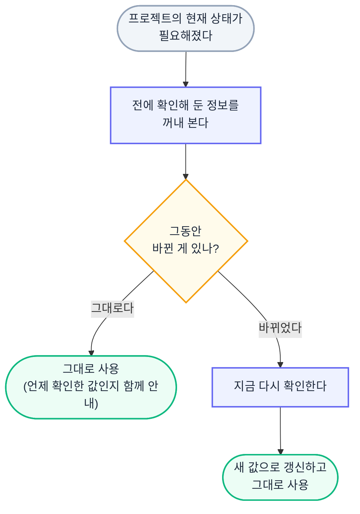
```mermaid
flowchart TD
    START(["프로젝트의 현재 상태가<br/>필요해졌다"]):::start
    SAVED["전에 확인해 둔 정보를<br/>꺼내 본다"]:::act
    FRESH{"그동안<br/>바뀐 게 있나?"}:::gate
    REUSE(["그대로 사용<br/>(언제 확인한 값인지 함께 안내)"]):::ok
    RECHECK["지금 다시 확인한다"]:::act
    UPDATE(["새 값으로 갱신하고<br/>그대로 사용"]):::ok

    START --> SAVED
    SAVED --> FRESH
    FRESH -- "그대로다" --> REUSE
    FRESH -- "바뀌었다" --> RECHECK
    RECHECK --> UPDATE

    classDef start fill:#F1F5F9,stroke:#94A3B8,color:#1E293B,stroke-width:2px
    classDef act   fill:#EEF2FF,stroke:#6366F1,color:#1E293B,stroke-width:2px
    classDef ok    fill:#ECFDF5,stroke:#10B981,color:#1E293B,stroke-width:2px
    classDef gate  fill:#FFFBEB,stroke:#F59E0B,color:#1E293B,stroke-width:2px
    classDef stop  fill:#FFF1F2,stroke:#F43F5E,color:#1E293B,stroke-width:2px
    classDef ext   fill:#F0F9FF,stroke:#0EA5E9,color:#1E293B,stroke-width:2px
```

</details>

---

### 4.3 정적 구조 — 무엇으로 만들어져 있고 어떻게 연결되나

이 검증 시스템이 **무엇으로 만들어져 있는지**를 자산 계층으로 정리하면 다섯 가지입니다.

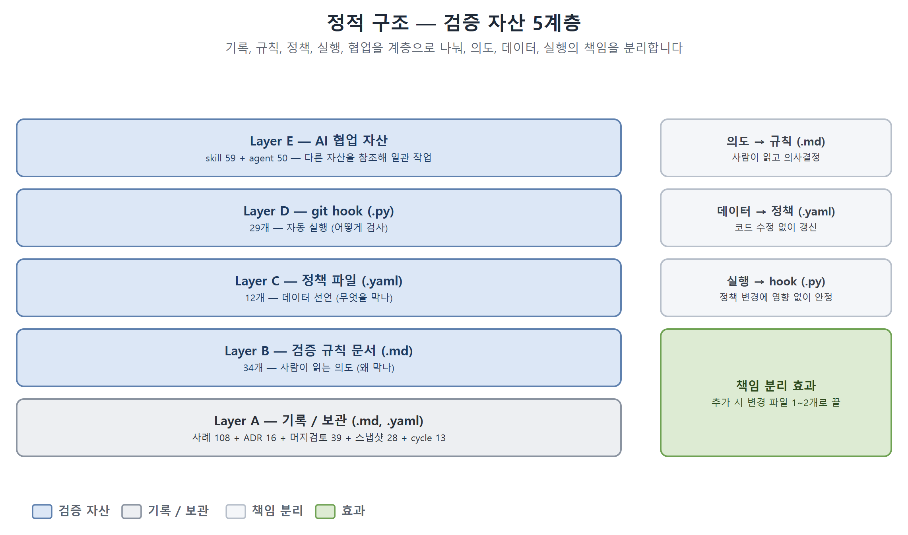

| 계층 | 자산 | 자료 형식 | 수량 |
|------|------|----------|------|
| Layer A | 기록, 보관 체계 | .md/.yaml (append-only) | 누적: 사례 108, 의사결정 기록(ADR) 16 / 시계열: 머지 점검 보고서 39, 자산 스냅샷 28, 회차 13 (+ 추적, 인수인계 문서) |
| Layer B | 검증 규칙 문서 | .md (사람이 읽는 의도) | 34개 규칙 |
| Layer C | 정책 파일 | .yaml (데이터 선언) | 12개 정책 |
| Layer D | git hook | .py (자동 실행) | 29개 Python hook |
| Layer E | AI 협업 자산 | skill, agent | skill 59 + agent 50 |

**이 구조의 핵심 설계 의도는 책임 분리입니다.**

| 분리 대상 | 어디에 두나 | 왜 분리하나 |
|-----------|------------|------------|
| 의도 (왜 보호) | 규칙 문서 (.md) | 사람이 읽고 의사결정 |
| 데이터 (무엇을 보호) | 정책 파일 (.yaml) | 신규 추가 시 코드 수정 없이 갱신 |
| 실행 (어떻게 검사) | hook (.py) | 정책 변경에 영향받지 않고 안정 운영 |
| 사례 (무엇이 일어났나) | 카탈로그 (.md, append-only) | 영구 보존, 사후 분석 가능 |
| 의사결정 (왜 그렇게 정했나) | ADR (.md) | 결정 reasoning 영구 기록, 향후 재논의 근거 |
| AI 협업 | skill, agent | 다른 자산을 참조해 일관된 작업 |

이 다섯 계층이 분리되어 있어서, 신규 고객사 추가나 신규 규칙 도입 시 변경 파일이 1~2개로 끝납니다.

#### 실제 디렉터리 구조

위 5계층은 저장소 안에서 3개 영역으로 나뉘어 있습니다.

```
제품 저장소/
│
├── .claude/                         AI 협업 자산 + 거버넌스 설정 (Layer B, C, E)
│   ├── agents/         (50개)        특정 역할의 별도 AI 작업자
│   ├── skills/         (59개)        재사용 가능한 작업 절차서
│   ├── rules/          (34개)        검증 규칙 (Layer B — 사람이 읽는 의도)
│   ├── policy/         (12개)        정책 파일 (Layer C — 데이터 선언)
│   ├── ai-context/                  도메인별 컨벤션과 지식
│   ├── role/                        역할별 프롬프트
│   ├── templates/                   문서 템플릿
│   ├── commands/                    사용 가이드
│   ├── settings.json                팀 공용 설정
│   └── settings.local.json          개인 로컬 설정
│
├── scripts/ai/                      자동화 실행 스크립트 (Layer D)
│   ├── hooks/          (29개)        git hook 본체 (pre-commit, post-merge 등)
│   ├── eval/                        평가 스크립트
│   ├── archive/                     폐기 스크립트 보관
│   └── *.py            (37개+)       측정, 진단, 동기화 스크립트
│
└── docs/ai/                         운영 문서 + 사례 카탈로그 (Layer A)
    ├── catalogs/                    FAILURE_PATTERNS, CONVENTION_DRIFT 등 사례 영구 보존
    ├── incoming-review/    (39개)    머지 후 자동 점검 보고서
    ├── harness/snapshots/  (28개)    검증 자산 변동 시계열 스냅샷
    ├── harness/cycle-*.md  (13개)    자기개선 회차 로그 (시계열)
    ├── decisions/          (16개)    ADR (의사결정 reasoning 기록)
    ├── designs/                     설계 문서
    ├── handoff/            (19개)    인수인계 기록
    ├── impact/             (11개)    영향 분석 기록
    ├── metrics/                     측정 지표
    └── onboarding/                  신규 사용자 진입 가이드
```

**세 영역의 협력 흐름**:

- `.claude/policy/*.yaml`을 `scripts/ai/hooks/*.py`가 읽어 staged 파일 검사
- 검사 결과는 `docs/ai/incoming-review/`, `docs/ai/harness/snapshots/`에 시계열로 저장
- 새 사고가 발견되면 `docs/ai/catalogs/FAILURE_PATTERNS.md`에 append되고, 이후 `.claude/rules/`, `.claude/policy/`, `scripts/ai/hooks/`로 환원되어 다음번에 자동 검출됨

`.claude/`는 거버넌스 자산, `scripts/ai/`는 실행 엔진, `docs/ai/`는 영구 증거 — 이 세 영역이 분리되어 있어서 자산을 추가하거나 폐기할 때 한 영역 안에서 끝납니다.

#### 기록, 보관 체계 — 무엇을 어떻게 남기고 보존하나

Layer A는 단순한 "사례 카탈로그"가 아니라 **기록(무엇을 남기나)과 보존(얼마나, 어떻게 보관하나)을 분리한 체계**입니다. 기록은 성격별로 여섯 종류로 나뉩니다.

| 기록 종류 | 자산 | 무엇을 남기나 | 수량 |
|-----------|------|--------------|------|
| 사례, 오류 기록 | FAILURE_PATTERNS.md, CONVENTION_DRIFT.md | 무슨 사고가 일어났나 (재현 경로, 임시 조치) | 108건 |
| 의사결정 기록 (ADR) | decisions/ADR-*.md | **왜 그렇게 결정했나** (대안, 근거, 트레이드오프) | 16건 |
| 점검 보고서 | incoming-review/*.md | 머지마다 8종 자동 점검 결과 | 39건 |
| 자산 변동 기록 | harness/snapshots/*.yaml | 검증 자산이 언제 무엇이 바뀌었나 | 28건 |
| 자기개선 회차 기록 | harness/cycle-*-log.md | 매 cycle drift 감지, hook 추가, veto 비율 | 13건 |
| 추적, 인수인계 기록 | TRACEABILITY_MATRIX, TEST_HISTORY, handoff/, impact/ | 요구→구현 추적, 테스트 수행, 세션 인수인계 | 카탈로그 + 30건 |

특히 **ADR(의사결정 기록)** 은 다른 기록과 성격이 다릅니다. 사례 기록이 "무엇이 일어났나"라면, ADR은 "**왜 그렇게 정했나**"를 남깁니다. Gson→Jackson 전환, 테스트 프레임워크 정책, 자원 등록 트리 제한처럼 되돌리기 어려운 결정의 근거를 16건 기록해, 향후 같은 논의가 다시 나왔을 때 재추론 비용을 없앱니다.

**보존(보관) 정책** 도 기록만큼 설계되어 있습니다. 모든 것을 영구 보관하면 신규 진입자가 죽은 문서에 파묻히기 때문에, 자산마다 보존 방식을 다르게 둡니다.

| 보존 방식 | 대상 | 정책 근거 |
|-----------|------|----------|
| append-only 영구 보존 | 사례 카탈로그, ADR | 수정, 삭제 금지 — 과거 근거가 사라지면 같은 문제 재발 |
| 시계열 누적 | snapshots, cycle log, 점검 보고서 | 변화 추이를 봐야 의미 있음 |
| TTL + 무효화 재측정 | 측정 대상 12종 | 매번 측정은 비용 과다, stale는 위험 (§4.2) |
| 보존 판정 3분류 (rule 70) | 운영 문서 전반 | **남김 / archive 이동 / 물리 삭제(git log에 위임)** 를 세 가지 질문으로 판정 |
| evidence 차등 보존 (rule 81) | 테스트 trace, video, report | trace 30일 / video 7일 / junit 90일 — 디스크 폭증 방지 |

즉 "무엇이 다음 작업에서 AI가 참조할 가치가 있나"를 기준으로, 가치 있는 것은 active 위치에 남기고, 역사 근거는 `docs/ai/archive/`로 내리고, git log로 충분한 것은 물리 삭제합니다. 기록을 남기는 것만큼 **불필요한 기록을 보관하지 않는 것** 도 거버넌스의 일부입니다.

---

### 4.4 사용 흐름 — 사람과 AI가 이 시스템을 어떻게 쓰나

이 시스템은 사람도 쓰고 AI(Claude Code)도 씁니다. 사용 패턴이 다릅니다.

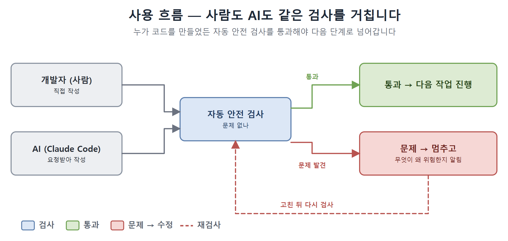

<details>
<summary>Mermaid 코드 (클릭하여 열기)</summary>

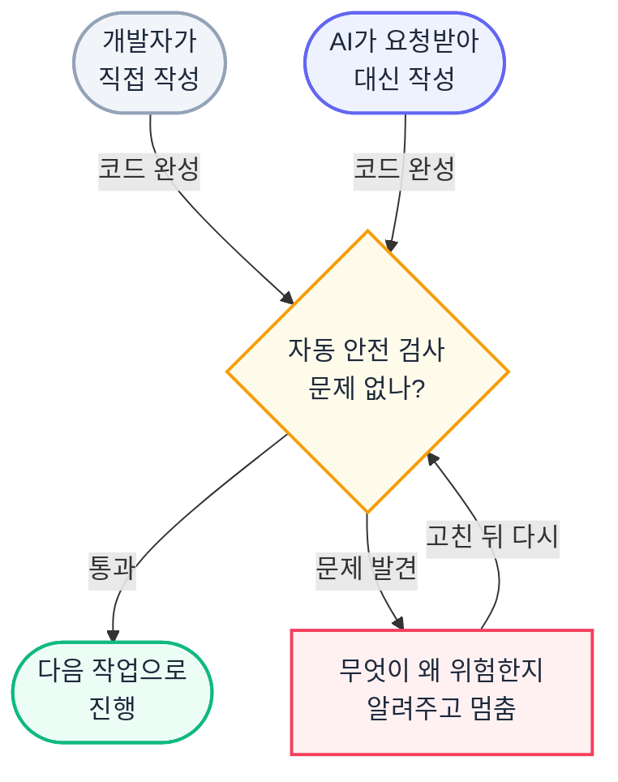
```mermaid
flowchart TD
    DEV(["개발자가<br/>직접 작성"]):::start
    AI(["AI가 요청받아<br/>대신 작성"]):::act

    DEV -->|코드 완성| CHECK
    AI -->|코드 완성| CHECK

    CHECK{"자동 안전 검사<br/>문제 없나?"}:::gate

    CHECK -->|통과| OK(["다음 작업으로<br/>진행"]):::ok
    CHECK -->|문제 발견| FIX["무엇이 왜 위험한지<br/>알려주고 멈춤"]:::stop
    FIX -->|고친 뒤 다시| CHECK

    classDef start fill:#F1F5F9,stroke:#94A3B8,color:#1E293B,stroke-width:2px
    classDef act   fill:#EEF2FF,stroke:#6366F1,color:#1E293B,stroke-width:2px
    classDef ok    fill:#ECFDF5,stroke:#10B981,color:#1E293B,stroke-width:2px
    classDef gate  fill:#FFFBEB,stroke:#F59E0B,color:#1E293B,stroke-width:2px
    classDef stop  fill:#FFF1F2,stroke:#F43F5E,color:#1E293B,stroke-width:2px
    classDef ext   fill:#F0F9FF,stroke:#0EA5E9,color:#1E293B,stroke-width:2px
```

</details>

---

### 4.5 개발 흐름 — AI가 코드를 만들어가는 과정은 어떻게 통제되나

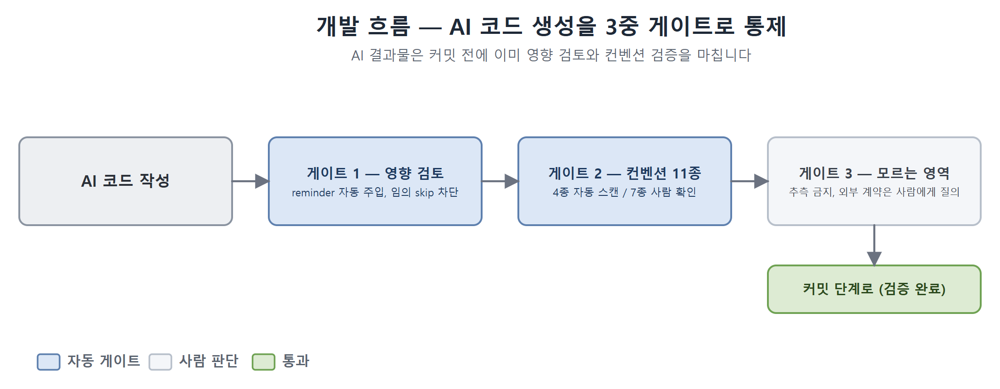

**이 흐름의 핵심 세 가지:**

- **AI가 임의 판단으로 게이트를 건너뛰지 못하도록 정책 레벨에서 강제 알림(reminder)을 자동 주입합니다.** "이 정도면 안전하다"는 임의 판단을 막는 경고(advisory) 단계입니다. 사용자가 명시적으로 "skip"을 말한 경우에만 제외합니다(추후 강제 차단 전환은 별도 cycle).
- **회사 코드 컨벤션 11종 중 4종은 자동 스캔합니다.** TODO 마커, 빈 i18n 메시지 키, hasLength/hasText 혼동, printStackTrace 등 정규식으로 잡을 수 있는 패턴은 저장(커밋) 시점에 자동 검출합니다. 나머지 7종(Null 체크, Stream 재사용 등)은 코드 구조 분석(AST 파싱)이 필요해 사람 확인 게이트로 분리했습니다.
- **AI가 모르는 영역은 사람에게 묻습니다.** 외부 시스템의 실제 계약은 코드만으로 알 수 없으므로, 추측 대신 사용자에게 먼저 확인합니다. 잘못된 가설이 다음 단계로 확장되는 패턴을 차단합니다.

이 흐름 덕분에 AI가 만든 결과물은 커밋 단계(§4.1)에 도달하기 전에 이미 영향 검토와 컨벤션 검증을 마친 상태입니다. AI와 사람이 같은 절차를 거치므로 코드 일관성이 유지되고, 사람 리뷰어 부담도 줄어듭니다.

---

### 4.6 거버넌스 흐름 — 위험도에 따른 세 가지 Tier 분류

검증 시스템 자체에도 변경이 발생합니다. 정책 YAML 한 줄 갱신, 새 hook 추가, 보호 경로 변경은 모두 다른 위험도를 가집니다. 매번 사람이 판단하기보다 **세 가지 Tier 분류**로 나눠 자동/수동 분기를 정해 두었습니다.

#### 세 가지 Tier 분류 (이름만 'Tier'를 공유할 뿐, 서로 독립된 분류입니다)

| 체계 | 분류 기준 | Tier | 처리 방식 |
|------|---------|------|----------|
| **문서 계층** | 보존 중요도 | 0 (최상위 정본) / 1 (진입 인덱스) / 2 (상세 정책) / 3 (이력 감사 기록) | 어떤 문서를 참조해야 하는지 결정 |
| **변경 등급** | 거버넌스 통제 | 1 (자동 허용) / 2 (사람 승인 필요) / 3 (절대 자동 금지) | 검증 시스템 변경 요청이 들어왔을 때 자동, 수동, 차단으로 분기 |
| **자동 수정 신뢰도** | 자동화 안전성 | A (결정론적, 신뢰도 1.0) / B (의도 영향 낮음, 신뢰도 0.95+) / C (수동 검토 필수) | 코드 위반 발견 시 어디까지 자동 수정 적용 |

#### 변경 등급 (Tier 1, 2, 3) 플로우


<details>
<summary>Mermaid 코드 (클릭하여 열기)</summary>

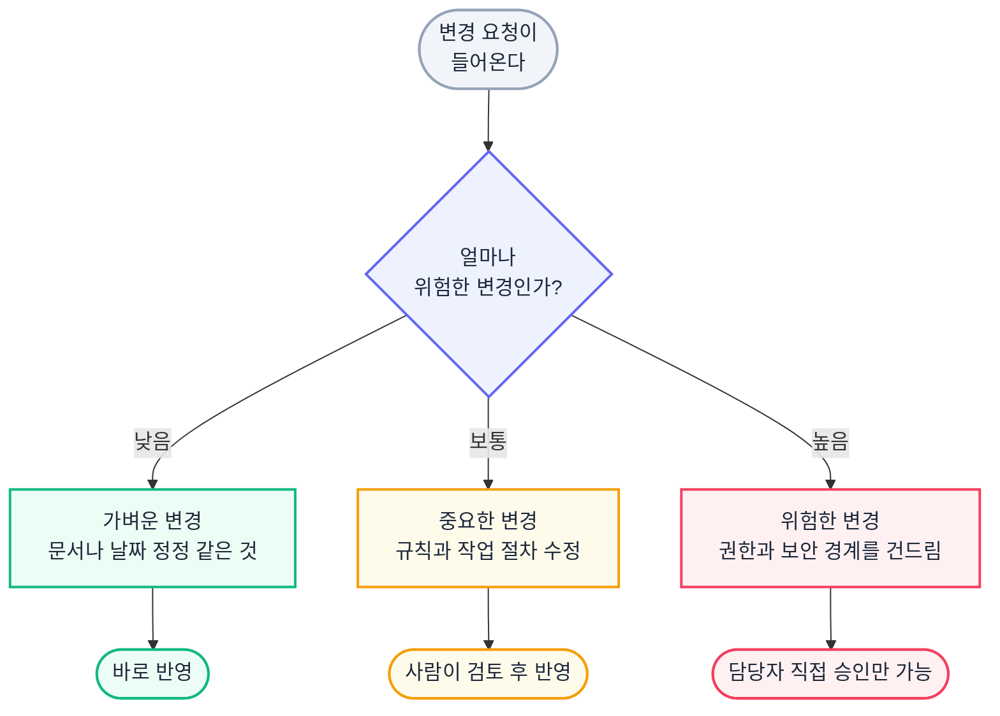
```mermaid
flowchart TD
    START(["변경 요청이<br/>들어온다"]):::start
    JUDGE{"얼마나<br/>위험한 변경인가?"}:::act

    LOW["가벼운 변경<br/>문서나 날짜 정정 같은 것"]:::ok
    MID["중요한 변경<br/>규칙과 작업 절차 수정"]:::gate
    HIGH["위험한 변경<br/>권한과 보안 경계를 건드림"]:::stop

    AUTO(["바로 반영"]):::ok
    HUMAN(["사람이 검토 후 반영"]):::gate
    BLOCK(["담당자 직접 승인만 가능"]):::stop

    START --> JUDGE
    JUDGE -- "낮음" --> LOW --> AUTO
    JUDGE -- "보통" --> MID --> HUMAN
    JUDGE -- "높음" --> HIGH --> BLOCK

    classDef start fill:#F1F5F9,stroke:#94A3B8,color:#1E293B,stroke-width:2px
    classDef act   fill:#EEF2FF,stroke:#6366F1,color:#1E293B,stroke-width:2px
    classDef ok    fill:#ECFDF5,stroke:#10B981,color:#1E293B,stroke-width:2px
    classDef gate  fill:#FFFBEB,stroke:#F59E0B,color:#1E293B,stroke-width:2px
    classDef stop  fill:#FFF1F2,stroke:#F43F5E,color:#1E293B,stroke-width:2px
    classDef ext   fill:#F0F9FF,stroke:#0EA5E9,color:#1E293B,stroke-width:2px
```

</details>

**거버넌스 핵심 원칙 3가지** (2번은 위 표의 "변경 등급", 3번은 "자동 수정 신뢰도" 분류를 가리킵니다):

- **자동과 수동의 경계를 정책 파일로 선언**합니다. 매번 사람이 판단하지 않고 정책 파일 `auto-fix-patterns.yaml`(자동 수정 규칙을 담은 설정)이 자동으로 분기시킵니다.
- **변경 등급 Tier 3(절대 자동 금지)** 은 자동 변경을 아예 시도하지 않습니다. 보호 경로(수정 금지로 지정한 파일, 디렉터리) 제거 같은 위험 변경은 사용자 명시 승인만 가능합니다.
- **자동 수정 신뢰도 Tier B(의도 영향 낮음)** 는 자동 수정하더라도 advisory 보고가 필수입니다. 사람이 다음 작업 전에 보고서로 확인합니다.

이 세 가지 Tier 분류 덕분에 "자동화할 것은 안전하게 자동화하고, 사람 판단이 필요한 것은 명확히 묻고, 절대 자동화하면 안 되는 것은 차단"이 한 시스템 안에서 분리 운영됩니다.

#### 6단계 거버넌스 파이프라인

Tier 2(사람 승인 필요) 변경은 임의로 통과시키지 않고 6단계 파이프라인을 거칩니다. 각 단계는 별도 agent로 구현되어 있으며, **이전 단계와 같은 인스턴스가 다음 단계를 겸할 수 없도록 정책으로 분리합니다**(Author ≠ Reviewer 정책 — AI 지시(프롬프트)에 역할을 분리해 넣는 방식이며, 운영체제나 파일 권한 수준의 기술적 강제는 아님).

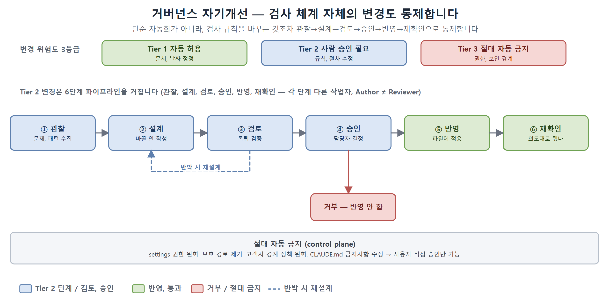

<details>
<summary>Mermaid 코드 (클릭하여 열기)</summary>

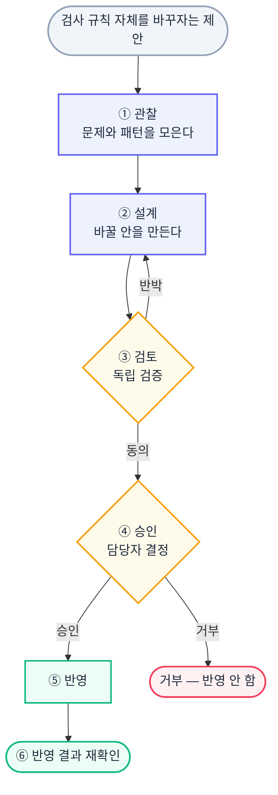
```mermaid
flowchart TD
    REQ(["검사 규칙 자체를 바꾸자는 제안"]):::start
    S1["① 관찰<br/>문제와 패턴을 모은다"]:::act
    S2["② 설계<br/>바꿀 안을 만든다"]:::act
    S3{"③ 검토<br/>독립 검증"}:::gate
    S4{"④ 승인<br/>담당자 결정"}:::gate
    S5["⑤ 반영"]:::ok
    S6(["⑥ 반영 결과 재확인"]):::ok
    REJECT(["거부 — 반영 안 함"]):::stop

    REQ --> S1 --> S2 --> S3
    S3 -- "동의" --> S4
    S3 -- "반박" --> S2
    S4 -- "승인" --> S5 --> S6
    S4 -- "거부" --> REJECT

    classDef start fill:#F1F5F9,stroke:#94A3B8,color:#1E293B,stroke-width:2px
    classDef act   fill:#EEF2FF,stroke:#6366F1,color:#1E293B,stroke-width:2px
    classDef ok    fill:#ECFDF5,stroke:#10B981,color:#1E293B,stroke-width:2px
    classDef gate  fill:#FFFBEB,stroke:#F59E0B,color:#1E293B,stroke-width:2px
    classDef stop  fill:#FFF1F2,stroke:#F43F5E,color:#1E293B,stroke-width:2px
    classDef ext   fill:#F0F9FF,stroke:#0EA5E9,color:#1E293B,stroke-width:2px
```

</details>

**Control plane 보호 대상**: `.claude/settings.json` 권한 완화, `protected-paths.yaml` 보호 경로 제거, 고객사 경계 정책 완화, CLAUDE.md 절대 금지사항 수정.

#### 두 루프 격리 — 제품 루프 vs 하네스 루프

검증 시스템은 두 루프를 완전히 분리해 운영합니다.

| 루프 | Orchestrator | 대상 | 금지 영역 |
|------|-------------|------|-----------|
| **제품 루프** | `wave-coordinator` | `src/`, `resources/` 등 제품 코드 | `.claude/`, `docs/ai/` 수정 (docs-sync-worker 제외) |
| **하네스 루프** | `harness-evolution-coordinator` | `.claude/`, `docs/ai/` 등 검증 자산 | 제품 코드 수정 |

**격리 의도**: 제품 코드 작업이 검증 자산을 의도치 않게 흔들거나, 검증 자산 개선이 제품 코드에 새는 일을 막습니다. 두 루프는 같은 저장소를 쓰지만 작업 대상이 교차하지 않습니다.

---

### 4.7 자동 실행 메커니즘 — git hook이 어떻게 자동으로 코드를 검출하나

지금까지는 시스템의 흐름과 구조를 봤습니다. 이 절에서는 **실제로 git hook(Python 스크립트)이 어떻게 자동 트리거되고 어떤 방법으로 코드를 검출하는지** 기술적 메커니즘을 설명합니다.

#### git hook이란

git이 특정 시점(commit, merge, push 등)에 자동으로 실행하는 스크립트입니다. 저장소의 `.git/hooks/` 디렉터리 안에 있는 실행 파일이 트리거됩니다. bash 스크립트도 가능하고, 여러 검사를 차례로 부르는 실행 스크립트도 가능합니다.

#### 설치 흐름

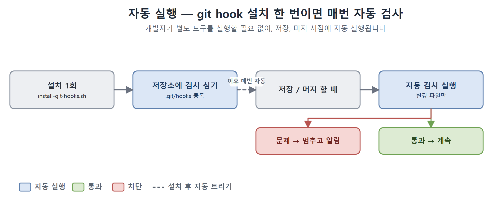

<details>
<summary>Mermaid 코드 (클릭하여 열기)</summary>

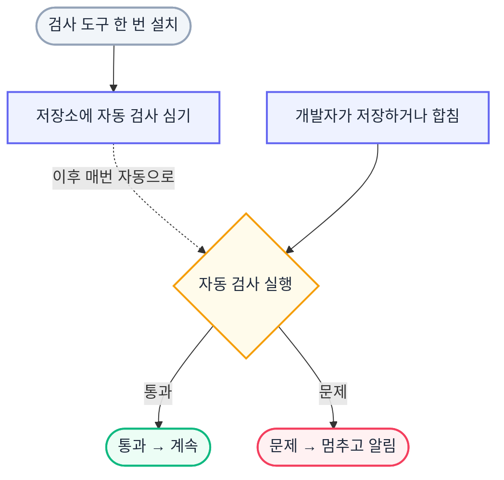
```mermaid
flowchart TD
    INSTALL(["검사 도구 한 번 설치"]):::start
    EMBED["저장소에 자동 검사 심기"]:::act
    WORK["개발자가 저장하거나 합침"]:::act
    AUTO{"자동 검사 실행"}:::gate
    PASS(["통과 → 계속"]):::ok
    FAIL(["문제 → 멈추고 알림"]):::stop

    INSTALL --> EMBED
    EMBED -.->|"이후 매번 자동으로"| AUTO
    WORK --> AUTO
    AUTO -- "통과" --> PASS
    AUTO -- "문제" --> FAIL

    classDef start fill:#F1F5F9,stroke:#94A3B8,color:#1E293B,stroke-width:2px
    classDef act   fill:#EEF2FF,stroke:#6366F1,color:#1E293B,stroke-width:2px
    classDef ok    fill:#ECFDF5,stroke:#10B981,color:#1E293B,stroke-width:2px
    classDef gate  fill:#FFFBEB,stroke:#F59E0B,color:#1E293B,stroke-width:2px
    classDef stop  fill:#FFF1F2,stroke:#F43F5E,color:#1E293B,stroke-width:2px
    classDef ext   fill:#F0F9FF,stroke:#0EA5E9,color:#1E293B,stroke-width:2px
```

</details>

```bash
#!/usr/bin/env bash
# .git/hooks/pre-commit (install-git-hooks.sh가 자동 생성)
# managed-by: scripts/ai/hooks/install-git-hooks.sh

set -e
REPO_ROOT="$(git rev-parse --show-toplevel)"
cd "${REPO_ROOT}"

fail=0

# 9개 Python hook을 순차 호출
if [[ -f scripts/ai/hooks/pre_commit_policy.py ]]; then
    python3 scripts/ai/hooks/pre_commit_policy.py || fail=$?
fi

if [[ -f scripts/ai/hooks/pre_commit_harness_drift.py ]]; then
    python3 scripts/ai/hooks/pre_commit_harness_drift.py || fail=$?
fi

if [[ -f scripts/ai/hooks/pre_commit_scheduler_guard.py ]]; then
    python3 scripts/ai/hooks/pre_commit_scheduler_guard.py || fail=$?
fi

if [[ -f scripts/ai/hooks/pre_commit_view_sync_cron_guard.py ]]; then
    python3 scripts/ai/hooks/pre_commit_view_sync_cron_guard.py || true  # advisory
fi

# ... (총 9개)

exit $fail
```

**이 실행 스크립트가 핵심**입니다. 동작 원리:

- **순차 실행**: 9개 Python hook을 위에서 아래로 하나씩 실행
- **차단 모드 (`|| fail=$?`)**: Python hook이 실패하면 fail 변수에 종료 코드 저장. 마지막 `exit $fail`로 git에 전달되어 커밋 차단
- **advisory 모드 (`|| true`)**: Python hook이 실패해도 fail 변수에 저장하지 않음. 경고만 출력하고 커밋 진행
- **신규 hook 추가**: install-git-hooks.sh에 한 줄 추가만 하면 다음 설치부터 자동 포함

post-merge 실행 스크립트도 같은 패턴입니다. 4개 Python hook을 모두 advisory(`|| true`)로 호출해 머지 후에는 차단 없이 보고서만 생성합니다.

```bash
# .git/hooks/post-merge (install-git-hooks.sh가 자동 생성)
python3 scripts/ai/hooks/post_merge_gap_check.py || true
python3 scripts/ai/hooks/post_merge_incoming_review.py || true
python3 scripts/ai/hooks/post_merge_remeasure.py || true
python3 scripts/ai/hooks/post_merge_harness_snapshot.py || true
```

**개발자가 처음 한 번만 `install-git-hooks.sh`를 실행**하면, 이후 모든 git commit, merge, push가 위 실행 스크립트를 거치므로 29개 Python hook이 적절한 시점에 자동 실행됩니다. 신규 hook을 추가해도 `install-git-hooks.sh`를 다시 실행만 하면 실행 스크립트가 갱신됩니다.

#### 코드 검출 메커니즘 3가지

Python hook이 실제로 코드 위반을 잡는 방법은 세 가지로 분류됩니다.

**1. 정규식 매칭** (가장 단순, 가장 많이 쓰임)

특정 텍스트 패턴을 찾는 방법. import 패턴, 어노테이션, 메시지 키 등 텍스트로 표현되는 패턴에 적합합니다.

```python
# 실제 코드 예시 (post_merge_incoming_review.py)

SCHEDULED_ANNOTATION = re.compile(r"^\s*@(?:[\w.]+\.)?Scheduled\s*\(")
EMPTY_I18N_KEY      = re.compile(r'getMessage\(\s*""\s*[,)]')
HASLENGTH_USAGE     = re.compile(r"\bStringUtils\.hasLength\s*\(")
TODO_COMMENT        = re.compile(r"//\s*(?:TODO|todo|note\.|추후|임시)\b")
JS_KOREAN_LITERAL   = re.compile(r"""(['"])([^'"\n]*?[가-힣][^'"\n]*?)\1""")
```

**2. 중괄호 매칭 (brace matching)** — 메서드 본문 추출

정규식만으로는 어노테이션 위치까지만 알 수 있습니다. 메서드 본문 안에 try 블록이 있는지 확인하려면 `{`와 `}` 짝을 세어 본문을 추출해야 합니다.

```python
# 실제 코드 흐름 (의사 코드)

for match in SCHEDULED_ANNOTATION.finditer(content):
    # 1. @Scheduled 어노테이션 위치 찾기
    start = match.end()
    
    # 2. 다음 '{' 찾기 (메서드 본문 시작)
    brace_open = content.find('{', start)
    
    # 3. depth 카운트로 짝 맞는 '}' 찾기
    depth = 1
    pos = brace_open + 1
    while depth > 0:
        if content[pos] == '{': depth += 1
        elif content[pos] == '}': depth -= 1
        pos += 1
    
    # 4. 메서드 본문 추출
    method_body = content[brace_open:pos]
    
    # 5. try 블록 존재 확인
    if not TRY_BLOCK.search(method_body):
        violations.append({"severity": "high", ...})
```

**3. 파일 비교 (git diff)**

검사 대상을 좁히기 위해 git이 알려주는 변경 파일만 검사합니다.

```python
# staged 파일만 추출 (pre-commit 시점)
staged = subprocess.run(
    ["git", "diff", "--cached", "--name-only"],
    capture_output=True
).stdout.split()

# staged 내용 읽기 (working tree가 아닌 staged 버전)
for filepath in staged:
    content = subprocess.run(
        ["git", "show", f":{filepath}"],
        capture_output=True
    ).stdout

# 머지 직후 변경 파일 추출 (post-merge 시점)
changed = subprocess.run(
    ["git", "diff", "--name-only", "--diff-filter=AM", f"{base}..{head}"],
    capture_output=True
).stdout.split()
```

#### 실제 사례 추적 — 스케줄러 try-catch 누락 검출

위 세 가지가 어떻게 결합되어 한 위반을 잡는지 추적합니다.

```
[개발자가 git commit 실행]
   │
   ▼
[git이 .git/hooks/pre-commit 자동 실행]
   │
   ▼
[pre_commit_scheduler_guard.py 트리거됨]
   │
   ▼
[1단계: git diff --cached로 staged Java 파일 추출]
   │  결과: ['NewScheduler.java']
   ▼
[2단계: 각 파일 내용을 git show :NewScheduler.java로 읽기]
   │
   ▼
[3단계: SCHEDULED_ANNOTATION 정규식으로 @Scheduled 위치 찾기]
   │  결과: line 42, line 78
   ▼
[4단계: 각 위치에서 brace matching으로 메서드 본문 추출]
   │  line 42 본문: { ... someWork(); ... }
   │  line 78 본문: { try { ... } catch (...) { ... } }
   ▼
[5단계: TRY_BLOCK 정규식으로 try 존재 확인]
   │  line 42: try 없음 → 위반 발견
   │  line 78: try 있음 → 통과
   ▼
[6단계: 위반 발견 시 stderr에 advisory 메시지 출력]
   │  "[ADVISORY] line 42 @Scheduled 메서드에 try-catch 없음"
   ▼
[종료 코드 0 반환 → 커밋은 진행 (advisory 모드)]
```

이 흐름이 `pre_commit_scheduler_guard.py` 파일에 약 150줄로 구현되어 있습니다. 핵심은 **git이 트리거 → Python이 분석 → 결과를 종료 코드와 stderr로 git에 돌려줌**입니다. git은 종료 코드만 보고 커밋을 진행할지 차단할지 결정합니다.

#### 왜 이 메커니즘이 효과적인가

- **개발자가 별도 도구를 실행할 필요 없음**: git commit만 하면 자동 트리거
- **빠름**: staged 파일만 검사하므로 전체 빌드, 테스트보다 가볍고 빠름 (변경분만 스캔)
- **확장 가능**: 새 검사가 필요하면 Python 함수만 추가 (Java 컴파일러 통합 불필요)
- **정책 변경에 강함**: 검사 로직(.py)과 정책 데이터(.yaml)가 분리되어 정책만 갱신하면 됨

---

### 4.8 AI 협업 워크플로우 — 사용자가 AI를 어떻게 호출하나

지금까지는 시스템이 작동한 후의 흐름이었습니다. 이 절에서는 **그 앞 단계** — 사용자가 AI에게 입력을 주는 순간부터 AI가 109개 자산(agent 50 + skill 59) 중 무엇을 골라 쓰는지까지의 라우팅 흐름을 다룹니다.

#### 사용자 입력에서 작업 완료까지 — 전체 흐름

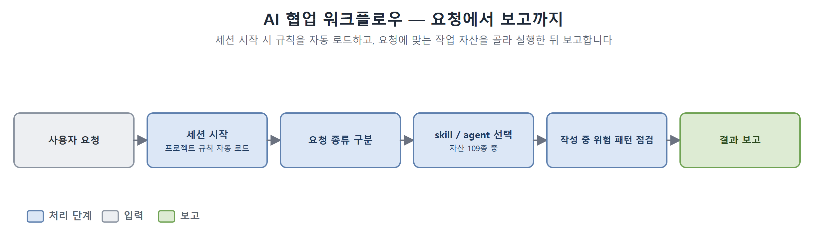

<details>
<summary>Mermaid 코드 (클릭하여 열기)</summary>

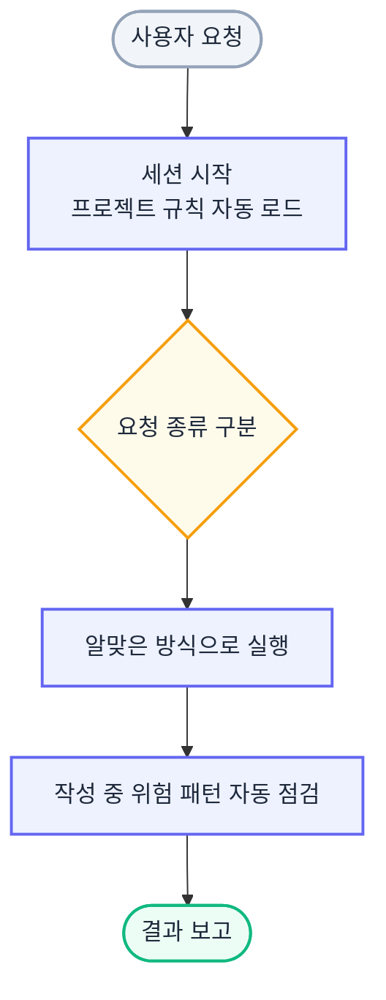
```mermaid
flowchart TD
    INPUT(["사용자 요청"]):::start
    SESS["세션 시작<br/>프로젝트 규칙 자동 로드"]:::act
    CLASS{"요청 종류 구분"}:::gate
    RUN["알맞은 방식으로 실행"]:::act
    CHECK["작성 중 위험 패턴 자동 점검"]:::act
    REPORT(["결과 보고"]):::ok

    INPUT --> SESS --> CLASS --> RUN --> CHECK --> REPORT

    classDef start fill:#F1F5F9,stroke:#94A3B8,color:#1E293B,stroke-width:2px
    classDef act   fill:#EEF2FF,stroke:#6366F1,color:#1E293B,stroke-width:2px
    classDef ok    fill:#ECFDF5,stroke:#10B981,color:#1E293B,stroke-width:2px
    classDef gate  fill:#FFFBEB,stroke:#F59E0B,color:#1E293B,stroke-width:2px
    classDef stop  fill:#FFF1F2,stroke:#F43F5E,color:#1E293B,stroke-width:2px
    classDef ext   fill:#F0F9FF,stroke:#0EA5E9,color:#1E293B,stroke-width:2px
```

</details>

```yaml
---
name: analyze-new-requirement
description: PO나 기획자의 새 요구사항을 받아 영향 범위와 변경 명세를 분석한다.
when_to_use: 사용자가 "요구사항 분석", "신규 기능 검토" 등을 요청할 때
argument-hint: <요구사항 텍스트>
user-invocable: true
disable-model-invocation: false
allowed-tools: [Read, Grep, Glob, Bash]
---
```

- `when_to_use`로 AI가 자동 매칭
- `user-invocable: true`면 사용자가 `/skill-name`으로 직접 호출 가능
- `disable-model-invocation: true`면 AI 자동 호출 금지 (위험한 작업, 사용자 명시 호출만 허용)
- `allowed-tools`로 권한 제한

#### 세션 시작 — 컨텍스트 자동 주입

Claude Code 세션 시작 시점에 `session_start.py` hook이 자동 실행되어, 사용자가 첫 입력을 주기 전부터 AI가 다음 정보를 가지고 있게 합니다.

| 자동 로드 항목 | 출처 | 효과 |
|---------------|------|------|
| 프로젝트 정체성 | `CLAUDE.md` (Tier 0 정본) | 빌드 명령, 보호 경로, 절대 금지사항 |
| 현재 고객사 컨텍스트 | git branch 파싱 (`고객사B-*`, `고객사A-*` 등) | 고객사별 Spring profile, 컨벤션, 보호 영역 |
| 저장소 facts | `collect_repo_facts.py` (TTL 1시간 캐시) | 모듈 수, 클래스 수, 변경 이력 |
| 검증 자산 무결성 | `.claude/` 디렉터리 구조 점검 | 자산 누락 시 advisory |

이 자동 주입 덕분에 AI는 매 세션마다 "이 저장소가 무엇인지, 어떤 고객사 컨텍스트인지, 어떤 자산이 있는지"를 처음부터 안 상태로 작업을 시작합니다. 사용자가 매번 컨텍스트를 설명할 필요가 없습니다.

#### 워크플로우 운영의 핵심 효과

- **AI가 자산을 명시적으로 호출하므로 추적 가능** — 어떤 skill이나 agent가 사용됐는지 로그에 남음
- **신규 자산 추가가 즉시 적용** — SKILL.md 한 파일 추가만으로 다음 세션부터 사용 가능
- **사용자 호출 vs AI 자동 호출 분리** — 위험한 작업은 `disable-model-invocation: true`로 사용자 명시 호출만 허용

#### 멀티에이전트 오케스트레이션 — 50개 AI 작업자를 병렬로, 역할로 나눠

여기서 "작업자"는 **사람 개발자가 아니라, 메인 AI가 부리는 하위 AI**입니다. agent 50개는 각자 역할이 다른 전문 AI 작업자입니다(백엔드 리팩토링, 경계 리뷰, 마이그레이션 등). 큰 작업이 들어오면 **메인 세션(AI 오케스트레이터)이 서로 독립적인 일을 여러 AI 작업자에게 동시에 맡깁니다.**

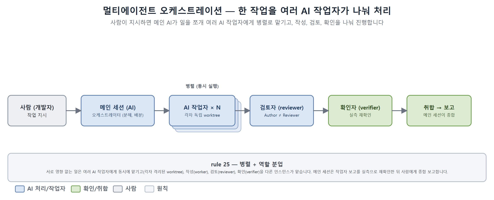

- **병렬 디스패치**: 서로 영향을 주지 않는 작업은 여러 작업자가 동시에 처리합니다. 각 작업자는 격리된 작업 공간(worktree)에서 돌아 파일 충돌이 없습니다(rule 25).
- **역할 분업**: 작성(worker) → 검토(reviewer) → 확인(verifier)을 서로 다른 인스턴스가 맡습니다. 작성한 인스턴스가 자기 작업을 검토할 수 없습니다(Author ≠ Reviewer).
- **실측 재확인**: 메인 세션은 작업자의 "완료" 보고를 그대로 믿지 않고, 직접 파일과 테스트로 결과를 다시 확인합니다(rule 25 R7 — 작업자 환각 방지).
- **취합과 보고**: 결과는 메인 세션이 모아 사용자에게 보고하고, 사용자는 메인 세션하고만 대화합니다.
- 오케스트레이터는 둘로 나뉩니다 — `wave-coordinator`(제품 코드 작업), `harness-evolution-coordinator`(검증 자산 개선).

실제로 이 포트폴리오의 도식 검수도 작업자 17개를 병렬로 띄워 각자 한 도식씩 점검하게 한 결과입니다.

---

## 5. 핵심 해결 과정 5개

각 항목은 같은 7단계로 설명합니다.

1. 어떤 문제가 있었는가
2. 어떤 선택지를 검토했는가
3. 왜 이 방식을 골랐는가
4. 어떤 기준이나 구조를 만들었는가
5. 어느 시점에 자동으로 검증되는가
6. 실패하면 어떻게 처리되는가
7. 결과적으로 무엇이 줄었거나 명확해졌는가

만든 결과만 보면 한 가지 답을 골랐던 것처럼 보입니다. 실제로는 여러 대안을 비교한 결과입니다. "검토한 선택지"와 "왜 이 방식"을 같이 적어 그 판단 과정을 드러냅니다.

---

### 5.1 검증 의도와 데이터의 분리

**1) 어떤 문제가 있었는가**

사고 패턴을 검증 코드 안에 직접 박으면, 신규 고객사를 추가할 때마다 검증 코드 자체를 수정해야 했습니다. 21명이 같이 쓰는 환경에서는 검증 코드를 한 번 바꾸면 모든 사람에게 영향이 가서, 신중하게 다뤄야 하는 만큼 변경 속도가 느려졌습니다. 예를 들어 "한 고객사용 분기가 다른 고객사에 새지 않도록 막는다"는 규칙을 if-else로 박아두면, 새 고객사가 들어올 때마다 그 if-else를 수정해야 합니다.

**2) 검토한 선택지**

- (a) 정책 파일 없이 검증 코드에 if-else로 직접 조건 작성
- (b) 일반 정적 분석 도구(SonarQube)의 custom rule로 표현
- (c) 검증 의도(.md) / 데이터(.yaml) / 실행(.py) 3계층 분리 — **채택**

**3) 왜 이 방식을 선택했는가**

(a)는 신규 고객사가 들어올 때마다 검증 코드를 수정해야 해서 모든 기여자 환경에 영향을 줍니다. (b)는 SonarQube custom rule이 이 제품 고유 정책(고객사 경계, 외부 계약)을 표현하기 어렵고, 정책 갱신 시 도구를 다시 빌드해야 합니다. (c) 3계층 분리는 YAML 한 블록 추가만으로 즉시 적용되고 검증 코드 자체는 건드리지 않아 다른 기여자 환경에 영향이 없습니다.

**4) 내가 만든 기준 / 구조**

검증의 의도는 규칙 문서(.md)에, 데이터는 정책 파일(.yaml)에, 실행은 git hook(.py)에 분리했습니다.

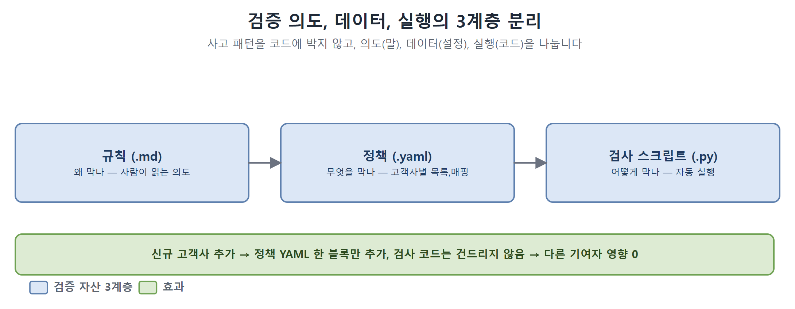

<details>
<summary>Mermaid 코드 (클릭하여 열기)</summary>

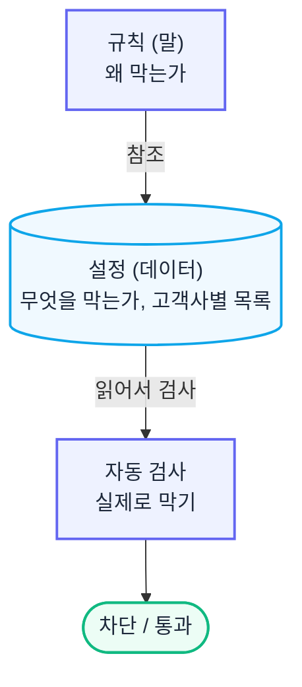
```mermaid
flowchart TD
    INTENT["규칙 (말)<br/>왜 막는가"]:::act
    DATA[("설정 (데이터)<br/>무엇을 막는가, 고객사별 목록")]:::ext
    CHECK["자동 검사<br/>실제로 막기"]:::act
    RESULT(["차단 / 통과"]):::ok

    INTENT -->|"참조"| DATA
    DATA -->|"읽어서 검사"| CHECK
    CHECK --> RESULT

    classDef start fill:#F1F5F9,stroke:#94A3B8,color:#1E293B,stroke-width:2px
    classDef act   fill:#EEF2FF,stroke:#6366F1,color:#1E293B,stroke-width:2px
    classDef ok    fill:#ECFDF5,stroke:#10B981,color:#1E293B,stroke-width:2px
    classDef gate  fill:#FFFBEB,stroke:#F59E0B,color:#1E293B,stroke-width:2px
    classDef stop  fill:#FFF1F2,stroke:#F43F5E,color:#1E293B,stroke-width:2px
    classDef ext   fill:#F0F9FF,stroke:#0EA5E9,color:#1E293B,stroke-width:2px
```

</details>

**5) 어느 시점에서 자동으로 검증되는가**

정책 파일(.yaml)을 읽어 검사 스크립트(.py)가 커밋, 머지 시점에 실행됩니다. 규칙 문서(.md)는 사람이 판단할 때 근거로 참조합니다.

**6) 실패하면 어떻게 처리되는가**

정책에 아직 선언되지 않은 새 경계는 검출되지 않습니다. 이때는 사례로 기록한 뒤 정책 YAML에 한 블록을 추가하면, 검사 코드 수정 없이 다음부터 잡힙니다.

**7) 결과적으로 무엇이 줄었는가**

신규 고객사나 규칙을 추가할 때 변경 파일이 1~2개로 끝나고 검사 코드 자체는 건드리지 않습니다. 여러 사람이 공유하는 환경에서 검증 코드 변경으로 인한 충돌이 줄었습니다.

---

### 5.2 변경 영향 미리보기 — 쓰기 전에 영향부터 본다

**1) 어떤 문제가 있었는가**

AI는 코드를 바로 고치기 시작하면 "이 정도면 안전하다"고 혼자 판단하고 직진하는 경향이 있습니다. 여러 고객사가 한 코드베이스를 공유하는 구조에서는, 한 파일 변경이 어느 고객사로 퍼지는지 미리 보지 않으면 사고가 배포까지 흘러갑니다.

**2) 검토한 선택지**

- (a) 변경한 뒤 코드 리뷰에서 영향 확인
- (b) 영향 분석 없이 바로 구현하고 문제가 생기면 대응
- (c) 코드 작성 전에 영향 프리뷰를 강제 — **채택**

**3) 왜 이 방식을 선택했는가**

(a)는 이미 코드를 다 쓴 뒤라 되돌리는 비용이 크고, (b)는 사고를 배포 후에야 발견합니다. (c)는 가장 싼 시점(작성 전)에 영향을 드러내, 방향이 잘못됐으면 구현을 시작하기 전에 멈출 수 있습니다.

**4) 내가 만든 기준 / 구조**

변경 키워드("추가", "수정", "리팩토링" 등)가 감지되면 구현 전에 5개 항목 — 영향 모듈 / 영향 고객사 / 함께 바뀔 것 / 리스크 top3 / 진행 확인 — 을 강제로 정리하게 했습니다. 사용자 입력 시점 hook이 이 프리뷰를 reminder로 주입합니다. 큰 작업이 하위 작업으로 쪼개지면 각 하위 작업 시작마다 다시 실행해, 처음엔 안 보이던 추가 범위를 일찍 감지합니다. 코드를 읽거나 쓰는 작업이면 의심 패턴 11종(null 누락, Stream 재사용, 빈 i18n 키, hasLength/hasText 혼동, TODO 마커 등)도 함께 스캔합니다.

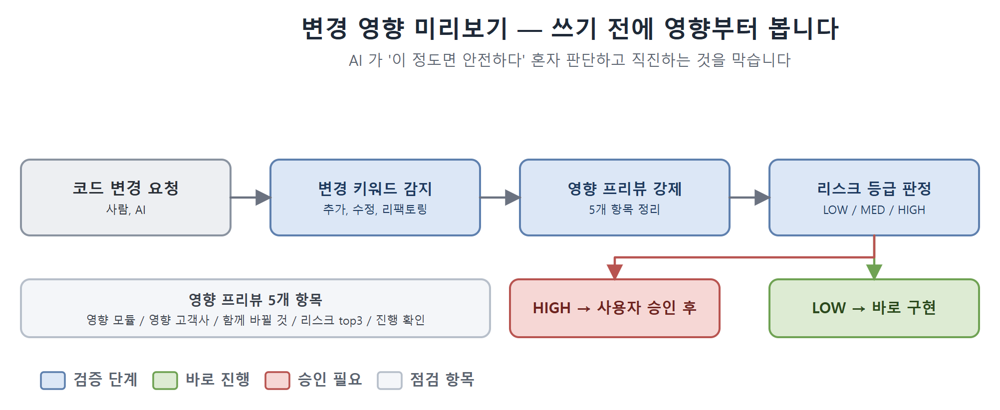

**5) 어느 시점에서 자동으로 검증되는가**

사용자가 변경 요청을 입력하는 즉시(UserPromptSubmit hook). 구현 단계로 들어가기 직전입니다.

**6) 실패하면 어떻게 처리되는가**

advisory 단계입니다. 리스크가 LOW면 바로 구현, MED면 선택지 비교를 먼저, HIGH면 영향 브리핑을 쓰고 사용자 승인을 받습니다. 5개 항목 중 하나라도 못 채우면 게이트를 통과하지 못합니다("영향 모듈 불명"은 허용되지 않음). 사용자가 "그냥 진행"을 명시하면 건너뜁니다.

**7) 결과적으로 무엇이 줄었는가**

영향 범위를 모른 채 구현으로 직진하는 패턴이 차단됐고, AI가 "이 정도면 안전하다"고 임의 판단하던 케이스가 게이트에서 막힙니다.

---

### 5.3 커밋 단계 고객사 경계 자동 감지

**1) 어떤 문제가 있었는가**

공통 코드에 `if (profile == "고객사B")` 같은 고객사 분기가 섞이면 여러 고객사 모두에 전파되어, 다른 고객사 배포에서 의도치 않은 동작을 일으켰습니다. PR 후반에서야 다른 고객사 담당자가 발견하면 이미 검증 비용이 크게 쌓여 있는 상태였습니다.

또한 시크릿 노출(API 키, 토큰, AWS 자격, DB 비밀번호)이 코드에 그대로 들어가 커밋되면, 한 번 git history에 남는 순간 키 교체(rotation) 전까지 영구 노출 위험이 있습니다.

**2) 검토한 선택지**

- (a) CI 단계 검증 (PR 빌드 시 경계 검사)
- (b) 위반 발견 시 자동 수정 (코드 자동 변경)
- (c) git hook 기반 커밋 단계 차단 — **채택**

**3) 왜 이 방식을 선택했는가**

(a)는 PR이 이미 올라간 후라 검증 비용이 누적된 시점이고, 잘못된 변경을 되돌리는 데 사람 비용이 들어갑니다. (b)는 고객사 경계처럼 비즈니스 의도가 들어간 영역은 자동 추론이 불가능해 잘못 수정하면 기존 동작이 다시 깨지는 사고(이하 "회귀 사고")가 더 큽니다. (c) git hook은 staged 파일만 검사해 작업 흐름에 영향이 가장 적고, 발견 시점이 가장 빠르며(아직 일어나지 않은 변경), 시크릿 노출처럼 명백한 위반은 강제 차단까지 할 수 있습니다.

**4) 내가 만든 기준 / 구조**

여러 고객사 × 3개 plugin × 15개 모듈의 매핑을 정책 파일에 선언하고, 커밋 직전 hook이 변경 파일이 경계를 침범하는지 검사합니다. 같은 hook이 시크릿 노출과 보호 경로 변경도 함께 검사합니다.

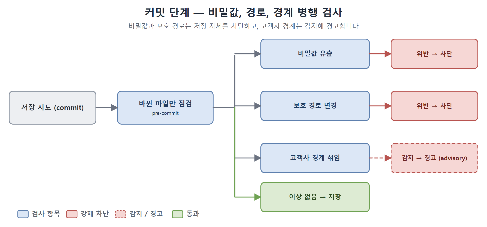

<details>
<summary>Mermaid 코드 (클릭하여 열기)</summary>

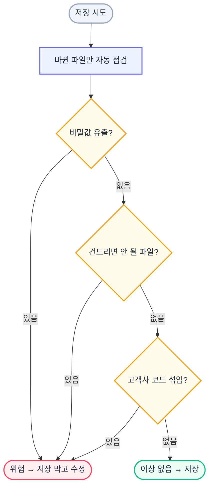
```mermaid
flowchart TD
    COMMIT(["저장 시도"]):::start
    SCAN["바뀐 파일만 자동 점검"]:::act
    C1{"비밀값 유출?"}:::gate
    C2{"건드리면 안 될 파일?"}:::gate
    C3{"고객사 코드 섞임?"}:::gate
    BLOCK(["위험 → 저장 막고 수정"]):::stop
    PASS(["이상 없음 → 저장"]):::ok

    COMMIT --> SCAN --> C1
    C1 -- "있음" --> BLOCK
    C1 -- "없음" --> C2
    C2 -- "있음" --> BLOCK
    C2 -- "없음" --> C3
    C3 -- "있음" --> BLOCK
    C3 -- "없음" --> PASS

    classDef start fill:#F1F5F9,stroke:#94A3B8,color:#1E293B,stroke-width:2px
    classDef act   fill:#EEF2FF,stroke:#6366F1,color:#1E293B,stroke-width:2px
    classDef ok    fill:#ECFDF5,stroke:#10B981,color:#1E293B,stroke-width:2px
    classDef gate  fill:#FFFBEB,stroke:#F59E0B,color:#1E293B,stroke-width:2px
    classDef stop  fill:#FFF1F2,stroke:#F43F5E,color:#1E293B,stroke-width:2px
    classDef ext   fill:#F0F9FF,stroke:#0EA5E9,color:#1E293B,stroke-width:2px
```

</details>

**5) 어느 시점에서 자동으로 검증되는가**

커밋 직전(pre-commit) 자동 실행. 변경이 코드 이력에 들어가기 전입니다.

**6) 실패하면 어떻게 처리되는가**

비밀값과 보호 경로 위반은 저장 자체를 차단합니다. 고객사 경계 침범은 감지해 경고하되(advisory) 저장은 막지 않습니다. 위반을 고친 뒤 다시 커밋합니다.

**7) 결과적으로 무엇이 줄었는가**

시크릿 노출과 경계 침범이 git 이력에 남기 전에 잡힙니다. PR 후반에야 발견하던 비용을 커밋 시점으로 앞당겼습니다.

---

### 5.4 머지 후 자동 점검 — 합친 직후 7종을 보고한다

**1) 어떤 문제가 있었는가**

다른 사람 코드를 합치면(merge) 빠진 안전장치나 중복, 컨벤션 위반이 함께 들어옵니다. 사람이 매번 눈으로 잡기 어렵고, 놓치면 다음 작업이 그 위에서 진행됩니다.

**2) 검토한 선택지**

- (a) 머지 후 사람이 수동으로 전수 검토
- (b) 위반 발견 시 자동 수정
- (c) 머지 직후 자동 점검 + 보고서 — **채택**

**3) 왜 이 방식을 선택했는가**

(a)는 누락 위험이 크고, (b)는 비즈니스 의도가 들어간 영역을 잘못 고치면 더 큰 회귀 사고가 납니다. (c)는 이미 머지된 변경이라 차단은 못 하지만, 빠진 것을 사람 검토 전에 보고서로 드러냅니다.

**4) 내가 만든 기준 / 구조**

머지, pull, rebase 직후 실행되는 post-merge hook이 7종(스케줄러 안전장치 누락, 의심 패턴, Flyway 중복, i18n 등)을 자동 점검해 보고서를 만듭니다.

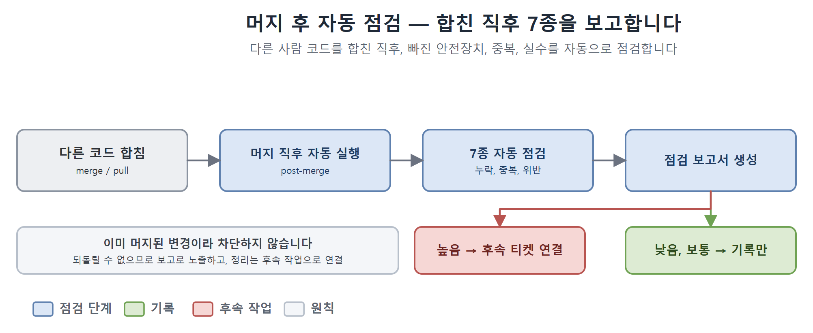

**5) 어느 시점에서 자동으로 검증되는가**

`git merge`, `git pull`, `git rebase` 직후 자동 실행. 사람이 다음 작업을 시작하기 전입니다.

**6) 실패하면 어떻게 처리되는가**

- 위반 없음: "이상 없음" 보고서로 종료
- 낮음, 보통 위반: 보고서에 기록만 (정보 제공)
- 높음 위반: 보고서 + 후속 작업 티켓으로 자동 연결 (정리 책임 명시)
- 차단은 하지 않음 — 이미 일어난 머지를 되돌릴 수 없으므로

**7) 결과적으로 무엇이 줄었는가**

머지로 들어온 위반이 사람 검토 전에 보고서로 자동 노출됩니다. 정리 책임을 후속 티켓으로 명시하므로 위반이 보고서에만 남아 잊히는 일이 줄었습니다.

---

### 5.5 외부 시스템 계약 사람 확인 게이트

**1) 어떤 문제가 있었는가**

AI가 작성한 코드의 외부 시스템 연동 정의(Jenkins 파이프라인이 받는 작업 종류 목록, VMware와 OpenStack의 API 경로, GitLab CI 작업 이름 등)가 외부 시스템 실제 지원과 어긋난 채 머지된 사례가 있었습니다.

대표 사례: `CustomActionPhaseType.DAY_1 = [PRE_OS]`로 정의된 enum이 실제 Jenkins 파이프라인은 `{redfish, linux, windows, esxi}`를 지원하고 있어 운영 환경에서 장애로 노출됐습니다. AI는 코드만 보고 가설을 확장하면서 3턴 추론을 거쳤습니다. 마지막에 사용자가 외부 계약을 알려주면서야 진짜 원인이 드러나는 패턴이 반복됐습니다.

이런 영역은 코드만으로 답할 수 없습니다. 외부 시스템 운영자만 정답을 알기 때문입니다.

**2) 검토한 선택지**

- (a) AI가 코드 추론으로 외부 계약을 추측 (기존 패턴)
- (b) 외부 시스템 문서 자동 크롤링 + 동기화
- (c) 사람 확인 게이트 (외부 enum 관여 시 사용자 질의) — **채택**

**3) 왜 이 방식을 선택했는가**

(a)는 외부 시스템 실제 동작과 어긋날 위험이 크고, AI가 추정을 실측으로 격상해 잘못된 가설을 확장하는 패턴이 발생했습니다(대표 사례에서 3턴 소요, 통계적 표본 아님). (b)는 외부 시스템마다 문서 형식이 다르고, 더 큰 문제는 운영자만 아는 비공식 변경(파이프라인 직접 수정 등)을 잡을 수 없습니다. (c) 사람 확인 게이트는 운영자가 실제 동작을 알고 있어 추측 오류가 없고, 대표 사례에서 1턴에 결론이 났습니다. 자동화하지 않는 것이 더 빠른 영역입니다.

**4) 내가 만든 기준 / 구조**

외부 시스템 연동 정의가 관여하는 작업은 **코드 추론을 시작하지 말고 사용자에게 외부 계약을 먼저 질의**하는 절차를 도입했습니다.

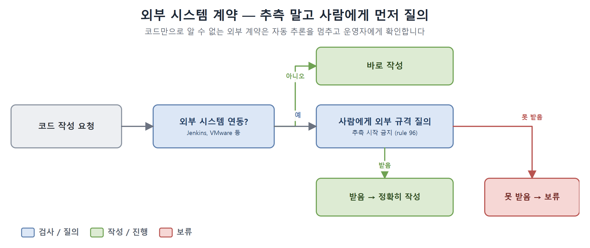

<details>
<summary>Mermaid 코드 (클릭하여 열기)</summary>

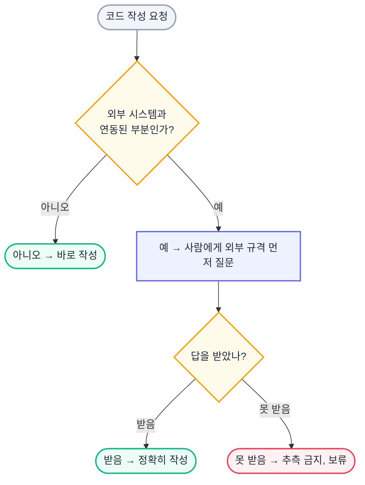
```mermaid
flowchart TD
    REQ(["코드 작성 요청"]):::start
    JUDGE{"외부 시스템과<br/>연동된 부분인가?"}:::gate
    NO(["아니오 → 바로 작성"]):::ok
    ASK["예 → 사람에게 외부 규격 먼저 질문"]:::act
    ANS{"답을 받았나?"}:::gate
    RESOLVED(["받음 → 정확히 작성"]):::ok
    HOLD(["못 받음 → 추측 금지, 보류"]):::stop

    REQ --> JUDGE
    JUDGE -- "아니오" --> NO
    JUDGE -- "예" --> ASK --> ANS
    ANS -- "받음" --> RESOLVED
    ANS -- "못 받음" --> HOLD

    classDef start fill:#F1F5F9,stroke:#94A3B8,color:#1E293B,stroke-width:2px
    classDef act   fill:#EEF2FF,stroke:#6366F1,color:#1E293B,stroke-width:2px
    classDef ok    fill:#ECFDF5,stroke:#10B981,color:#1E293B,stroke-width:2px
    classDef gate  fill:#FFFBEB,stroke:#F59E0B,color:#1E293B,stroke-width:2px
    classDef stop  fill:#FFF1F2,stroke:#F43F5E,color:#1E293B,stroke-width:2px
    classDef ext   fill:#F0F9FF,stroke:#0EA5E9,color:#1E293B,stroke-width:2px
```

</details>

또한 외부 enum 관여 여부 판정 대상은 Jenkins, VMware, GitLab, OpenStack, Ansible, Harbor 등이며, `*Type`, `*Phase`, `*Target` 패턴으로 정의됩니다.

자동화로 풀 수 있는 영역(의심 패턴 11종 — null 누락, 빈 i18n 메시지, hasLength/hasText 혼동, TODO 마커 등)은 자동 검출하되, 외부 계약처럼 코드만으로 알 수 없는 영역은 사람 게이트로 분리합니다. 외부 계약 영역은 자동 수정도 금지합니다 — 잘못 수정하면 운영 사고가 더 크기 때문입니다.

머지 후 자동 점검에서 외부 enum의 origin 주석을 강제하던 검사 c는 rule 96 R1(origin 주석 의무) 폐기와 함께 비활성화했습니다(현재 빈 결과 반환). 외부 enum 변경의 영향 범위(i18n 키, Flyway CHECK 제약, 화면 라벨, plugin 이벤트) 확인은 자동 추론 대신 사람 질의 게이트(rule 96 R2/R3/R4)로 처리합니다 — 코드만으로는 정답을 알 수 없는 영역이기 때문입니다.

**5) 어느 시점에서 자동으로 검증되는가**

- 코드 작성 전: 외부 시스템 enum이 관여하는 작업에서 사용자 질의 게이트
- 머지 후: 외부 enum origin 자동 검사(검사 c)는 폐기되어 비활성. 영향 범위 확인은 사람 질의 게이트로 처리

**6) 실패하면 어떻게 처리되는가**

- 사용자 답변을 받으면 1턴에 결론
- 답변을 못 받으면 결론을 "추정" 상태로 명시하고, 다른 작업의 입력값으로 사용 금지
- 여러 추정이 같은 방향이라도 "수렴 = 실측"으로 격상하지 않음

**7) 결과적으로 무엇이 줄었는가**

외부 시스템 연동 기준이 실제 외부 시스템과 어긋난 상태(이하 "계약 불일치")를 조사하는 시간이 대표 사례 기준 3턴에서 1턴으로 줄었습니다. AI가 잘못된 가설로 시간을 소모하는 패턴이 차단되었고, 비슷한 케이스가 반복될 때마다 같은 절차로 빠르게 해결됩니다.

---

## 6. 결과

**핵심 결과**

- **제품 개발 재작업 3건 → 1건 (66.7% 감축)** — 외부 시스템 연동 오류를 코드 추측 대신 사람 선확인으로 전환한 대표 사례 기준
- **AI 활용 개발 오류 108건을 정책화** → 같은 오류가 다시 들어오면 자동으로 검출되는 재발 방지 체계 구축

운영 중 발견된 오류와 고객사 경계 위반 사례를 누적 **108건**까지 모았습니다. 이를 분류해 정책 파일 **12종**, 검증 규칙 문서 **34종**, 자동 실행 스크립트 **29개**로 옮겼습니다. 그 결과 같은 유형의 문제가 다시 들어오면 커밋 전 검사 또는 머지 후 보고서로 자동 확인되는 구조가 만들어졌습니다.

**Before / After**

| 항목 | Before | After |
|------|--------|-------|
| AI가 코드 작성에 진입하는 방식 | AI가 "이 정도면 안전하다"고 자체 판단해서 바로 작성 시작 | 영향 범위 5개 항목 산출 + 회사 코드 컨벤션 확인 후에만 작성 진입 |
| AI 코드의 컨벤션 준수 | 사람이 다시 다듬어야 함 (빈 i18n 메시지, hasLength/hasText 혼동 등) | 11종 의심 패턴 자동 스캔으로 작성 단계에서 검출 |
| 한 고객사용 분기가 공통 영역에 섞이는 위반 발견 시점 | 코드 리뷰 후반에서 다른 고객사 담당자가 수동으로 발견 | AI와 함께 만든 코드를 저장(커밋)하려는 시점에 자동 차단, 또는 머지 직후 보고서로 노출 |
| 외부 시스템(Jenkins 등) 연동 항목이 실제 시스템과 어긋난 경우 원인 파악 | 대표 사례에서 AI가 코드만 보고 추측하며 3회 시행착오 | 외부 시스템 담당자에게 먼저 확인하는 절차로 바꿔 같은 사례를 1회에 원인 파악 |
| 새 고객사 추가 시 검증 적용 | 검증 코드를 직접 수정 | 정책 파일(YAML)에 한 블록만 추가 |
| 발견된 오류 처리 방식 | 1회성 수정으로 종료 | 정책, 규칙, git hook으로 옮겨 다음번 같은 유형은 자동 검출 |

**단계별 운영 효과**

- **개발 단계**: AI가 코드 작성에 진입하기 전에 영향 검토와 컨벤션 준수를 강제. AI가 만든 코드도 사람이 직접 만든 코드와 같은 기준으로 검토
- **커밋 단계**: 보호 경로 변경, 시크릿 노출, 고객사 코드 경계 침범을 자동 차단
- **머지 후 단계**: 같은 유형의 오류 위험, 외부 시스템 연동 항목 불일치, 컨벤션 위반을 자동 보고
- **자기개선 운영**: 누적 15회 cycle log로 시계열 추적 (cycle-001 ~ cycle-015. 활성 로그 cycle-003 ~ 015 13건, 초기 2건은 archive). 매 cycle마다 drift 감지 수, 신규 hook 추가, reviewer veto 비율을 정량 기록
- **컨텍스트 비용 관리**: 측정 대상 17종 설계 중 12종에 TTL과 무효화 trigger를 선언해, AI가 매번 전수 측정하지 않고 변경 영역만 자동 재측정

**전체 효과**: 사람 리뷰어가 모든 규칙을 기억하지 않아도 같은 실수가 다시 잡힙니다. AI가 만든 코드든 사람이 만든 코드든 정책 기반으로 한 번 더 확인하는 절차를 거칩니다. 검증 시스템 자체도 자기개선 cycle로 계속 진화합니다.

---

## 7. 기술적 의사결정

| 결정 | 근거 |
|------|------|
| 기존 정적 분석 도구를 대체하지 않고 보완 구조로 설계 | SonarQube와 Checkstyle은 일반 코드 품질 검사는 가능하지만 이 제품 고유의 영역(고객사 plugin 경계, 외부 시스템 계약, 운영 컨벤션, AI 작업 흐름)까지는 표현 어려움. 프로젝트 특화 검증을 직접 설계. |
| 커밋 전은 차단, 머지 후는 보고 | 머지 후 시점에 차단해도 이미 일어난 변경을 되돌릴 수 없음. 시점에 따라 다른 정책 적용. |
| 자동 수정은 좁은 영역만 허용 | 외부 시스템 연동 기준이나 비즈니스 의도는 자동 추론 불가. 잘못 수정 시 같은 유형 오류가 더 크게 재발하고, 사람이 답하면 추측 오류 없이 정확. |
| 발견된 사례를 정책, 규칙, hook으로 옮김 | 사례를 문서로만 두면 사람 기억에 의존. 자동 검출이 가능한 형태로 옮겨야 다음번 같은 유형을 막을 수 있음. |
| 기록을 성격별로 분리하고 보존 방식도 차등 적용 | 사례(무엇이 일어났나)와 ADR(왜 그렇게 정했나)은 성격이 달라 분리. 동시에 모든 것을 영구 보관하면 죽은 문서에 파묻히므로 rule 70(남김/archive/삭제), rule 81(evidence 차등)로 보존 판정. 기록을 남기는 것만큼 불필요한 기록을 보관하지 않는 것도 설계. |
| 검증 의도(.md)와 데이터(.yaml) 분리 | 신규 고객사나 신규 보호 경로 추가 시 검증 코드를 수정하지 않아도 되도록. |
| 오탐 발생 시 규칙 보정 의무 | 한 번 만든 규칙도 false positive가 나오면 그대로 두지 않고 정책 자체를 수정해 재발 방지. |
| 자동 차단(block) vs 경고(advisory) 결정 기준 | block은 (1) 위반이 명백하고 (2) 사람 추가 판단이 불필요한 경우만 적용 — 시크릿 노출, 보호 경로 변경, 고객사 코드 경계 침범, 스케줄러 try-catch 누락. 그 외(스타일, 관습, 머지 후 발견, 의심 패턴)는 모두 advisory(exit 0). 머지 후 발견은 이미 일어난 변경이라 block 자체가 의미 없음. |
| AI의 추정 결론을 사실로 받아들이지 않음 | 외부 시스템 연동 기준 등에서 AI가 "추정"으로 표시한 결론을 다른 작업의 입력으로 쓰면 잘못된 가설이 쌓임. 추정은 추정으로 끝나도록 절차로 막음. |
| 검증 시스템 변경은 6단계 파이프라인 + Author ≠ Reviewer 강제 | 같은 인스턴스가 작성과 검증을 겸하면 사각지대 발생. 관찰(observer) → 설계(architect) → 검토(reviewer) → 승인(governor) → 반영(updater) → 재확인(verifier) 6단계로 분리, 각 단계 별도 agent. |
| Control plane은 3중 방어로 보호 | 설정 권한 완화, 보호 경로 제거 같은 위험 변경은 architect 거부 → governor VETO → updater 실행 거부 3중 방어. 사용자 명시 승인만이 유일한 경로. |
| 제품 루프와 하네스 루프 완전 격리 | 제품 코드 작업이 검증 자산을 의도치 않게 흔들지 않도록 wave-coordinator(제품)와 harness-evolution-coordinator(하네스)로 orchestrator 분리. |
| 측정 대상은 TTL + 무효화 trigger로 자동 재측정 | 매번 전수 측정 시 AI 컨텍스트 비용 폭증, 캐시만 쓰면 stale 정보로 잘못된 코드. 측정 대상 17종 설계 중 12종을 yaml에 TTL과 trigger로 선언해 변경 영역만 자동 재측정. |
| Layer(코드 아키텍처)와 Tier(거버넌스 분류) 용어 분리 | 두 개념이 헷갈리면 의사결정 추적 불가. "Layer"는 Java 모듈 계층(Plugin/Infra/Integration/Web/Domain), "Tier"는 문서 계층(0~3), 변경 등급(1~3), 자동 수정 신뢰도(A~C)로 분리해 명명. |

---

## 8. 한계점, 향후 계획, 확장 가능성

### 8.1 알려진 한계

면접에서 깊이 파고드는 분이 있을 수 있어 솔직히 적습니다.

- **AI 도구 의존**: skill(정형화된 작업 절차)의 자동 호출은 Claude Code 같은 AI 도구에 의존합니다. 도구가 없으면 사용자가 슬래시 커맨드로 수동 호출해야 합니다.
- **advisory 위주**: 저장 직전 검사(pre-commit hook) 9개 중 일부만 강제 차단(시크릿, 보호 경로 등)이고, 의심 패턴 검출은 대부분 경고(advisory)라 사용자가 무시할 수 있습니다.
- **Java 코드 구조 분석 한계**: §4.4에서 정의한 의심 패턴 11종 중 4종만 정규식으로 자동 검출 가능합니다. 나머지 7종(Null 체크, Stream 재사용, Regex lookaround 등)은 코드 구조 분석(AST 파싱)이 필요해 사람 게이트로 분리되어 있습니다.
- **운영 측정 데이터 부족**: cycle log로 검증 시스템 자체의 변화는 시계열 추적되지만, AI 코드 생성 비중 변화나 사람 리뷰 시간 단축 같은 ROI는 별도 측정 데이터가 없습니다.
- **고객사 1곳 적용**: 현재 이 제품 1개 저장소에 적용 중. 다른 회사나 다른 저장소에 일반화한 사례는 아직 없습니다.
- **Hook 설치 의존성**: 신규 기여자가 `install-git-hooks.sh`를 한 번이라도 실행하지 않으면 29개 hook(저장 직전 pre-edit 3개 + pre-commit 9개 + 머지 후 post-merge 4개 등)이 동작하지 않습니다. 강제 설치 메커니즘(Gradle task 등) 통합이 필요합니다.
- **Windows 환경 호환성**: 실행 스크립트는 bash 기반이라 Windows 개발자가 git-bash를 쓰지 않는 환경에서는 hook 트리거가 불완전할 수 있습니다.

### 8.2 향후 계획

- **AST 기반 검출 도입**: PMD, SpotBugs 같은 정적 분석 도구를 통합해 의심 패턴 7종을 자동 검출 영역으로 확장.
- **자동 수정 Tier B 영역 확장**: 현재 Tier B로 검증된 자동 수정은 `hasLength → hasText` 1건(183개 파일 307곳에서 0건 회귀). 검증 후 추가 패턴 도입.
- **외부 시스템 계약 카탈로그 자동 동기화**: 현재 사람 확인 게이트로 운영. 일부 외부 시스템은 API 스펙을 노출하므로 자동 동기화 검토.
- **CI 통합 강화**: 현재 로컬 git hook 중심. Bitbucket Pipeline에 advisory 검증 통합해 PR 단계에서도 검출.
- **운영 메트릭 정량화**: AI 코드 생성 비중 변화, 사람 리뷰 시간, drift 해결까지 걸리는 시간 등 ROI 지표 측정 시작.

### 8.3 다른 프로젝트 적용 가능성

본 시스템은 정책 YAML과 hook Python 코드가 프로젝트 특화 영역(고객사 매핑, 외부 시스템 enum 등)과 분리되어 있어, **골격은 다른 프로젝트에 재사용 가능**합니다.

다른 프로젝트에 적용하려면:

1. `.claude/policy/customer-boundary-map.yaml`을 해당 프로젝트의 매핑으로 교체
2. `scripts/ai/hooks/post_merge_incoming_review.py`의 8종 검사를 해당 프로젝트 의심 패턴에 맞게 정규식 수정
3. `install-git-hooks.sh` 실행해 hook 자동 설치

골격(거버넌스 Tier 체계, 6단계 파이프라인, 카탈로그 형식, 자기개선 cycle)은 그대로 가져갈 수 있습니다.

---

## 9. 부록

본문에서 빠진 세부 수치는 아래에 정리합니다. 면접에서 출처 질문이 나오면 답변 가능한 실측값들입니다.

### 9.1 자산 분포

- 정책 파일(YAML): 12종 — 보호 경로, 고객사 매핑, 모듈 소유권, 보안 마스킹, 측정 대상 등
- 검증 규칙(MD): 34종 — 10개 도메인 그룹 (저장소 공통 / 백엔드 / 프론트 / 외부 시스템 / QA / 고객사 / 보안 / 문서 / CI / 게이트와 컨벤션)
- git hook (Python): 29개 — pre-edit과 post-edit 3 / pre-commit 9 / commit-msg 1 / post-commit 1 / post-merge 4 / pre-push와 pre-merge 2 / 세션 관련 9

### 9.2 사례 카탈로그 108건 전수 분해

108건은 성격이 다른 두 카탈로그의 합입니다 — **FAILURE_PATTERNS.md 75건**(실제 일어난 실수, 사고)과 **CONVENTION_DRIFT.md 33건**(문서와 실제 코드가 어긋난 상태). 카탈로그 헤더(`### 날짜 — 카테고리 — 제목`, `## DRIFT-NNN`)를 전수 파싱한 기준입니다.

**FAILURE_PATTERNS 75건 — 테마별 분해** (카테고리 40여 종을 성격별로 묶음)

| 테마 | 건수 | 대표 카테고리 | 예시 사고 |
|------|------|--------------|----------|
| 테스트 누락, 부채 | 17 | test-gap 14, test-debt-no-ci-gate 2, stale-test 1 | TDD 표방했으나 Service 커버리지 1%, 검증 실패 시 빈 메시지 키 |
| AI 작업 운영 실패 | 11 | scope-miss 6, ai-hallucination 3, name-hallucination 1, hallucination 1 | "완료" 선언 후 새 작업 꺼내기 반복, 공통 컴포넌트 모르고 v1→v5 재작업, 영문 ID로 한글 이름 환각 |
| 코드 결함, 컨벤션 | 13 | convention-drift 5, bug 2, convention-mismatch 1, production-logic-inverted 1, bean-wiring-runtime-bug 1 외 | ExpectedFeeCalculator NPE, 프로덕션 로직 반전, Bean 와이어링 런타임 버그 |
| 도구, 환경 마찰 | 7 | tool-ergonomics 4, environment-drift 1, local-dev-drift 1, git-hygiene 1 | 다중 세션 index.lock 충돌, WSL JDK 부재로 검증 불가 |
| 설계 결정, 관측 | 5 | design-decision 3, observer-pattern-incomplete 1, spec-drift 1 | 의도된 설계로 판정한 경계 사례 |
| 보안 | 3 | security 2, security-leak 1 | Nexus IP, DB 비번, JWT 하드코딩 |
| 프로토타입 | 2 | prototype-drift 1, prototype-leak-to-production 1 | 프로토타입 CSS가 운영 화면으로 유출 |
| 외부 시스템 계약 | 2 | external-contract-unverified 1, external-contract-drift 1 | enum이 Jenkins 실제 지원값과 불일치 (§4.2 사례 2) |
| 의존성, 회귀 | 2 | dependency-removal 1, regression 1 | Gson 제거 → transitive ClassNotFound 위험 |
| hook 오탐, 룰, 문서, 브랜치, 고객사 등 | 13 | hook-false-positive 2, rule-update 2, branch-gap 2, cross-customer 1, scheduler-recorder-misuse 1 외 단발 | 공통 변경 시 고객사 A 0원 회귀, advisory인데 commit 차단한 오탐 |

빈도 상위 카테고리는 **test-gap 14, scope-miss 6, convention-drift 5, tool-ergonomics 4, design-decision 3, ai-hallucination 3** 순이며, 나머지는 30여 종 단발 카테고리로 넓게 분산됩니다. "AI가 만든 실수"만이 아니라 **기존 코드 버그, 테스트 부채, 환경 결함**까지 같은 카탈로그에 누적하는 것이 특징입니다.

**CONVENTION_DRIFT 33건 — 테마별 분해**

| 테마 | 대표 DRIFT |
|------|-----------|
| 모듈, 구조 정리 | redfish 모듈 누락(001), 서버 모듈 빈 모듈(007), 참조 디렉터리 미존재(003) |
| 보안 하드코딩 | Nexus IP(006), DB 비번, JWT (Tier 0에서 해소) |
| 테스트 체계 | TDD 명시 vs 커버리지 1%(004), Groovy/Java 테스트 혼재(008) |
| 빌드, 설정 | Java 버전 불일치(005), properties 프로파일 혼재(009), Dockerfile 바이너리(010), .claude/ .gitignore 포함(002) |
| 하네스 자체 drift | pre_commit hook 미등록, agent description WHEN 비일관, skill TOC, naming 혼재 |
| 코드 컨벤션 | Gson 규칙 모호성, SchedulerFailureRecorder 오용(결국 폐기), Flyway 버전 임의 생성 |

> 측정 기준: 2026-06-01 재실측 (헤더 전수 파싱). 이 사례들 중 자동 검출로 옮겨진 항목은 §9.5(머지 후 8종 검사 출처), §9.6(커밋 전 3종), §9.7(정책 12종 발생 배경)에서 다룹니다.

### 9.3 자동 운영 누적

- 머지 후 자동 검증 보고서: 39건 (2026-04-26 ~ 2026-05-29)
- 검증 자산 변동 시계열 기록: 28건 (2026-05-06 ~ 2026-05-29)
- 의사결정 기록 (ADR): 16건 (2026-04-16 ~ 2026-05-20)
- 자기개선 회차 로그: 13건 (cycle-003 ~ cycle-015, 활성)

### 9.4 멀티테넌트 범위

- 고객사: 여러 곳 (고객사 A~F)
- plugin 모듈: 4개 (plugin-sdk 1 + 고객사별 3: plugin-A, plugin-C, plugin-example)
- Gradle 모듈: 15개
- 자동화 영역(`.claude/`, `scripts/ai/`) 기여자: 6명 (본인 외 5명, 자동화 영역 커밋 91/110을 본인이 작성). 작업 브랜치 전체 기여자는 비교 기준(dev/배포)에 따라 8~10명

### 9.5 머지 후 8종 검사 슬롯 전체 (현재 7종 활성 + c 비활성)

각 검사가 어떤 사례에서 비롯됐는지를 함께 정리합니다. 모두 운영 중 실제로 발생한 사고에서 시작해 자산으로 옮겨진 결과입니다.

| # | 검사 | 검출 방법 | 출처 사례 |
|---|------|-----------|-----------|
| a | @Scheduled 메서드 try-catch 누락 | 정규식으로 어노테이션 위치 찾고, 중괄호 매칭으로 메서드 본문 추출, try 블록 존재 여부 확인 | 2026-04-17 운영 점검에서 `@Scheduled` 42개 중 11개만 try-catch로 보호되고 있음을 발견. 나머지는 실패가 조용히 묻혀 운영 사고로 직결될 위험 |
| b1 | Enum.valueOf() IllegalArgumentException 래핑 누락 | 정규식 `Enum\.valueOf\(...\)` + 주변 try-catch 검사 | 사용자 임의 입력값을 enum으로 변환하다 IllegalArgumentException이 500 응답으로 그대로 노출된 사례 |
| b2 | 빈 i18n 메시지 키 `getMessage("")` | 정규식 `getMessage\(\s*""\s*[,)]` | i18n 키 자동 동기화 실패로 화면에 빈 문자열이 표시된 사례 |
| b3 | hasLength vs hasText 혼동 | 정규식 `StringUtils\.hasLength` 발견 시 경고 | 공백 문자열을 "유효한 입력"으로 잘못 받아 다음 단계에서 NullPointerException이 발생한 사례 |
| c | 외부 enum origin 검사 (**현재 비활성**) | rule 96 R1(origin 주석 의무) 폐기로 `check_external_contract_enums()`가 빈 결과 반환. 외부 계약 확인은 사람 질의 게이트(rule 96 R2/R3/R4)로 이관 | 2026-04-23 `CustomActionPhaseType` Jenkins 지원값 불일치 사례 — 자동 검사보다 사람 질의가 정확하다고 판단해 retired (§4.2 사례 2 참조) |
| d | Flyway 마이그레이션 중복/누락 채번 | 파일명 시퀀스 매칭 + 내용 정규화 비교 | 머지 충돌 해결 중 두 개발자가 같은 V2.1.x 번호로 마이그레이션 파일을 만들어 운영 배포 직전 발견된 사례 |
| e | JS 한글 라벨 (i18n 미적용) | 정규식 `(['"])[^'"\n]*?[가-힣][^'"\n]*?\1` | 다국어 번역이 누락된 한글 라벨이 영어권 사용자 화면에 그대로 노출된 사례 |
| f | i18n bridge 객체 (`*_MSG = {...}`) | 정규식 `(const\|let\|var)\s+[A-Z_]+_(MSG\|MESSAGES)` | JS 객체 형태로 i18n 메시지를 정의해 자동 동기화에서 누락된 사례 |
| g | DTO에 Entity 인터페이스 implements 오용 | 정규식 `class\s+\w+(Row\|Dto\|Projection)\s+.*implements\s+Entity` | DTO 클래스가 Entity로 잘못 분류되어 JPA 메타데이터 충돌로 컨텍스트 로딩이 실패한 사례 |
| h | i18n 키 중복 (같은 값 N곳) | 신규 키 value를 기존 key-value 맵과 대조 | 같은 의미의 메시지가 도메인별로 다른 키 N곳에 정의되어 번역 갱신 시 누락이 반복된 사례 |

### 9.6 커밋 전 3종 검사 항목

| 검사 | 정규식이나 기준 | 종료 코드 |
|------|------------|----------|
| 시크릿 노출 | 9종 정규식 (API 키, JWT 토큰, AWS access key, RSA 개인 키, DB 연결 문자열, 비밀번호 패턴 등) | 3 (차단) |
| 보호 경로 변경 | `.git/`, `Dockerfile`, `bitbucket-pipelines.yml`, `qa/.env` 등 — 머지 커밋은 면제 | 3 (차단) |
| 문서 갱신 누락 | 코드 파일(.java/.xml/.sql) 변경 시 `CURRENT_STATE.md` 포함 여부, 최근 3커밋 lookback으로 오탐 방지 | 0 (경고) |

### 9.7 정책 YAML 12종 발생 배경

각 YAML이 어떤 사고나 필요에서 만들어졌는지 정리합니다. §4.3의 12종 목록과 같은 순서입니다.

| YAML | 발생 배경 |
|------|-----------|
| `approval-authority.yaml` | 공통 컴포넌트, 보호 경로, 검증 시스템 규칙을 누가 승인할 권한이 있는지 모호한 사례 — 변경 후 책임 소재 분쟁 발생 |
| `customer-boundary-map.yaml` | 한 고객사용 분기(예: 고객사 B 전용 로직)가 공통 코드에 섞여 다른 고객사 배포로 그대로 전파된 사례가 반복됨 |
| `module-ownership.yaml` | 15개 모듈 의존성을 사람이 기억으로 관리하다가 web → domain 역방향 import 같은 의존성 위반이 발견됨 |
| `review-matrix.yaml` | 변경 영역에 맞는 리뷰어가 아닌 사람이 리뷰하느라 핵심 위험을 놓친 사례 — 변경 경로별 적절한 리뷰 에이전트 자동 라우팅 필요 |
| `security-redaction-policy.yaml` | 로그나 문서에 내부 IP, 토큰, DB 비밀번호가 그대로 노출된 사례 — 마스킹 규칙을 코드가 아닌 정책으로 분리 |
| `test-selection-map.yaml` | 변경된 영역과 무관한 테스트만 실행되어 회귀를 잡지 못한 사례 — 변경 경로별 실행 대상 테스트 자동 선정 |
| `measurement-targets.yaml` | DB 스키마나 프로젝트 구조 등을 매번 전수 측정해 AI 컨텍스트 비용이 폭증한 문제 — 실측 대상별 TTL과 무효화 트리거 정의 |
| `protected-paths.yaml` | `.git/`, `Dockerfile` 등을 실수로 수정해 빌드와 배포 파이프라인이 깨진 사례 — 절대 보호, 티켓 필요, 고객 경계 3등급으로 분류 |
| `auto-fix-patterns.yaml` | 자동 수정을 시도했다가 비즈니스 의도까지 잘못 바꾼 사례 — 자동 수정 가능 영역(Tier A)과 위험 영역(Tier C) 명시적 분리 |
| `feature-mode-protection.yaml` | 작업 트리(워크트리)에서 보호 브랜치로 의도치 않게 push가 일어난 사례 — 워크트리에서 보호 브랜치로의 push와 merge 자동 차단 |
| `surface-counts.yaml` | 검증 시스템 자산 수(rule 34개, hook 26개 등)가 문서마다 다르게 적혀 있어 혼란 — 단일 진실 출처(SSoT) 필요 |
| `project-map-fingerprint.yaml` | 모듈 구조 변경이 다른 자산(catalog, 의존성 그래프)에 영향을 미치는데 추적되지 않은 사례 — 변경 감지용 지문 |

### 9.8 Hook 추가와 폐기 절차

신규 hook을 추가하거나 기존 hook을 폐기할 때의 절차를 명시합니다. 자산이 끝없이 늘어나 운영 부담이 커지지 않도록, 명확한 입출구 기준을 둡니다.

**신규 hook 추가 절차**

1. **사례 누적 확인** — 사례 카탈로그(FAILURE_PATTERNS.md)에 같은 유형이 2건 이상 기록되어야 자동화 후보로 검토. 1건만으로는 패턴화하지 않음
2. **자동 검출 가능 판정** — §4.2 2단계 분류 기준에 따라 "자동 가능"으로 판정되는지 확인
3. **검출 로직 작성** — 정규식, AST 분석, 파일 비교 중 가장 단순한 방법 선택
4. **기존 사례로 검증** — 누적된 과거 사례 파일을 hook에 통과시켜 검출 확인. 오탐이 5% 이상이면 로직 재설계
5. **block vs advisory 결정** — §7 의사결정 기준 적용. 명백한 위반이면서 사람 판단이 불필요한 경우 → block. 그 외 → advisory
6. **관련 rule(MD) 작성** — 의도, 예외, 재검토 조건을 사람이 읽을 수 있게 명시
7. **자산 인벤토리 갱신** — `surface-counts.yaml`에 hook 수 갱신

**Hook 폐기 절차**

1. **폐기 검토 조건** — 다음 중 하나에 해당하면 검토 시작
   - 6개월간 검출 0건 (해당 패턴이 더 이상 발생하지 않음)
   - 오탐만 누적 (사용자가 매번 무시하는 상태)
   - 같은 영역에 더 정확한 새 hook이 추가되어 중복
2. **영향 분석** — 폐기 시 어떤 사례 유형이 자동 검출되지 않게 되는지 명시
3. **사용자 확인** — 폐기 결정은 사용자 명시 승인 필요 (자동 폐기 금지)
4. **단계적 폐기** — 1주일 advisory만 발생 → 1주일 후 비활성화 → 1개월 후 코드 제거
5. **자산 인벤토리 갱신** — `surface-counts.yaml` 갱신 + 관련 rule MD도 함께 정리 (rule만 남고 hook은 없는 상태 방지)

**거버넌스 원칙**

- **추가는 사례 기반, 폐기는 사용 데이터 기반** — 사례가 있어야 추가하고, 사용 데이터가 없어야 폐기
- **자동 추가나 자동 폐기 금지** — 모든 변경은 사람 확인을 거침. 자산 자체는 사람이 결정
- **rule과 hook은 짝으로 관리** — 한쪽만 남기지 않음. rule MD가 있으면 hook도 있어야 하고, hook이 있으면 rule MD에 의도가 적혀 있어야 함

### 9.9 측정 대상 카탈로그 (설계 17종 / yaml 선언 12종)

§4.2 측정 lifecycle에서 다룬 측정 대상 설계 17종의 전체 목록입니다. 이 중 **1~12번이 현재 `measurement-targets.yaml`에 선언**되어 자동 재측정 trigger로 갱신되고, **13~17번(Contributors, 테스트 커버리지, 외부 계약 origin, Pipeline 성공률, Deprecation)은 아직 yaml 미등재**(별도 카탈로그만 있거나 신설 예정)입니다.

| # | 대상 | 저장 위치 | TTL | 무효화 trigger |
|---|------|----------|-----|---------------|
| 1 | DB 스키마 (Flyway + Mapper) | `clovircm-domain/src/migration/erd.md` | 2주 또는 Flyway 5건 | Flyway 새 파일, Mapper 수정 |
| 2 | 프로젝트 구조 (PROJECT_MAP) | `docs/ai/catalogs/PROJECT_MAP.md` | 1주 | 디렉토리 추가나 삭제, 모듈 추가 |
| 3 | 프론트엔드 컴포넌트 | `docs/ai/catalogs/FRONTEND_COMPONENTS.md` | 2주 | 공통 컴포넌트 수정 |
| 4 | API endpoint 목록 | `docs/ai/catalogs/API_ENDPOINTS.md` | 1주 | Controller 수정 |
| 5 | i18n 키 세트 | `docs/ai/catalogs/I18N_KEYS.md` | 2주 | messages_*.properties 수정 |
| 6 | Scheduler 인벤토리 | `docs/ai/catalogs/SCHEDULER_INVENTORY.md` | 2주 | @Scheduled 추가나 제거 |
| 7 | 하네스 표면 수 | `.claude/policy/surface-counts.yaml` | 매 cycle | agents/skills/rules 변경 |
| 8 | 고객사 기능 토글 | `docs/ai/catalogs/CUSTOMER_BOUNDARY.md` | 1달 | custom/{profile}/*.yaml 수정 |
| 9 | 모듈 의존성 그래프 | 별도 캐시 | 1달 | build.gradle 수정 |
| 10 | dev 브랜치 갭 | session_start hook 출력 | 세션 동안 | git merge, pull, branch switch |
| 11 | Plugin boundary 위반 | CI step 출력 | 커밋마다 | 커밋 |
| 12 | Flyway 이력 | 직접 조회 | 1일 | 새 Flyway 파일 |
| 13 | Contributors 매핑 | `docs/ai/catalogs/CONTRIBUTORS.md` | 6개월 | 새 git 이메일 등장 |
| 14 | 테스트 커버리지 | `docs/ai/catalogs/TEST_COVERAGE.md` | 1주 | 신규 테스트 추가, production 대규모 변경 |
| 15 | 외부 시스템 계약 origin | `docs/ai/catalogs/EXTERNAL_CONTRACTS.md` | 1달 | 외부 enum 변경 |
| 16 | Pipeline 성공률 | `docs/ai/catalogs/PIPELINE_HEALTH.md` | 1주 | 최근 5건 중 실패 ≥ 2건 |
| 17 | Deprecation 카탈로그 | `docs/ai/catalogs/DEPRECATION.md` | 1달 | 새 @Deprecated 표시 |

### 9.10 보안 마스킹 정책 (6종)

`security-redaction-policy.yaml`의 `redaction_rules`에 선언된 마스킹 규칙. 로그, 문서, 리뷰 산출물에 민감 정보가 노출되지 않도록 자동 치환합니다.

| 마스킹 대상 | 정규식 패턴 (요약) | 치환 |
|-----------|-------------------|------|
| 내부 IP 주소 | 10.x, 172.16~31.x, 192.168.x | `[REDACTED_IP]` |
| API 토큰과 키 | `token`, `api_key`, `authorization` 패턴 + 20자 이상 | `[REDACTED_TOKEN]` |
| 비밀번호 | `password`, `passwd`, `pwd` 패턴 + 4자 이상 | `[REDACTED_PASSWORD]` |
| 내부 Nexus URL | `10.200.1.4:포트` | `[INTERNAL_NEXUS]` |
| Jira와 Xray 인증 정보 | `JIRA_TOKEN`, `XRAY_SECRET` 등 | `[REDACTED_JIRA]` |
| DB 연결 문자열 | `jdbc:` / `mysql:` / `mariadb:` URL | `[REDACTED_DB_URL]` |

### 9.11 CI 통합 현황

본 검증 시스템은 주로 로컬 git hook으로 동작하지만, 일부는 Bitbucket Pipeline과 통합되어 있습니다.

- **Bitbucket Pipelines** (`bitbucket-pipelines.yml`): self-hosted runner 기반. 앱 빌드(Gradle), Docker 이미지 빌드와 push(내부 Nexus), 환경별 배포
- **로컬 hook vs CI 분리**: 로컬 hook은 즉각 advisory나 차단, CI는 배포 단계에서 동작
- **CI 통합 검증** (향후 계획): 로컬 hook의 검증 결과를 CI에서도 advisory로 출력하도록 통합 검토 중
