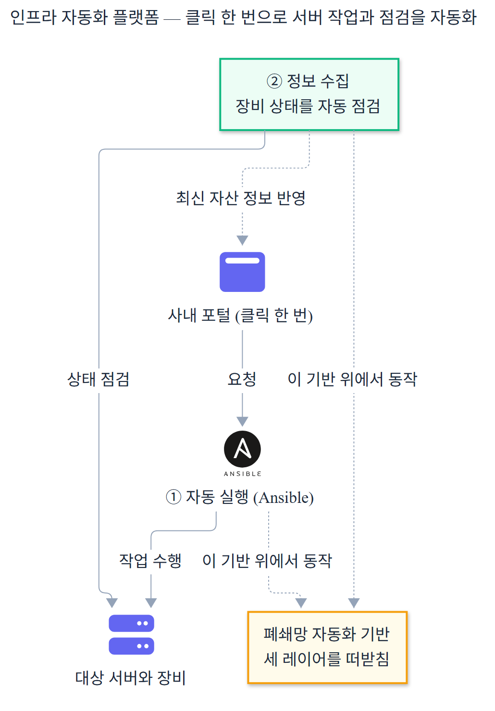
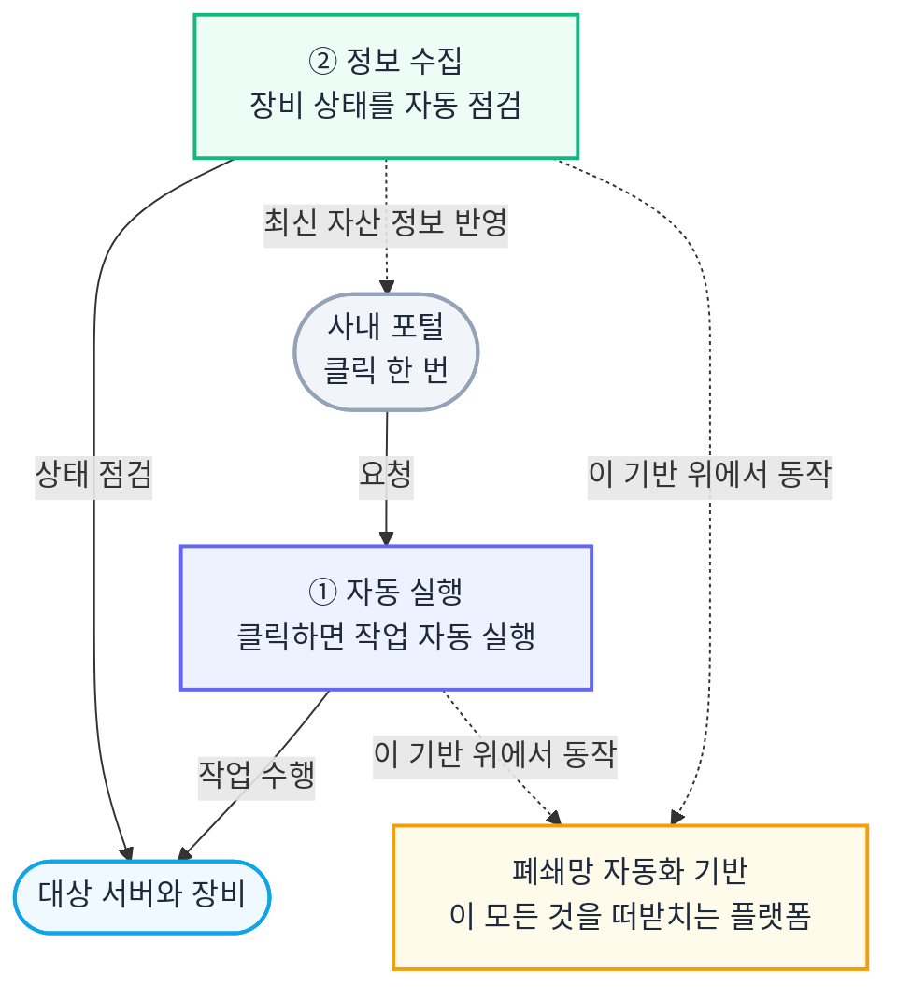

# SK하이닉스 인프라 자동화 플랫폼

신규 반도체 클러스터로 인프라가 빠르게 커지는 환경에서, 서버를 코드로 점검하고 운영하는 자동화 플랫폼을 설계하고 구축했습니다. 인터넷이 없는 폐쇄망에 자동화 기반을 세우고, 포털 클릭 한 번이 Ansible 실행으로 이어지게 하고, IP 하나로 서버 정보를 표준 형식으로 수집하는 세 레이어로 이뤄집니다.

## 1. 30초 요약

| 구분 | 내용 |
|------|------|
| **포지션** | 인프라 자동화와 플랫폼 엔지니어링. 폐쇄망 인프라 자동화 플랫폼을 설계, 구축, 운영 |
| **문제** | 신규 반도체 클러스터로 인프라가 급증. 장비 준비 시간, 운영 인력 비용, 반복 수작업에서 오는 휴먼 에러를 줄여야 했음. 환경은 인터넷 없는 폐쇄망 + 자체 HA 없는 무료 오픈소스 + 개발/운영과 지역 분리 |
| **핵심 설계** | 세 레이어로 분리. ① 폐쇄망 플랫폼 기반(3중 망 분리, 무료 OSS HA를 인프라 레벨로, Webhook 파일 동기화) ② 포털 → Jenkins → 동적 인벤토리 → Ansible 구동 ③ IP 하나로 3채널 점검, 13필드 표준 JSON |
| **대표 결과** | 포털 클릭 한 번으로 멀티벤더 서버 점검과 운영 자동화. **2026년 7월 체결 목표로 14.9억 규모 본계약 추진 중** |
| **기여** | 세 레이어의 아키텍처 설계와 핵심 구현을 본인이 주도 |
| **기술** | Redfish, vSphere API, GitLab, Jenkins, Ansible, Nexus, Redis, Python |

> 수치는 별도 표기가 없으면 각 저장소 2026-06-01 실측값입니다. 망 분리, 고가용성, 본계약 규모는 운영 환경 기준 실제값이며, 본계약은 "추진 중"입니다. 14.9억은 체결 전 추진 단계입니다.

---

## 2. 추진 배경

신규 반도체 클러스터가 들어오면서 관리할 인프라가 빠르게 커졌습니다. 서버를 한 대씩 손으로 준비하고 점검하면 준비 시간이 길고, 운영 인력 비용이 늘고, 반복 작업에서 휴먼 에러가 납니다. 이걸 줄이려고 인프라를 코드로 다루는 자동화 플랫폼을 만들었습니다.

다만 환경이 까다로웠습니다. 인터넷이 없는 폐쇄망이라 모든 설치 자원을 외부에서 들고 들어와야 했고, GitLab과 Jenkins는 자체 고가용성이 없는 무료 오픈소스였으며, 개발망과 운영망이 갈리고 데이터센터도 지역 A, B, C로 떨어져 있었습니다.

그래서 플랫폼을 세 레이어로 나눠 풀었습니다. 자동화를 떠받칠 기반을 짓고, 그 위에서 포털로 자동화를 돌리고, 그 과정에서 서버 정보를 표준 형식으로 수집하는 구조입니다.

---

## 3. 전체 아키텍처 — 세 레이어

Mermaid 코드 (클릭하여 열기)

세 레이어는 이렇게 맞물립니다.

- **① 플랫폼을 짓고 (part1)** — 인터넷 없는 폐쇄망에 자동화 기반을 세웁니다. Nexus(파일과 아티팩트), Jenkins(실행 엔진), GitLab(코드)을 깔고, 개발/운영과 서비스/OOB로 망을 나누고, 무료 오픈소스의 HA 부재를 인프라 레벨(VMware FT, NFS active-passive)로 메웁니다. 나머지 둘이 이 위에서 돕니다.
- **② 자동화를 돌리고 (part2)** — 포털에서 작업과 대상 서버를 고르면, 그게 Jenkins를 거쳐 Ansible 실행으로 이어집니다. 포털 JSON을 Ansible 인벤토리로 바꾸는 동적 인벤토리가 다리 역할을 합니다.
- **③ 정보를 수집한다 (part3)** — IP 하나만 넘기면 서버 종류를 스스로 알아내 OS, 가상화, 서버 하드웨어 정보를 수집하고, 성공이든 실패든 같은 13필드 JSON으로 돌려줍니다. 그 결과가 포털의 자산이 됩니다.

---

## 4. 본인 기여와 결과

세 레이어의 아키텍처를 설계하고 핵심 부분을 직접 만들었습니다.

- **part1 (플랫폼 기반)**: 3중 망 분리와 방화벽 설계, 무료 오픈소스 HA를 인프라 레벨로 우회(GitLab VMware FT, Jenkins NFS active-passive), /data1 데이터 경계 설계, Webhook 기반 OOB 파일 동기화 엔진. shell 스크립트 47개, Jenkins 파이프라인 4개, Ansible playbook 7개, Round 8.1까지 검증.
- **part2 (포털 자동화 구동)**: 포털 JSON을 Ansible 실행 대상으로 바꾸는 동적 인벤토리, Jenkinsfile과 Playbook 작성 표준, 동작 예제와 가이드. 커밋 58개 중 본인 57개(98.3%).
- **part3 (정보 개더링)**: IP 하나로 3채널 점검, 제조사 차이를 설정 파일로 흡수, 13필드 표준 JSON. 공개 GitHub 커밋 335개 중 327개(97.6%), Redfish 수집 엔진 3,812줄.

**결과**: 포털 클릭 한 번으로 멀티벤더 서버를 점검하고 운영하는 자동화 플랫폼을 세웠습니다. 이 플랫폼으로 **2026년 7월 체결을 목표로 14.9억 규모 본계약을 추진 중**입니다. (체결 전 추진 단계입니다.)

### 도입 전후 한눈에

---

## 5. 세 레이어 상세

각 레이어의 깊은 내용은 아래 문서에 있습니다.

| 레이어 | 문서 | 핵심 |
|------|------|------|
| ① 플랫폼을 짓고 | [part1_플랫폼아키텍처.md](./part1_플랫폼아키텍처.md) | 폐쇄망 망 분리, 무료 OSS HA를 인프라 레벨로, /data1 경계, Webhook 파일 동기화 |
| ② 자동화를 돌리고 | [part2_포털자동화구동.md](./part2_포털자동화구동.md) | 포털 3파라미터, 동적 인벤토리, Jenkinsfile/Playbook 작성 표준 |
| ③ 정보를 수집한다 | [part3_정보개더링.md](./part3_정보개더링.md) | IP 하나로 3채널 점검, 제조사 adapter 흡수, 13필드 표준 JSON |

- 이력서: [이력서_인프라자동화플랫폼.md](./이력서_인프라자동화플랫폼.md)
- 면접 예상 질문: [면접예상질문_인프라자동화플랫폼.md](./면접예상질문_인프라자동화플랫폼.md)
