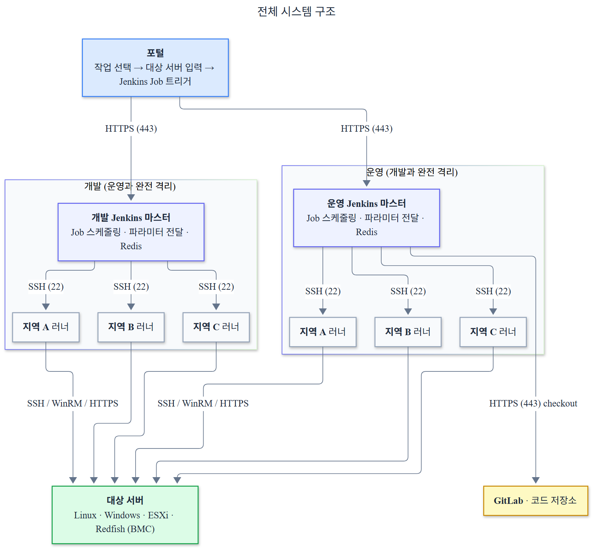
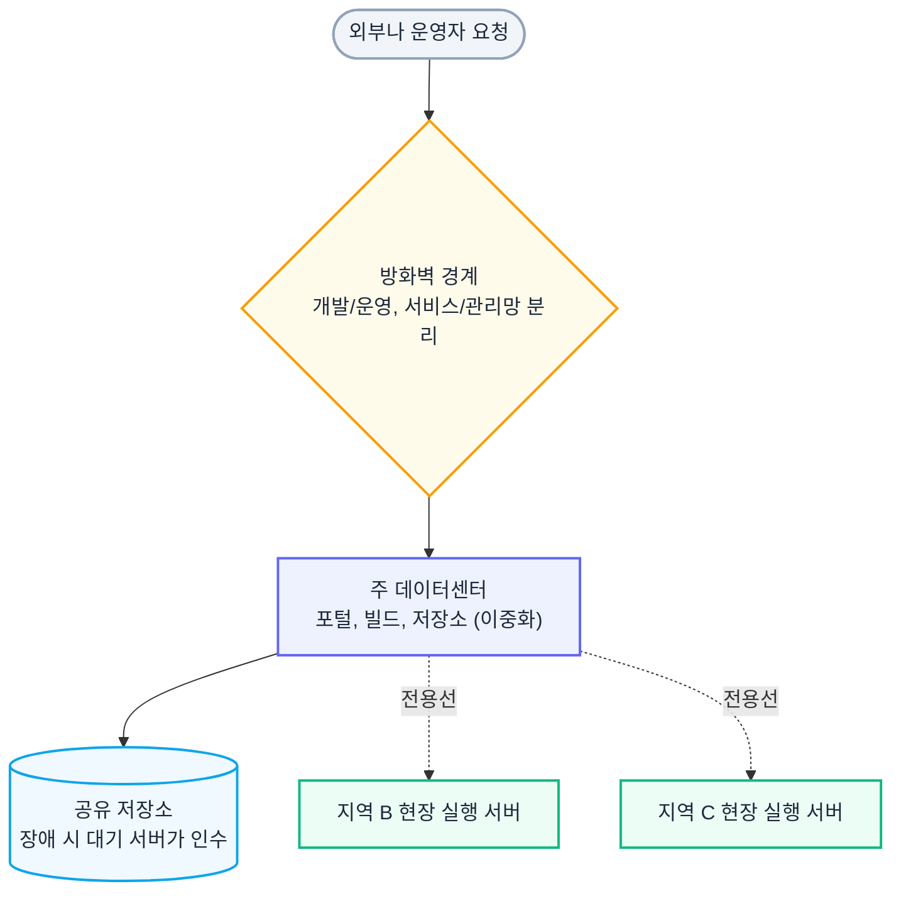
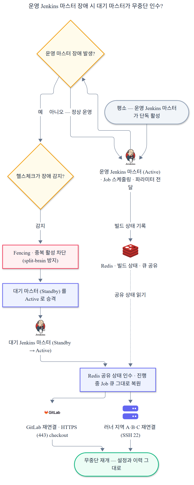
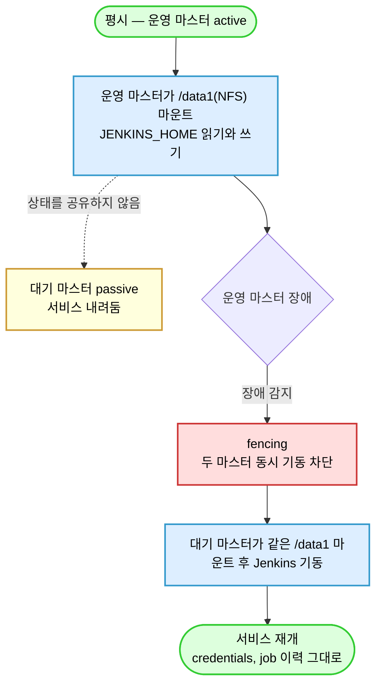
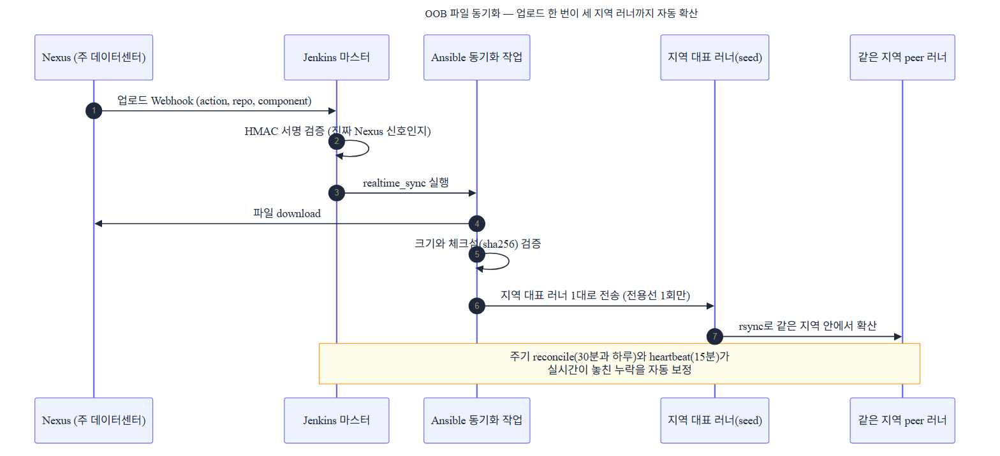
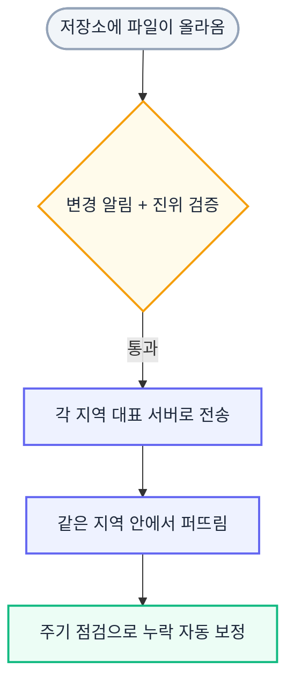

# Part 1 — 폐쇄망 인프라 자동화 플랫폼 아키텍처

> 플랫폼 전체 서사는 [00_포트폴리오_인프라자동화플랫폼.md](./00_포트폴리오_인프라자동화플랫폼.md) 참조. 이 문서는 "플랫폼을 어떻게 설계해 지었나"를 다룹니다.

## 1. 한 줄 요약

인터넷이 없는 폐쇄망에, 자동화를 돌릴 기반(코드 저장소, 파일 저장소, 실행 엔진)을 직접 설계해 세웠습니다. GitLab과 Jenkins는 무료 오픈소스 버전이라 자체 고가용성 기능이 없어서, 이중화를 인프라 레벨로 풀었습니다. 개발망과 운영망을 나누고, 각 망 안에서 다시 서비스망과 OOB망을 분리했으며, 지역이 다른 데이터센터는 전용선으로 묶었습니다.

### 30초 요약

| 구분 | 내용 |
|------|------|
| **포지션** | 폐쇄망 인프라 자동화 플랫폼의 아키텍처 설계와 구축 |
| **문제** | 신규 반도체 클러스터로 인프라가 급증하는데, 인터넷 없는 폐쇄망 + 자체 HA가 없는 무료 오픈소스 + 개발/운영과 지역이 갈린 환경에서 자동화 기반을 안정적으로 세워야 했음 |
| **핵심 설계** | 개발/운영 + 서비스/OOB 3중 망 분리와 방화벽 경계. 무료 오픈소스의 HA 부재를 인프라 레벨로 우회(GitLab은 VMware FT, Jenkins 마스터는 NFS active-passive). /data1 공유 스토리지와 VM 로컬의 경계 설계. Webhook 기반 OOB 파일 동기화 엔진 |
| **대표 결과** | 폐쇄망에 Nexus, Jenkins, GitLab 기반 자동화 플랫폼을 구축하고 Round 8.1까지 검증. 구축과 운영 자동화에 shell 스크립트 47개, Jenkins 파이프라인 4개, Ansible playbook 7개 |
| **기여** | 아키텍처 설계와 구축 스크립트, 파이프라인, 동기화 엔진을 본인이 작성 |
| **기술** | Nexus, Jenkins, GitLab, Ansible, PostgreSQL, Nginx, Redis, HMAC Webhook, rsync, NFS, VMware FT |

> 수치는 2026-06-01 저장소 실측값입니다. 망 분리, 고가용성 방식, /data1 이관, 본계약 규모는 운영 환경 기준의 실제 설계값입니다.

---

## 2. 추진 배경

### 무엇을 세워야 했나

신규 반도체 클러스터가 들어오면서 관리할 인프라가 빠르게 늘었습니다. 장비를 준비하는 시간, 운영 인력 비용, 반복 수작업에서 나오는 휴먼 에러를 줄이려면 인프라를 코드로 다루는 자동화가 필요했습니다. 그런데 자동화를 돌리려면 그걸 떠받칠 기반이 먼저 있어야 합니다. 코드를 두는 GitLab, 아티팩트와 파일을 두는 Nexus, 작업을 실행하는 Jenkins. part1은 이 기반을 짓는 레이어입니다.

### 왜 까다로웠나

세 가지 제약이 겹쳤습니다.

첫째, **인터넷이 없습니다.** 보안상 폐쇄망이라 패키지 하나도 인터넷에서 바로 못 받습니다. 설치에 필요한 모든 것을 외부에서 번들로 만들어 들고 들어가야 합니다.

둘째, **GitLab과 Jenkins가 무료 오픈소스 버전입니다.** 유료 엔터프라이즈 버전이 가진 클러스터링이나 고가용성 기능이 없습니다. 그래도 운영 환경에서는 한 대가 죽어도 서비스가 이어져야 했습니다.

셋째, **망과 지역이 갈려 있습니다.** 개발망과 운영망이 분리돼 있고, 각 망 안에서 다시 서비스망과 OOB망(서버 관리 전용망)이 나뉩니다. 데이터센터도 지역 A, B, C로 떨어져 전용선으로만 연결됩니다.

### 그래서 무엇을 정했나

자동화 기반을 한 번 제대로 세우되, 무료 오픈소스의 한계는 인프라 레벨에서 메우고, 망과 지역 분리는 아키텍처로 흡수하기로 했습니다. 그 결과가 아래 설계입니다.

---

## 3. 내 역할

이 플랫폼의 아키텍처를 설계하고 구축 자동화를 직접 만들었습니다.

- 개발/운영, 서비스/OOB 망 분리와 방화벽 경계 설계
- 무료 오픈소스(GitLab CE, Jenkins)의 고가용성을 인프라 레벨로 푸는 방식 결정과 구축
- 폐쇄망 오프라인 설치 번들과 검증, 롤백 스크립트 (shell 47개)
- Webhook 기반 OOB 파일 동기화 엔진 (Jenkins 파이프라인 4개 + Ansible playbook 7개)
- /data1 공유 스토리지와 VM 로컬의 데이터 경계 설계

---

## 4. 전체 아키텍처

같은 플랫폼을 여섯 관점으로 나눠 봅니다. 망이 어떻게 갈리는지부터 보고, 사이트 배치, 고가용성, 데이터 경계, 파일 동기화, 라우팅 순서로 읽으면 전체가 한 흐름으로 보입니다.

### 4.0 구성 요소와 버전

폐쇄망에 세운 구성 요소와 검증 버전입니다. 인터넷이 없어 전부 외부에서 오프라인 번들로 들고 들어가 설치합니다.

| 구성 요소 | 버전 | 역할 |
|---|---|---|
| Nexus Repository CE | 3.91.0 | 아티팩트와 파일 저장소 (PostgreSQL 백엔드, blob store) |
| PostgreSQL | 16 | Nexus 메타데이터 (shared_buffers 1024MB, max_connections 200) |
| Nginx | 1.20 | Nexus reverse proxy |
| Jenkins | LTS 2.528.3 | 자동화 실행 엔진 (Java 21.0.10 Temurin) |
| GitLab | CE 18.10.1 | 코드 저장소 |
| Redis | 6.x | Jenkins fact 캐시 |

모두 무료 오픈소스 버전입니다. 그래서 고가용성을 §4.3처럼 인프라 레벨로 풀어야 했습니다.

### 4.1 망 분리 — 3중으로 가른 이유

망을 세 겹으로 나눴습니다. 개발망과 운영망을 먼저 나누고, 각 망 안에서 서비스망과 OOB망을 다시 나눕니다.



<details>
<summary>Mermaid 코드 (클릭하여 열기)</summary>



</details>

### 4.2 사이트 배치 — 무엇을 어디에 두나

데이터센터는 지역 A, B, C 셋입니다. 모든 걸 세 곳에 똑같이 두지 않고 역할을 갈랐습니다.

| 사이트 | 무엇을 두나 |
|---|---|
| 지역 A (주 데이터센터) | 포털, GitLab, Nexus(Primary), Jenkins 마스터 2대(개발망용, 운영망용) |
| 지역 B, C | Nexus Secondary(proxy)와 러너 |

코드와 아티팩트 원본은 지역 A에 두고, 지역 B와 C는 프록시로 받아 같은 파일을 로컬에서 빠르게 씁니다. 러너는 세 지역에 모두 둬서 어느 지역 장비든 그 지역 러너가 가까이서 작업합니다. 지역 사이는 전용선으로만 연결됩니다.

### 4.3 고가용성 — 무료 오픈소스의 HA 부재를 인프라 레벨로 우회

GitLab CE와 Jenkins 무료 버전은 자체 고가용성 기능이 없습니다. 그래서 이중화를 애플리케이션이 아니라 인프라 레벨에서 풀었습니다.

| 컴포넌트 | 이중화 방식 | 핵심 |
|---|---|---|
| GitLab | VMware FT | 가상화가 무중단(fault tolerance)을 책임짐 |
| Jenkins 마스터 | NFS active-passive | JENKINS_HOME을 /data1(NFS)에 두고 대기 마스터는 서비스를 내려둠. 장애가 나면 같은 /data1을 물고 올라옴 |
| 러너 | 이중화 안 함 | 작업 공간이 stateless |

운영 Jenkins 마스터가 죽으면 대기 마스터가 같은 /data1을 마운트해 올라옵니다. 둘이 동시에 뜨면 상태가 깨지므로 fencing으로 동시 기동을 막습니다. 인계 흐름은 아래와 같습니다.



<details>
<summary>Mermaid 코드 (클릭하여 열기)</summary>



</details>

이 HA 설계의 판단 근거와 검토했다 버린 대안은 §5.1에서 자세히 다룹니다.

### 4.4 /data1 운영 데이터 분리 — 무엇을 공유하고 무엇을 로컬에 두나

active-passive 이중화의 핵심은 "장애가 나도 살아야 할 상태"를 공유 스토리지(/data1)에 두는 것입니다. 그런데 전부 공유하면 안 됩니다. 두 마스터가 동시에 건드리면 깨지는 데이터가 있기 때문입니다. 그래서 컴포넌트마다 경계를 갈랐습니다.

| VM | /data1 공유 (상태 보존) | VM 로컬 유지 (공유 시 손상 또는 불필요) |
|---|---|---|
| GitLab | repositories, PostgreSQL, uploads, artifacts, LFS, packages, registry, pages | 로그, 내부 Redis(세션/큐/캐시), SSL 인증서, /etc/gitlab(secrets는 별도 백업), 바이너리, 캐시 |
| Jenkins 마스터 | JENKINS_HOME 전체(jobs, builds, plugins, secrets, users, credentials, identity) | 로그, **Redis fact 캐시(두 마스터가 공유하면 손상)**, VM별 설정, 바이너리 |
| 러너 | agent workspace | SSH 키, ansible.cfg, Python venv, fact 캐시(마스터에 있음) |

대표적으로 Jenkins credentials와 identity 키는 장애 후에도 살아야 하니 /data1에 둡니다. 반대로 Redis fact 캐시는 두 마스터가 같은 걸 바라보면 망가지므로 각 VM 로컬에 둡니다. "살려야 할 것"과 "공유하면 깨지는 것"의 경계를 컴포넌트별로 그은 게 이 표입니다. 전체 이관 목록은 9절 부록에 있습니다.

### 4.5 Webhook 기반 OOB 파일 동기화 엔진

OOB망에서 도는 핵심 자동화입니다. 주 데이터센터 Nexus에 파일이 올라오면, 그걸 각 지역 러너까지 자동으로 퍼뜨립니다.



<details>
<summary>Mermaid 코드 (클릭하여 열기)</summary>



</details>

동기화 동작은 설정 파일로 못 박았습니다.

```yaml
# sync_config.yml (발췌)
reconcile_schedule: { partial: "H/30 * * * *", full: "H 3 * * *" }
heartbeat_schedule: "H/15 * * * *"
retry:    { download_max_attempts: 3, fanout_max_attempts: 3 }
checksum: { preferred_algorithm: sha256, fallback_algorithm: sha1 }
limits:   { max_file_size_bytes: 53687091200, min_free_disk_bytes: 107374182400 }  # 50GB / 100GB
fanout:   { transport: rsync, rsync_options: "-avz --partial --inplace --whole-file --timeout=300" }
```

네트워크 전제도 못 박았습니다. Nexus와 Master는 전 포트, Master와 Agent는 SSH 22, 같은 지역 Agent끼리는 전 포트, 다른 지역 Agent끼리는 통신 불가입니다. 그래서 OOB Agent는 Nexus에 직접 붙지 않고, Master가 받아 지역 seed로 보낸 뒤 같은 지역 안에서만 rsync로 퍼집니다. OOB Agent는 운영 마스터와 개발 마스터 아래 각각 지역 A, B, C에 2대씩, 모두 12대입니다. 파일은 받는 중에는 /sync/incoming, 끝나면 /sync/files, 삭제는 /sync/quarantine로 갑니다. Nexus CE 3.91.0은 asset 구조가 없어 Webhook payload(timestamp, action, repositoryName, component)에서 다운로드 경로와 체크섬을 직접 만들어 검증합니다.

### 4.6 라우팅 — 포털 하나가 어떻게 갈라지나

포털은 하나입니다. 그 하나가 개발인지 운영인지 구분해 해당 Jenkins 마스터로 보냅니다. 마스터는 다시 러너를 고르는데, 기준이 **loc(지역) + target_type(서비스 os/esxi 또는 OOB redfish)** 라벨입니다. 지역 B의 OS 작업이면 지역 B의 서비스망 러너, OOB 파일 작업이면 OOB망 러너가 잡힙니다. 포털과 GitLab은 하나로 두되, 그 뒤의 마스터와 러너에서 개발/운영과 지역, 망을 가르는 구조입니다.

---

## 5. 핵심 해결 과정 5개

각 항목을 같은 7단계로 풉니다. 문제, 검토한 선택지, 왜 이 방식인지, 무엇을 만들었는지, 언제 검증되는지, 실패하면 어떻게 되는지, 결과적으로 무엇이 달라졌는지입니다.

### 5.1 무료 오픈소스의 HA 부재를 인프라 레벨로 우회

**1) 어떤 문제가 있었는가**

운영 환경에서는 GitLab과 Jenkins가 한 대 죽어도 서비스가 이어져야 했습니다. 그런데 둘 다 무료 오픈소스 버전이라 자체 고가용성 기능이 없습니다. 유료 엔터프라이즈 라이선스를 사면 되지만, 그건 선택지가 아니었습니다.

**2) 검토한 선택지**

- (a) 유료 엔터프라이즈 버전으로 전환해 내장 HA 사용
- (b) 애플리케이션을 직접 클러스터링(GitLab Geo 모사, Jenkins 다중 마스터 구성)
- (c) HA를 인프라 레벨로 우회 — 가상화 FT와 공유 스토리지 active-passive — 채택

**3) 왜 이 방식을 선택했는가**

(a)는 비용 문제로 막혔습니다. (b)는 무료 버전이 클러스터링을 공식 지원하지 않아, 억지로 구성하면 버전 올릴 때마다 깨질 위험이 큽니다. (c)는 애플리케이션을 건드리지 않습니다. GitLab은 VMware FT로 가상화가 무중단을 책임지고, Jenkins 마스터는 상태를 공유 스토리지에 둔 active-passive로 풉니다. 애플리케이션은 단일 인스턴스처럼 동작하니 버전 업그레이드도 단순합니다.

**4) 내가 만든 기준 / 구조**

GitLab은 VMware FT로 묶어 한 대가 죽어도 끊김 없이 이어지게 했습니다. Jenkins 마스터는 JENKINS_HOME을 /data1 공유 스토리지(NFS)에 두고, 운영 마스터와 대기 마스터 두 대를 둔 뒤 대기 쪽은 서비스를 내려 뒀습니다. 장애가 나면 대기 마스터가 같은 /data1을 물고 올라옵니다. 둘이 동시에 뜨면 상태가 깨지므로 fencing으로 동시 기동을 막았습니다.

**5) 어느 시점에서 검증되는가**

설치 검증 스크립트가 서비스 기동과 응답, 공유 스토리지 마운트를 확인합니다. failover 시 대기 마스터가 정상 인계되는지 검증 라운드에서 확인했습니다.

**6) 실패하면 어떻게 처리되는가**

NFS 마운트가 준비되기 전에 Jenkins가 뜨면 빈 상태로 올라와 위험합니다. 그래서 마운트 준비 전 기동을 막는 의존성을 각 VM에 뒀습니다. fencing이 동시 기동을 차단합니다.

**7) 결과적으로 무엇이 달라졌는가**

라이선스 비용 없이 운영 GitLab과 Jenkins의 고가용성을 확보했습니다. 무료 버전을 쓰면서도 한 대 장애가 서비스 중단으로 이어지지 않습니다.

### 5.2 개발/운영 + 서비스/OOB 망 분리와 방화벽

**1) 어떤 문제가 있었는가**

개발에서 시험하던 자동화가 운영 장비를 건드리면 사고입니다. 또 OS를 다루는 트래픽과 서버 하드웨어(BMC)를 다루는 트래픽을 같은 망에 섞으면 보안 경계가 흐려집니다.

**2) 검토한 선택지**

- (a) 단일 망에 두고 권한과 태그로만 구분
- (b) 개발/운영만 분리
- (c) 개발/운영 + 서비스/OOB 3중 분리 + 방화벽 경계 — 채택

**3) 왜 이 방식을 선택했는가**

(a)는 한 번의 설정 실수가 곧바로 운영 사고로 번집니다. (b)로는 부족했습니다. OS 경로와 하드웨어 관리(OOB) 경로는 보안 등급이 다른데, 섞이면 BMC 같은 민감한 관리면이 서비스망에 노출됩니다. (c)는 사고 반경을 망 경계로 가둡니다. 개발 실수는 개발망에서 멈추고, 하드웨어 관리는 OOB망 안에서만 돕니다.

**4) 내가 만든 기준 / 구조**

개발망과 운영망을 나누고, 각 망 안에서 서비스망(OS, 앱)과 OOB망(BMC, 파일 배포)을 다시 나눴습니다. 경계마다 방화벽을 뒀습니다. 개발과 운영 사이, 서비스망과 OOB망 사이, 외부와 포털 앞단 사이입니다. 지역이 다른 데이터센터는 전용선으로만 연결했습니다.

**5) 어느 시점에서 검증되는가**

러너를 고를 때 loc + target_type 라벨이 망과 지역을 함께 가르므로, OS 작업이 OOB망 러너로 잘못 가는 일이 라우팅 단계에서 막힙니다.

**6) 실패하면 어떻게 처리되는가**

방화벽이 허용하지 않은 경로는 애초에 연결되지 않습니다. 잘못된 망으로 가려는 시도는 통신 자체가 차단됩니다.

**7) 결과적으로 무엇이 달라졌는가**

사고 반경이 망 경계 안으로 갇혔습니다. 개발 변경이 운영에 새지 않고, 하드웨어 관리면이 서비스망에 노출되지 않습니다.

### 5.3 /data1 공유 스토리지와 VM 로컬의 경계

**1) 어떤 문제가 있었는가**

Jenkins 마스터를 active-passive로 이중화하려면 상태를 공유 스토리지에 둬야 합니다. 그런데 전부 공유하면 안 됩니다. 두 마스터가 동시에 같은 파일을 건드리면 깨지는 데이터가 있습니다.

**2) 검토한 선택지**

- (a) 전부 /data1에 공유
- (b) 전부 VM 로컬에 두고 백업으로만 복제
- (c) 컴포넌트별로 공유와 로컬을 가름 — 채택

**3) 왜 이 방식을 선택했는가**

(a)는 위험합니다. Redis fact 캐시처럼 두 마스터가 공유하면 손상되는 데이터가 있습니다. (b)는 failover 후 credentials나 job 이력이 사라져 이중화 의미가 없습니다. (c)만 둘 다 만족합니다. 살아야 할 상태는 /data1에, 공유하면 깨지는 것은 VM 로컬에 둡니다.

**4) 내가 만든 기준 / 구조**

GitLab은 repositories, PostgreSQL, uploads, artifacts, LFS, packages, registry, pages를 /data1로 보냈습니다. Jenkins 마스터는 JENKINS_HOME 전체(secrets, credentials, identity 포함)를 /data1로 보내되, Redis fact 캐시는 각 VM 로컬에 남겼습니다. 러너는 작업 공간만 /data1로 보내고 SSH 키와 실행 환경은 로컬에 뒀습니다.

**5) 어느 시점에서 검증되는가**

이관 후 경로 설정과 권한을 검증 스크립트가 확인합니다. failover 테스트에서 credentials와 job 이력이 대기 마스터에 그대로 보이는지 봤습니다.

**6) 실패하면 어떻게 처리되는가**

GitLab secrets처럼 /data1로 옮기지 않는 항목은 별도 백업 대상으로 분리했습니다. 이게 없으면 복구 시 CI/CD 변수나 Runner 인증이 깨지기 때문입니다.

**7) 결과적으로 무엇이 달라졌는가**

failover 후에도 credentials와 job 이력이 살아 있고, 공유로 인한 데이터 손상은 막았습니다. 무엇을 어디 두는지가 표 하나로 정리돼, 다음 사람이 추적할 수 있습니다.

### 5.4 Webhook 기반 OOB 파일 동기화 엔진

**1) 어떤 문제가 있었는가**

주 데이터센터 Nexus에 올라온 파일을 지역 A, B, C 러너까지 똑같이 깔아야 했습니다. 사람이 지역마다 복사하면 느리고, 빠지거나 어긋난 게 생깁니다.

**2) 검토한 선택지**

- (a) 각 지역이 필요할 때 Nexus에서 직접 받기
- (b) 메시지 큐로 동기화 보장(재시도 큐, DLQ)
- (c) Webhook 트리거 + 지역 seed + rsync fan-out + 주기 reconcile — 채택

**3) 왜 이 방식을 선택했는가**

(a)는 느립니다. 같은 50GB 파일을 지역마다 전용선 너머로 끌어와야 하니까요. (b)는 폐쇄망에 큐 인프라를 새로 들이는 비용이 큽니다. 그래서 (c)로 갔습니다. 전용선은 지역 대표 러너(seed) 한 대까지만 건너고, 그다음은 같은 지역 안에서 rsync로 퍼뜨립니다. 실시간이 놓친 일관성은 주기 reconcile이 메웁니다.

**4) 내가 만든 기준 / 구조**

Nexus 업로드 이벤트가 Webhook으로 Jenkins에 들어오면, HMAC 검증으로 진짜 Nexus 신호인지 확인합니다. 통과하면 Ansible이 파일을 받아 크기와 체크섬을 맞추고, 지역 seed 한 대에 보낸 뒤 rsync로 같은 지역 peer에 확산합니다. 더해서 주기 reconcile(30분과 하루)로 Nexus와 다시 맞추고, heartbeat(15분)로 러너 상태를 보고, 삭제는 quarantine으로 격리 후 지웁니다. Jenkins 파이프라인 4개(webhook_dispatch, realtime_sync, reconcile, heartbeat)와 Ansible playbook 7개로 만들었습니다.

**5) 어느 시점에서 검증되는가**

Webhook 수신 시 HMAC 검증, 다운로드 후 크기와 체크섬 검증, reconcile 시 Nexus 기준 재정합. 대용량 파일 전송을 반복 검증했습니다.

**6) 실패하면 어떻게 처리되는가**

다운로드는 재시도합니다. 디스크 여유가 부족하면 사전에 막습니다. 삭제는 바로 지우지 않고 격리한 뒤 재확인합니다. 실시간 동기화가 놓친 건 주기 reconcile이 잡습니다.

**7) 결과적으로 무엇이 달라졌는가**

파일 하나가 올라오면 사람 손 없이 세 지역 러너까지 자동으로 같은 상태가 됩니다. 전용선은 한 번만 건너고, 빠지거나 어긋난 건 주기 점검이 메웁니다.

### 5.5 포털 하나에서 개발/운영과 지역으로 갈라지는 라우팅

**1) 어떤 문제가 있었는가**

포털은 하나인데, 그 뒤에는 개발과 운영 마스터가 있고 지역도 셋입니다. 작업 하나가 어느 마스터, 어느 지역 러너로 가야 하는지 정해야 했습니다.

**2) 검토한 선택지**

- (a) 마스터마다 포털을 따로 두기
- (b) 포털이 모든 라우팅을 직접 결정해 러너를 지정
- (c) 포털은 개발/운영만 구분, 러너 선택은 마스터가 라벨로 — 채택

**3) 왜 이 방식을 선택했는가**

(a)는 포털이 여러 개가 됩니다. 사용자가 헷갈리고 관리 지점만 늘어납니다. (b)는 포털이 러너 토폴로지까지 알아야 해서, 러너가 늘 때마다 포털을 고쳐야 합니다. (c)는 책임을 나눕니다. 포털은 개발이냐 운영이냐만 정하고, 어느 지역 어느 망 러너인지는 마스터가 loc + target_type 라벨로 고릅니다.

**4) 내가 만든 기준 / 구조**

포털 하나가 개발/운영을 구분해 해당 마스터로 보냅니다. 마스터는 loc(지역)와 target_type(서비스 os/esxi 또는 OOB redfish) 라벨로 러너를 고릅니다. 러너가 늘어도 라벨만 맞추면 잡히므로 포털은 건드리지 않습니다.

**5) 어느 시점에서 검증되는가**

작업 트리거 시 라벨 조합으로 러너가 결정됩니다. 라벨이 맞는 러너가 없으면 그 시점에 드러납니다.

**6) 실패하면 어떻게 처리되는가**

해당 라벨 러너가 없으면 작업이 대기하거나 실패로 표시됩니다. 잘못된 망으로는 방화벽이 애초에 통신을 막습니다.

**7) 결과적으로 무엇이 달라졌는가**

포털은 하나로 단순하게 유지하면서, 개발/운영과 지역, 망 분기는 마스터와 라벨이 맡습니다. 러너가 늘어도 포털 코드는 그대로입니다.

---

## 6. 결과

### Before / After

| 항목 | Before | After |
|------|--------|-------|
| 자동화 기반 | 폐쇄망에 기반 부재 | Nexus, Jenkins, GitLab 기반을 코드와 스크립트로 구축 |
| 무료 OSS 고가용성 | 자체 HA 없음 | GitLab VMware FT, Jenkins NFS active-passive로 인프라 레벨 우회 |
| 망 보안 경계 | 단일 망 위험 | 개발/운영 + 서비스/OOB 3중 분리 + 방화벽 |
| 지역 간 파일 배포 | 수작업 복사 | Webhook 동기화 엔진으로 세 지역 자동 확산 |
| failover 시 상태 | 손상/유실 위험 | /data1 공유와 VM 로컬 경계로 상태 보존 + 손상 방지 |

### 정량 결과

- 폐쇄망 인프라 자동화 플랫폼 구축, Round 8.1까지 검증
- 구축/검증/운영 자동화: shell 스크립트 47개, Jenkins 파이프라인 4개, Ansible playbook 7개, 문서 59개
- 3개 묶음: Nexus 오프라인 설치 / OOB 파일 동기화 / Jenkins, GitLab 설치
- Nexus Primary 1 + Secondary proxy(지역 B, C)

---

## 7. 기술적 의사결정

| 결정 | 근거 |
|------|------|
| HA를 애플리케이션이 아니라 인프라 레벨로 | 무료 오픈소스는 자체 HA가 없고 유료 전환은 비용 문제. 가상화 FT와 공유 스토리지 active-passive면 애플리케이션을 단일 인스턴스로 두면서 이중화 |
| 컴포넌트마다 이중화 방식을 다르게 | GitLab은 무중단이 중요해 FT, Jenkins 마스터는 상태가 커서 공유 스토리지 active-passive, 러너는 stateless라 이중화 안 함 |
| /data1 공유와 VM 로컬을 컴포넌트별로 가름 | failover 시 살아야 할 상태는 공유, 두 마스터가 동시에 건드리면 깨지는 것(Redis fact 캐시)은 로컬 |
| 망을 3중으로 분리 | 개발 사고를 운영에서 격리, 하드웨어 관리면(OOB)을 서비스망에서 분리. 사고 반경을 망 경계로 가둠 |
| 파일 동기화는 seed + rsync fan-out | 전용선을 한 번만 건너고 지역 내부에서 확산. 대용량 파일을 지역마다 원격에서 끌어오는 비용 회피 |
| 동기화에 실시간 + 주기 reconcile 병행 | 실시간만으로는 놓치는 게 생김. 주기 점검이 Nexus 기준으로 다시 맞춤 |
| 포털은 개발/운영만 구분, 러너는 마스터가 라벨로 | 포털이 러너 토폴로지를 알면 러너 늘 때마다 포털 수정. 책임 분리로 포털을 단순하게 유지 |

### 검토했다 버린 대안

판단 근거를 분명히 하려고, 같은 문제를 풀 수 있었던 다른 선택지와 버린 이유를 적습니다.

- **유료 엔터프라이즈 전환** → 버림. 내장 HA를 쓸 수 있지만 비용이 막혔습니다. 가상화 FT와 공유 스토리지 active-passive로 무료 버전에서 이중화를 확보했습니다.
- **OOB Agent가 Nexus에서 직접 다운로드** → 버림. 같은 대용량 파일을 지역마다 전용선 너머로 끌어와 느리고, Agent가 Nexus에 직접 붙으면 망 경계가 흐려집니다. Master가 받아 지역 seed로 보내고 같은 지역 rsync로 푸는 방식을 택했습니다.
- **파일 동기화를 메시지 큐로 보장** → 버림. 폐쇄망에 큐 인프라를 새로 들이는 비용이 큰데, Webhook과 주기 reconcile로 일관성을 메울 수 있어 과합니다.
- **Jenkins 마스터 active-active(다중 마스터)** → 버림. 무료 버전이 공식 지원하지 않아 깨질 위험이 큽니다. active-passive로 단순화했습니다.

---

## 8. 한계점

면접에서 깊이 묻는 분이 있을 수 있어 솔직히 적습니다.

- **active-passive의 인계 시간**: Jenkins 마스터는 무중단(active-active)이 아니라 active-passive입니다. 대기 마스터가 올라오는 동안 짧은 공백이 있습니다. 무중단이 필요하면 GitLab처럼 FT를 검토해야 합니다.
- **무료 버전 제약은 우회일 뿐**: 인프라 레벨 HA는 애플리케이션 레벨 클러스터링을 완전히 대체하지 않습니다. 부하 분산은 따로 풀어야 합니다.
- **폐쇄망 번들 갱신 부담**: 인터넷이 없어 패키지 업데이트마다 외부에서 번들을 다시 만들어 들고 들어와야 합니다.
- **러너는 이중화 안 함**: 작업 공간이 stateless라는 전제입니다. 장기 실행 작업 중 러너가 죽으면 그 작업은 다시 돌려야 합니다.

---

## 9. 부록

### 9.1 /data1 운영 데이터 이관 (전체)

failover 시 "상태 보존"과 "공유 시 손상 방지"의 경계를 컴포넌트별로 가른 설계입니다.

**GitLab** — 이관: repositories, PostgreSQL, uploads, backups, artifacts, LFS, packages, registry, pages. 제외(로컬/별도 백업): 로그, 내부 Redis(세션/큐/캐시 재생성 가능), SSL과 인증서, /etc/gitlab(secrets는 별도 백업 필수), 바이너리, 캐시.

**Jenkins 마스터** — 이관: JENKINS_HOME 전체(jobs, builds, plugins, secrets, users, credentials, identity key, 내부 ssh). 제외: 로그, Redis fact 캐시(공유 시 손상 → 각 VM 로컬), VM별 설정과 systemd override, 바이너리.

**러너** — 이관: agent workspace. 제외: SSH 키와 config, ansible.cfg, Python venv, fact 캐시(마스터에 존재).

### 9.2 실측 수치 카탈로그 (2026-06-01)

| 지표 | 값 |
|------|----|
| shell 스크립트 | 47 |
| Jenkins 파이프라인 | 4 (webhook_dispatch, realtime_sync, reconcile, heartbeat) |
| Ansible playbook | 7 (download, fanout, heartbeat, quarantine, realtime, reconcile, verify) |
| 문서 | 59 |
| 검증 라운드 | 8.1 |
| 묶음 | 3 (Nexus 설치 / OOB 동기화 / Jenkins, GitLab 설치) |
| Nexus | Primary 1 + Secondary proxy(지역 B, C) |
| Nexus repository | infra-automation-raw-hosted(SSoT), application-install-raw(hosted + proxy) |
| OOB Agent | 12대 (운영 마스터 6 + 개발 마스터 6, 각 지역 A/B/C 2대씩) |
| 구성 버전 | Nexus CE 3.91.0 / PostgreSQL 16 / Nginx 1.20 / Jenkins LTS 2.528.3 / GitLab CE 18.10.1 / Java 21.0.10 |
| 파일 동기화 한도 | 단일 파일 50GB, 디스크 여유 100GB, checksum sha256 |

> 재현: 저장소 루트에서 `find . -name '*.sh' | wc -l`(47), `find . -name 'Jenkinsfile*' | wc -l`(4), `find . -path '*/playbooks/*.yml' | wc -l`(7). 버전은 `nexus-install/config/install.env`(NEXUS_VERSION, PG_VERSION 등), 동기화 설정은 `oob-sync-design/config/sync_config.yml`(cron, limits, fanout)에서 확인.
