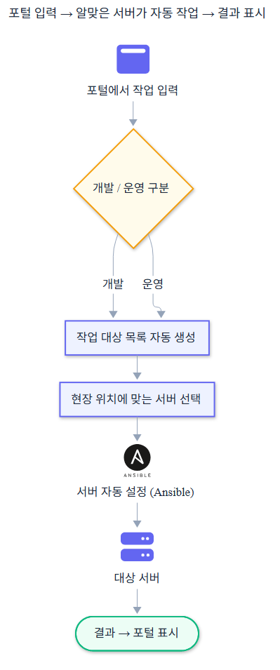
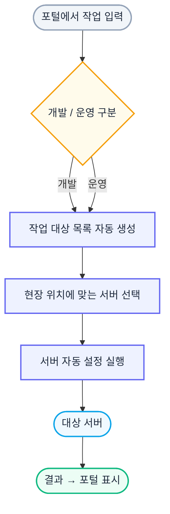

# Part 2 — 포털에서 인프라 자동화를 구동하는 표준

> 플랫폼 전체 서사는 [00_포트폴리오_인프라자동화플랫폼.md](./00_포트폴리오_인프라자동화플랫폼.md) 참조. 이 문서는 "포털 클릭 한 번이 어떻게 Ansible 실행으로 이어지나"를 다룹니다.

## 1. 한 줄 요약

사내 클라우드 포털에서 작업을 고르고 대상 서버를 넘기면, 그게 Jenkins를 거쳐 Ansible 실행으로 이어지도록 구동 표준을 만들었습니다. 핵심은 포털이 보내는 호스트 JSON을 Ansible이 바로 쓸 수 있는 인벤토리로 바꾸는 동적 인벤토리입니다. Jenkins와 Ansible을 처음 쓰는 사람도 표준을 따라 새 작업을 만들 수 있도록, 작성 규칙과 동작하는 예제를 함께 정리했습니다.

### 30초 요약

| 구분 | 내용 |
|------|------|
| **포지션** | 포털과 Ansible 사이의 자동화 구동 표준 설계 |
| **문제** | 포털에서 고른 작업과 대상 서버를, 사람 손 없이 Jenkins와 Ansible 실행으로 이어야 했음. 호스트가 몇 개든, 작업이 무엇이든 같은 규칙으로 |
| **핵심 설계** | 포털 3파라미터(loc, target_type, inventory_json)를 고정 입력으로. 호스트 JSON을 Ansible 인벤토리로 바꾸는 동적 인벤토리. Jenkinsfile과 Playbook 작성 표준과 동작 예제 |
| **대표 결과** | 포털 클릭 한 번이 Ansible 실행으로 이어지는 구동 경로 확립. 동작 예제 6개, 연습 슬롯 10개, 문법 데모 12개, 작성 가이드 4편 |
| **기여** | 동적 인벤토리, 작성 표준, 예제와 가이드를 본인 작성 (커밋 58개 중 본인 57개, 98.3%) |
| **기술** | Jenkins(Pipeline), Ansible, Python(동적 인벤토리), ansible-vault, GitLab |

> 수치는 2026-06-01 저장소 실측값입니다.

---

## 2. 추진 배경

신규 반도체 클러스터로 인프라가 늘면서, 운영자가 포털에서 작업을 골라 실행하는 경로가 필요했습니다. 그런데 포털이 "이 서버들에 이 작업을 해라"라고 보내도, Ansible은 그 JSON을 그대로 못 받습니다. Ansible은 자기 형식의 인벤토리를 원합니다.

또 문제가 하나 더 있었습니다. 새 자동화 작업을 만드는 사람마다 Jenkinsfile과 Playbook을 제멋대로 짜면, 포털이 보내는 파라미터와 어긋나거나 자격증명을 잘못 다룹니다. Jenkins와 Ansible을 처음 접하는 사람도 표준을 따라 안전하게 새 작업을 만들 수 있어야 했습니다.

그래서 두 가지를 정했습니다. 포털 JSON을 Ansible 인벤토리로 바꾸는 다리(동적 인벤토리)를 만들고, 작성 규칙과 동작 예제를 표준으로 묶는 것입니다.

---

## 3. 내 역할

- 포털 JSON을 Ansible 인벤토리로 바꾸는 동적 인벤토리(`my_inventory.sh`) 작성
- 포털 3파라미터(loc, target_type, inventory_json)를 받는 Jenkinsfile 작성 표준 정의
- Playbook 작성 규칙과 hostvars 사용법 정리
- 동작 예제 6개, 연습 슬롯 10개, 문법 데모 12개, 작성 가이드 4편 작성

---

## 4. 아키텍처

### 4.1 포털에서 타겟까지 — 4계층 구동 흐름



<details>
<summary>Mermaid 코드 (클릭하여 열기)</summary>



</details>

### 4.2 동적 인벤토리 — 포털 JSON을 Ansible이 읽게

포털이 보낸 호스트 JSON 한 건:
```json
[{ "hostname": "linux-dev-01", "service_ip": "10.x.x.x", "vendor": "dell" }]
```

동적 인벤토리가 바꾼 것:
```json
{
  "all": { "hosts": ["linux-dev-01"] },
  "_meta": { "hostvars": { "linux-dev-01": {
    "ansible_host": "10.x.x.x", "vendor": "dell"
  } } }
}
```

규칙은 셋입니다. `inventory_hostname`은 hostname(로그에 보일 이름), `ansible_host`는 service_ip(실제 접속 주소), 나머지 필드는 모두 hostvars로 넘겨 playbook에서 쓰게 합니다. 포털이 필드를 더 보내도 playbook이 hostvars로 받으므로, 인벤토리 형식을 고치지 않습니다.

스크립트는 표준 라이브러리(json, ipaddress)만 씁니다. service_ip는 ipaddress로 형식을 검증하고, inventory_hostname이 겹치면 에러로 멈춥니다. INVENTORY_JSON 환경변수가 비면 WORKSPACE의 `.inventory_input.json` 파일을 대신 읽고, 둘 다 없으면 대상 없이 멈춥니다. Ansible 동적 인벤토리 규약(`--host`)도 따릅니다.

### 4.3 Day1과 Day2 작업 분류

자동화 대상을 둘로 나눴습니다.

| 분류 | 작업 | 경로 |
|------|------|------|
| **Day1** (구축) | OS 설치, BIOS 설정, RAID 구성, 펌웨어 업데이트 | 서버 하드웨어(Redfish/BMC) |
| **Day2** (운영) | NTP 동기화, 패치 관리, 소프트웨어 설치, 계정 관리 | OS 안에서(SSH/WinRM) |

이 저장소는 Day2 운영 자동화의 동작 예제와 표준에 집중합니다. NTP 점검, 보안 패치(3단계), 디스크 점검, chrony와 motd 기본 구성(Role), sshd 안전 재시작(block/rescue로 실패 시 롤백), nginx 헬스체크 배포(tags 다단계) 6가지가 동작하는 예제입니다.

예를 들어 sshd 안전 재시작은 block/rescue/always로 짰습니다. 정상 경로는 설정을 백업하고 `sshd -t`로 유효성을 검사한 뒤 재시작하고 22 포트 응답을 확인합니다. 중간에 실패하면 rescue가 백업으로 롤백하고 다시 재시작해, 잘못된 설정이 접속 차단으로 이어지지 않게 합니다.

```yaml
block:
  - sshd_config 백업 (→ .bak)
  - sshd -t 유효성 검사
  - sshd 재시작 + 22 포트 wait_for
rescue:
  - 백업으로 롤백 후 재시작
  - fail (백업 복원을 알림)
always:
  - 작업 시각 기록
```

### 4.4 작성 표준 — 누가 만들어도 포털과 맞물리게

새 작업을 만드는 사람이 표준을 따르도록 Jenkinsfile과 Playbook 작성 규칙을 고정했습니다.

| 규칙 | 이유 |
|------|------|
| `parameters { loc, target_type, inventory_json }` 고정 | 포털이 이 이름으로 보냄. 다르면 안 물림 |
| `agent { label "${loc} && ${target_type}" }` | 지역과 작업 종류 조합으로 러너 선택 |
| `inventory_json` 기본값 `'[]'` | 호스트 목록은 매번 다르니 Jenkinsfile에 박지 않음 |
| 자격증명은 ansible-vault + Jenkins Credentials | 비밀번호를 코드에 두지 않음 |

여기에 작성 가이드 4편(Jenkinsfile 규칙, Playbook 규칙과 hostvars, Agent 측 ansible.cfg 표준, 작성 보조)과 연습 슬롯 10개, 문법 데모 12개(roles, block-rescue, tags, templates, conditionals, loops 등)를 붙여, 처음 쓰는 사람이 복사해 시작할 수 있게 했습니다.

실제 Jenkinsfile은 이렇게 시작합니다.

```groovy
pipeline {
  agent { label "${params.loc} && ${params.target_type}" }
  parameters {
    string(name: 'loc',            defaultValue: 'A')      // 지역
    string(name: 'target_type',    defaultValue: 'linux')  // 대상 종류
    text(  name: 'inventory_json', defaultValue: '[]')     // 호스트 JSON 배열
  }
  environment {
    INVENTORY_JSON = "${params.inventory_json}"
    TARGET_TYPE    = "${params.target_type}"
  }
  // stages: ansiblePlaybook(..., vaultCredentialsId: 'ansible-vault-password')
}
```

agent 라벨이 loc와 target_type 조합이라 지역과 작업 종류로 러너가 잡히고, 자격증명은 `vaultCredentialsId`로 Jenkins가 복호화해 넘깁니다. 파라미터 이름을 포털이 보내는 것과 똑같이 맞춰 두면, 포털 값이 그대로 들어옵니다.

---

## 5. 핵심 해결 과정 3개

part1과 같은 7단계로 풉니다. 문제, 검토한 선택지, 왜 이 방식인지, 무엇을 만들었는지, 언제 검증되는지, 실패하면 어떻게 되는지, 결과입니다.

### 5.1 포털 JSON을 Ansible 실행 대상으로 바꾸는 동적 인벤토리

**1) 어떤 문제가 있었는가**

포털은 "이 호스트들에 이 작업"이라고 JSON 배열로 보냅니다. Ansible은 그 형식을 그대로 못 읽습니다. 게다가 호스트가 1개일 때도 100개일 때도 같은 경로로 돌아야 했습니다.

**2) 검토한 선택지**

- (a) 작업마다 인벤토리 파일을 미리 만들어 두기
- (b) 포털이 Ansible 인벤토리 형식으로 직접 보내기
- (c) 동적 인벤토리 스크립트로 런타임에 변환 — 채택

**3) 왜 이 방식을 선택했는가**

(a)는 호스트 조합이 매번 달라 미리 만들 수 없습니다. (b)는 포털이 Ansible 내부 형식까지 알아야 해서 둘이 강하게 묶입니다. (c)가 답이었습니다. 포털은 자기 JSON으로 보내고, 변환은 동적 인벤토리가 맡습니다. 호스트가 1대든 100대든 런타임에 펼쳐집니다.

**4) 내가 만든 기준 / 구조**

`my_inventory.sh`가 포털 JSON을 받아 Ansible 인벤토리로 바꿉니다. hostname은 표시 이름, service_ip는 실제 접속 주소(ansible_host), 나머지 필드는 hostvars로 넘깁니다. 포털이 필드를 더 보내도 인벤토리 형식은 그대로입니다.

**5) 어느 시점에서 검증되는가**

Jenkins가 동적 인벤토리를 실행할 때 IP 형식과 중복을 검증합니다. 잘못된 입력은 여기서 걸립니다.

**6) 실패하면 어떻게 처리되는가**

inventory_json 기본값을 빈 배열로 둬, 값이 없으면 대상 없이 안전하게 끝납니다. IP 형식 오류는 변환 단계에서 막습니다.

**7) 결과적으로 무엇이 달라졌는가**

포털에 등록된 자산을 그대로 자동화 실행 대상으로 연결했습니다. 운영자가 인벤토리를 손으로 만들 필요가 없어졌습니다.

### 5.2 작성 표준을 고정해 누가 만들어도 포털과 맞물리게

**1) 어떤 문제가 있었는가**

새 작업을 만드는 사람마다 Jenkinsfile을 제각각 짜면 포털 파라미터와 어긋나거나, 자격증명을 코드에 박는 사고가 났습니다.

**2) 검토한 선택지**

- (a) 자유롭게 두고 리뷰로 잡기
- (b) 파라미터 이름과 러너 선택, 자격증명 방식을 표준으로 고정 — 채택

**3) 왜 이 방식을 선택했는가**

(a)는 리뷰어 부담이 크고 사람마다 기준이 다릅니다. (b)는 포털이 보내는 파라미터 이름(loc, target_type, inventory_json)과 러너 선택 라벨, vault 자격증명 방식을 표준으로 박아, 표준만 따르면 포털과 자동으로 맞물립니다.

**4) 내가 만든 기준 / 구조**

Jenkinsfile은 파라미터 3개를 고정하고, 러너는 `loc && target_type` 라벨로 고르며, inventory_json 기본값은 빈 배열로 둡니다. 자격증명은 ansible-vault로 암호화하고 Jenkins Credentials로 키를 관리합니다. 이 규칙을 가이드 문서로 정리했습니다.

**5) 어느 시점에서 검증되는가**

표준을 벗어난 파라미터 이름은 포털이 보낸 값과 안 맞아 작업 단계에서 드러납니다.

**6) 실패하면 어떻게 처리되는가**

자격증명을 코드에 박으면 안 되므로, vault와 Credentials 경로를 표준에 명시해 평문 노출을 막습니다.

**7) 결과적으로 무엇이 달라졌는가**

새 작업이 포털과 어긋나거나 자격증명을 노출하는 사고가 줄었습니다. 표준을 따르면 처음 만드는 사람도 포털과 맞물리는 작업을 만듭니다.

### 5.3 동작 예제와 연습 환경으로 진입 장벽을 낮춤

**1) 어떤 문제가 있었는가**

Jenkins와 Ansible을 처음 접하는 사람이 백지에서 시작하면 표준을 익히기 어렵고, 운영에 바로 쓸 작업을 만들기까지 시간이 걸렸습니다.

**2) 검토한 선택지**

- (a) 문서로만 규칙 설명
- (b) 문서 + 복사해 시작하는 동작 예제와 연습 환경 — 채택

**3) 왜 이 방식을 선택했는가**

(a)는 규칙을 읽어도 실제로 어떻게 짜는지 감이 안 옵니다. (b)는 동작하는 예제를 복사해 고치면서 배웁니다. block/rescue 롤백, tags 다단계, Role 같은 패턴을 실제 돌아가는 코드로 보여줍니다.

**4) 내가 만든 기준 / 구조**

Day2 동작 예제 6개(NTP, 패치, 디스크 점검, 기본 구성, sshd 안전 재시작, nginx 헬스체크)와 연습 슬롯 10개(각각 3단계 파이프라인), 문법 데모 12개를 만들었습니다. 작성 가이드 4편으로 규칙과 이유를 함께 정리했습니다.

**5) 어느 시점에서 검증되는가**

예제는 실제로 동작하는 코드라, 복사해 돌리면 바로 결과가 나옵니다.

**6) 실패하면 어떻게 처리되는가**

sshd 재시작 예제는 block/rescue로 실패 시 이전 설정으로 롤백하게 해, 잘못된 변경이 접속 차단으로 이어지지 않게 했습니다.

**7) 결과적으로 무엇이 달라졌는가**

처음 쓰는 사람도 예제를 복사해 표준에 맞는 작업을 빠르게 만들 수 있습니다. 규칙을 글로만 읽는 것보다 진입이 쉬워졌습니다.

---

## 6. 결과

### Before / After

| 항목 | Before | After |
|------|--------|-------|
| 포털 → Ansible 연결 | 사람이 인벤토리 수작업 | 동적 인벤토리로 포털 JSON 자동 변환 |
| 호스트 수 | 작업마다 고정 | 1개든 100개든 같은 경로 |
| 새 작업 작성 | 사람마다 제각각, 포털과 어긋남 | 작성 표준 + 동작 예제로 포털과 자동 정합 |
| 자격증명 | 코드 노출 위험 | vault + Jenkins Credentials |

### 정량 결과

- 포털 클릭 한 번이 Ansible 실행으로 이어지는 구동 경로 확립
- 동작 예제 6개, 연습 슬롯 10개, 문법 데모 12개, 작성 가이드 4편
- 동적 인벤토리로 호스트 수와 무관하게 같은 경로 처리
- 커밋 58개 중 본인 57개(98.3%, Administrator 1개 제외)

---

## 7. 기술적 의사결정

| 결정 | 근거 |
|------|------|
| 포털 JSON을 동적 인벤토리로 런타임 변환 | 호스트 조합이 매번 달라 미리 만들 수 없고, 포털이 Ansible 형식을 알면 강하게 묶임 |
| 포털 파라미터 이름을 표준으로 고정 | 작업마다 제멋대로 짜면 포털과 어긋남. 표준만 따르면 자동 정합 |
| 자격증명은 vault + Jenkins Credentials | 비밀번호를 코드에 두지 않기 위해 |
| 문서 + 동작 예제 병행 | 규칙을 글로만 두면 실제 작성법이 안 보임. 복사해 시작하는 예제가 진입을 낮춤 |

### 검토했다 버린 대안

- **인벤토리 파일을 작업마다 미리 작성** → 버림. 호스트 조합이 매번 달라 미리 만들 수 없습니다. 동적 인벤토리로 런타임에 변환했습니다.
- **포털이 Ansible 인벤토리 형식으로 직접 전송** → 버림. 포털이 Ansible 내부 형식을 알아야 해 둘이 강하게 묶입니다. 포털은 자기 JSON으로 보내고 변환은 동적 인벤토리가 맡습니다.
- **자격증명을 Jenkins 환경변수로 주입** → 버림. 평문 노출 위험이 있습니다. ansible-vault 암호화와 Jenkins Credentials로 키를 관리합니다.

---

## 8. 한계점

- **운영 playbook은 별도 저장소**: 이 저장소는 작성 표준과 동작 예제에 집중합니다. 실제 운영 playbook은 별도 저장소에서 관리되어, 표준과 운영 코드가 분리돼 있습니다.
- **Day1 자동화는 범위 밖**: 이 문서는 Day2 운영 자동화 구동에 집중합니다. Day1(OS 설치 등) 하드웨어 작업은 별도입니다.
- **동작 예제는 학습용**: 연습 슬롯과 문법 데모는 학습 목적이라, 그대로 운영에 쓰는 코드는 아닙니다.

---

## 9. 부록 — 실측 수치 (2026-06-01)

| 지표 | 값 |
|------|----|
| Day2 동작 예제 | 6 (ntp, pkg-update, disk-check, baseline, sshd-safe-reload, nginx-healthcheck) |
| 연습 슬롯 | 10 (각 3단계 파이프라인) |
| 문법 데모 | 12 (roles, block-rescue, tags, templates 등) |
| 작성 가이드 | 4편 |
| 커밋 | 58 (본인 57, 98.3%) |
| 동적 인벤토리 | my_inventory.sh (포털 JSON → Ansible inventory) |
