# Part 3 — 멀티벤더 서버 정보 개더링 자동화

> 플랫폼 전체 서사는 [00_포트폴리오_인프라자동화플랫폼.md](./00_포트폴리오_인프라자동화플랫폼.md) 참조. 이 문서는 "서버 정보를 어떻게 수집해 표준 형식으로 돌려주나"를 다룹니다.

## 1. 한 줄 요약

Dell, HPE, Lenovo와 HPE 대형 스케일업 서버(CSUS) 네 종류 서버를 IP 주소 하나만으로 점검하고, 성공하든 실패하든 항상 같은 형식으로 결과를 돌려주는 자동화를 Jenkins와 Ansible로 만들었습니다. 운영자는 제조사별 절차를 외울 필요가 없습니다. 새 제조사나 세대가 들어와도 설정 파일 하나만 추가하면 되고, 점검 본체 코드와 파이프라인은 그대로입니다. 사내 클라우드 포털이 SK하이닉스의 지역 A, 지역 B, 지역 C 3개 데이터센터에서 이 자동화를 호출해 서버를 점검합니다.

### 30초 요약

| 구분 | 내용 |
|------|------|
| **포지션** | 인프라 자동화와 플랫폼 엔지니어링. 멀티벤더 서버 점검을 Jenkins와 Ansible로 자동화한 사내 도구 (서버 구축 이후의 점검과 운영, Day2) |
| **문제** | Dell, HPE, Lenovo, HPE CSUS 네 종류가 제조사마다, 같은 제조사라도 세대마다 점검 방식과 응답 형식이 달라 운영자가 손으로 점검(한 대 5~30분, 현장 추정). 결과 형식이 제각각이라 사내 클라우드 포털이 그대로 받아 쓰기 어려움 |
| **핵심 설계** | IP 하나로 운영체제, 가상화, 서버 하드웨어 3채널 자동 분기. 제조사 차이를 설정 파일(adapter)로 흡수해 점검 본체는 제조사를 모름. 성공이든 실패든 13 필드 표준 JSON으로 응답 |
| **대표 결과** | 운영 4종을 점검 본체 코드 수정 0으로 설정 파일 추가만으로 확장. 점검 실패도 13 필드로 진단. 회귀 기준선 8종과 pytest 699개로 배포 전 차단 |
| **기여** | 공개 GitHub 커밋 335개 중 327개(97.6%)를 본인 계정으로 작성 (2026-05-30 기준) |
| **기술** | Jenkins, Ansible, Python(표준 라이브러리), Redfish/vSphere/SSH/WinRM, Ansible Vault, Redis, pytest |

> 측정 수치는 별도 표기가 없으면 **2026-05-30, 공개 GitHub `origin/main` 기준 실측값**입니다. git 커밋 수처럼 시계열로 늘어나는 항목은 측정 시점에 따라 증가합니다.

---

## 2. 추진 배경

### 무엇을 점검해야 했나

SK하이닉스는 사내 클라우드 인프라를 자체 포털로 관리합니다. 그 아래에는 Dell, HPE, Lenovo 서버와 HPE 대형 스케일업 서버(CSUS) 네 종류가 수천 대 규모로 깔려 있습니다. 데이터센터도 지역 A, 지역 B, 지역 C 3곳으로 나뉩니다.

문제는 제조사마다, 또 같은 제조사 안에서도 세대마다 점검 방식과 응답 형식이 다르다는 점이었습니다. Dell은 iDRAC, HPE는 iLO, Lenovo는 XCC, HPE CSUS는 RMC라는 서로 다른 관리 컨트롤러를 쓰고, 같은 "메모리 용량"을 물어봐도 응답 구조가 제각각입니다. 운영체제 점검은 리눅스면 SSH, 윈도우면 WinRM, 가상화면 vSphere로 또 갈라집니다.

### 왜 이 자동화가 필요했나

운영자가 장비 종류별로 다른 절차를 외워 손으로 점검하면 한 대당 5분에서 30분이 들었습니다(현장 추정). 결과 형식도 사람마다 달라서, 사내 클라우드 포털이 그 결과를 그대로 받아 화면에 뿌리기 어려웠습니다. 데이터센터가 3개 사이트로 분리돼 있어 어느 사이트 장비인지에 따라 접근 경로까지 달랐습니다.

그래서 다음 세 가지가 필요했습니다. 점검 진입을 IP 하나로 통일하는 것. 제조사 차이를 점검 코드 밖으로 빼내 새 장비를 코드 수정 없이 늘리는 것. 포털이 단 하나의 해석 코드로 모든 제조사 결과를 받도록 응답을 표준화하는 것.

### 왜 기존 방식으로는 안 됐나

제조사마다 점검 스크립트를 따로 짜는 방식은 장비 종류가 늘수록 코드가 비례해서 늘어납니다. 새 펌웨어가 나오면 어느 스크립트를 고쳐야 하는지 추적하기 어렵고, 한 제조사 응답 형식이 바뀌면 그 스크립트만 조용히 깨집니다. 점검 결과를 받는 포털 입장에서도 제조사 수만큼 해석 분기가 필요했습니다.

점검 본체를 한 번만 만들고, 제조사 차이는 설정 파일로 흡수하는 구조가 필요했습니다. 점검이 실패해도 같은 형식으로 "왜 실패했는지"까지 돌려줘야 포털이 사람 개입 없이 다음 동작을 정할 수 있었습니다.

---

## 3. 내 역할

server-exporter의 구조를 설계하고 직접 만들었습니다. 공개 GitHub 기준 커밋 335개 중 327개(97.6%)를 본인 계정으로 작성했습니다(`git log --oneline | wc -l` = 335, `git shortlog -sn HEAD` 실측 hshwang1994 326 + 황형섭 1, 동일인 두 계정 합산). 나머지 Administrator 8개는 본인의 다른 작업 환경인지 동료 기여인지 정확히 구분되지 않아 보수적으로 제외했습니다.

직접 만든 것:

- 점검 채널 3개(운영체제, 가상화, 서버 하드웨어)와 IP 하나로 갈라지는 분기 설계
- 제조사/모델/펌웨어 차이를 담은 설정 파일(adapter YAML) 26개(운영 4종 기준: 서버 하드웨어 15, 운영체제 7, 가상화 4)
- 표준 응답 형식 13 필드 envelope와 정규화 파이프라인
- Jenkins 파이프라인 2종(표준 점검용, 사내 클라우드 포털 연동용)
- 커스텀 Ansible 플러그인 4종(출력 정제, adapter 자동 선택, 진단 매핑, 제조사 정규화)
- Redfish 수집 엔진(`redfish_gather.py`, 3,812줄, Python 표준 라이브러리만 사용)
- 4단계 사전 진단(precheck) 모듈과 제조사별 자격증명 2단계 로딩
- 회귀 기준선(baseline) 8종(운영 4종 서버 하드웨어 Dell/HPE/CSUS/Lenovo + 운영체제와 가상화 4)과 pytest 699개(테스트 함수 375개, 파일 42개)

서버 최초 구축(Day1)은 다른 팀 몫이라 이 포트폴리오에 포함하지 않습니다. 본인 범위는 구축 이후의 점검과 운영(Day2)입니다.

---

## 4. 전체 아키텍처

이 시스템은 여러 축으로 나뉩니다. 다이어그램을 보기 전에, 각 축이 무엇이 달라서 나눴는지부터 정리합니다. 분해의 이유가 곧 설계의 근거이기 때문입니다.

먼저 전체 아키텍처를 한눈에 봅니다. IP 하나가 입력으로 들어와 Jenkins 4단계와 사전 진단(precheck)을 거쳐 3개 채널로 수집되고, adapter와 fragment 정규화를 지나 13필드 표준 JSON으로 나옵니다. 비밀값, 스키마, 캐시는 기반으로 받칩니다.

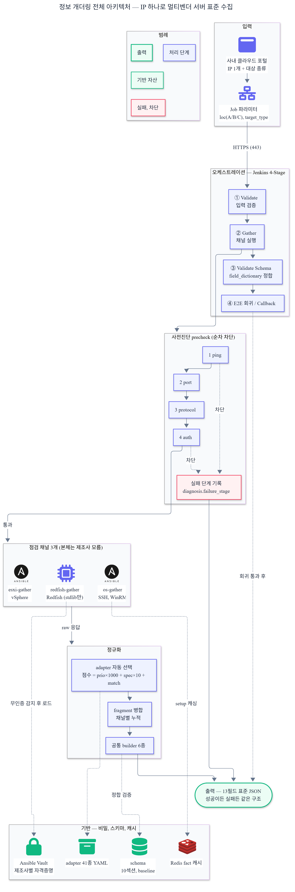

### 4.0 무엇을 왜 나눴나 — 분해 기준

| 나눈 단위 | 무엇이 다른가 | 그래서 어떻게 분리했나 |
|------|------|------|
| 점검 채널 3개 (운영체제, 가상화, 서버 하드웨어) | 접근 경로와 데이터 출처가 다릅니다. 운영체제는 OS 안에서 SSH나 WinRM으로, 가상화는 하이퍼바이저 API인 vSphere로, 서버 하드웨어는 OS와 무관한 관리 칩 BMC에서 Redfish로 읽습니다 | 채널마다 독립한 점검으로 분리. 한 채널이 실패해도 나머지 채널과 표준 출력은 그대로입니다 |
| 서버 하드웨어 4종 (HP, Dell, Lenovo, CSUS) | 같은 Redfish라도 관리 컨트롤러가 제각각입니다. HP는 iLO, Dell은 iDRAC, Lenovo는 XCC, CSUS는 RMC를 쓰고, 같은 항목을 물어도 응답 구조와 제조사 고유 확장(OEM)이 다릅니다 | 제조사 차이를 점검 코드가 아니라 설정 파일(adapter)로 흡수했습니다. 점검 본체는 제조사를 모릅니다 |
| 세대 구분 | 같은 제조사라도 펌웨어 세대마다 Redfish 경로와 응답 스키마가 바뀝니다. Dell만 봐도 iDRAC8, iDRAC9, iDRAC10이 다르고, 전원 정보 위치가 Power에서 PowerSubsystem으로 옮겨가기도 했습니다 | 세대별 설정 파일과 우선순위 계단을 둬서 최신 세대를 먼저 선택하고, 안 맞으면 옛 경로로 떨어집니다 |
| CSUS를 HP와 따로 | HP ProLiant는 iLO 하나가 서버 한 대를 관리하는 단일 노드입니다. CSUS는 RMC 하나가 여러 파티션과 섀시를 묶는 대형 스케일업이라 점검 토폴로지 자체가 다릅니다 | CSUS는 멀티노드 수집(data.multi_node)을 Additive로 더했습니다. 단일 노드 장비의 출력은 변하지 않습니다 |
| 점검을 섹션별 조각으로 | CPU, 메모리, 저장장치는 수집 출처도 실패하는 양상도 서로 다릅니다 | 각 점검이 자기 조각(fragment)만 만들고 공통 엔진이 병합합니다. 한 섹션 실패가 다른 섹션을 오염시키지 않습니다 |
| Jenkins 파이프라인 2종 (표준, 포털) | 표준은 배포 전 회귀까지 검증하고, 포털 연동은 망이 분리된 환경에서 결과를 중앙으로 모아 콜백합니다 | 4단계 중 앞 3단계는 공통으로 두고, 마지막 단계만 회귀 검증 또는 콜백으로 다르게 했습니다 |

이어서 같은 시스템을 여덟 가지 관점에서 봅니다. 진입에서 시작해 점검, 표준화, 회귀 순서로 읽으면 한 점검 요청이 결과로 돌아오는 전체 과정이 보입니다.

> **다이어그램 읽는 법 (9개 공통)**: 화살표는 흐름 방향입니다. 색은 의미를 고정했습니다 — 회색은 시작과 입력, 초록은 성공과 정상 출력, 노랑은 주의와 fallback(우회 경로), 빨강은 실패와 차단, 파랑은 외부 시스템(포털과 대상 장비)입니다. 점선은 보조 흐름이거나 결과 통보(콜백)입니다. 약어는 처음 나올 때 풀어 썼고, 모르는 용어는 §9.2 용어 글로서리에 모았습니다. (BMC = 서버가 꺼져 있어도 하드웨어를 원격으로 읽는 관리 칩, precheck = 본 점검 전 4단계 사전 진단, fragment = 각 점검이 자기 영역만 채우는 데이터 조각, envelope = 성공이든 실패든 같은 13필드로 돌려주는 표준 응답.)

먼저 전체 위상부터 봅니다.

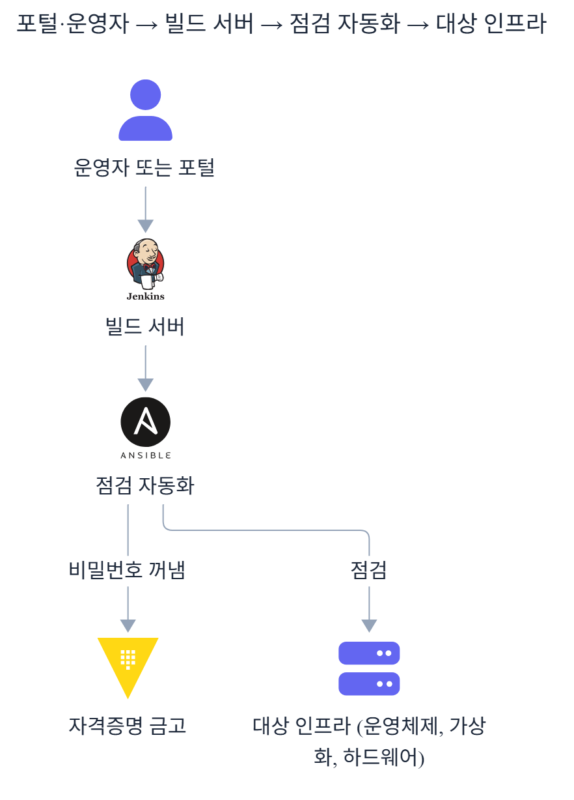

<details>
<summary>Mermaid 코드 (클릭하여 열기)</summary>

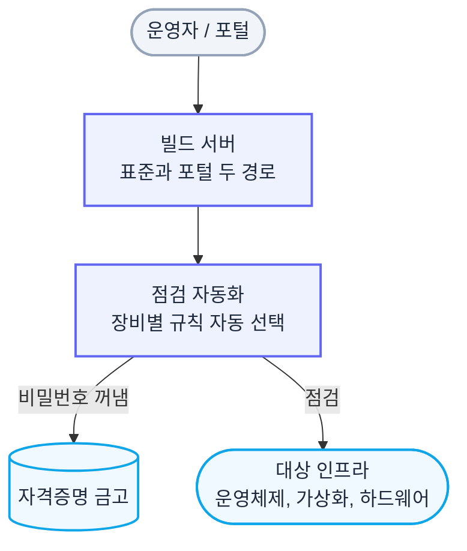

</details>

왼쪽 사내 클라우드 포털이 진입점, 오른쪽 대상 인프라가 점검 대상입니다. 빌드 서버가 진입점 2개를 갖고, 점검 자동화가 설정 파일과 플러그인으로 제조사 차이를 흡수합니다. 점선은 결과가 포털로 되돌아가는 콜백입니다.

### 4.1 멀티채널 점검 분기 — IP 하나가 어떻게 갈라지나

운영자나 사내 클라우드 포털이 IP 하나와 대상 종류만 넘기면, 자동화가 접속 포트를 탐지해 맞는 점검 경로를 고릅니다. 세 갈래로 갈라져도 출구는 하나의 표준 형식입니다.

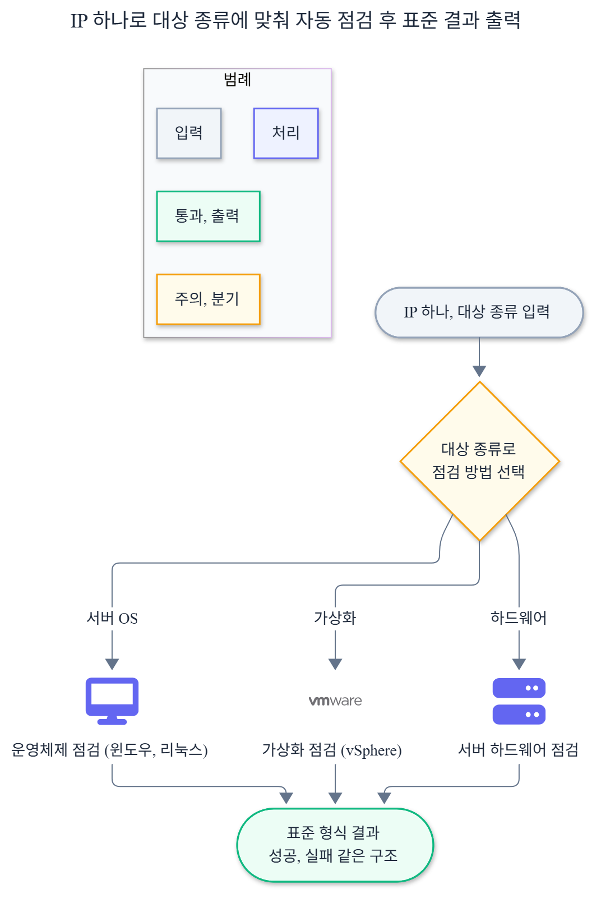

<details>
<summary>Mermaid 코드 (클릭하여 열기)</summary>

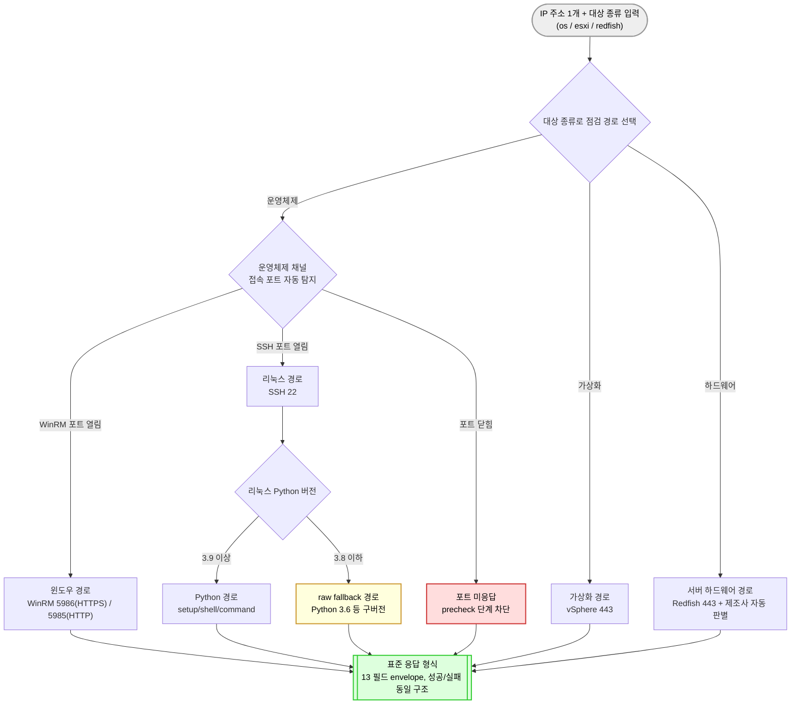

</details>

운영체제 채널만 포트 탐지로 윈도우와 리눅스를 한 번 더 나눕니다. 리눅스는 거기서 Python 버전을 또 확인합니다(이유는 §4.8).

**이 분기에서 강조하고 싶은 것 두 가지:**

- **세 갈래로 갈라져도 출구는 하나다.** 어느 경로를 타든 마지막은 같은 13 필드 표준 형식으로 모입니다. 포털은 채널이 무엇이었는지와 무관하게 한 형식만 받습니다.
- **호출자는 경로를 모른다.** IP와 대상 종류만 넘기면 포트 탐지가 나머지를 정하므로, 포털은 점검 대상의 OS나 제조사를 미리 알 필요가 없습니다.

### 4.2 Fragment 정규화 흐름 — 점검 결과가 어떻게 한 형식으로 모이나

각 점검(gather)은 자기 영역만 수집해서 자기 조각(fragment)만 만듭니다. CPU 점검은 CPU만, 메모리 점검은 메모리만 채웁니다. 공통 병합 엔진(`merge_fragment`)이 이 조각들을 누적하고, 공통 빌더 6종이 최종 JSON을 조립합니다.

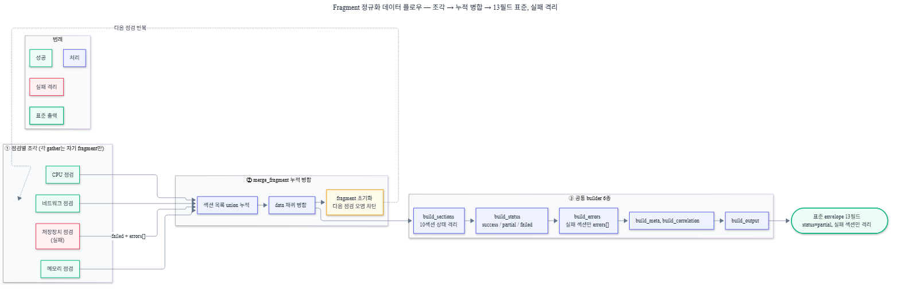

<details>
<summary>Mermaid 코드 (클릭하여 열기)</summary>

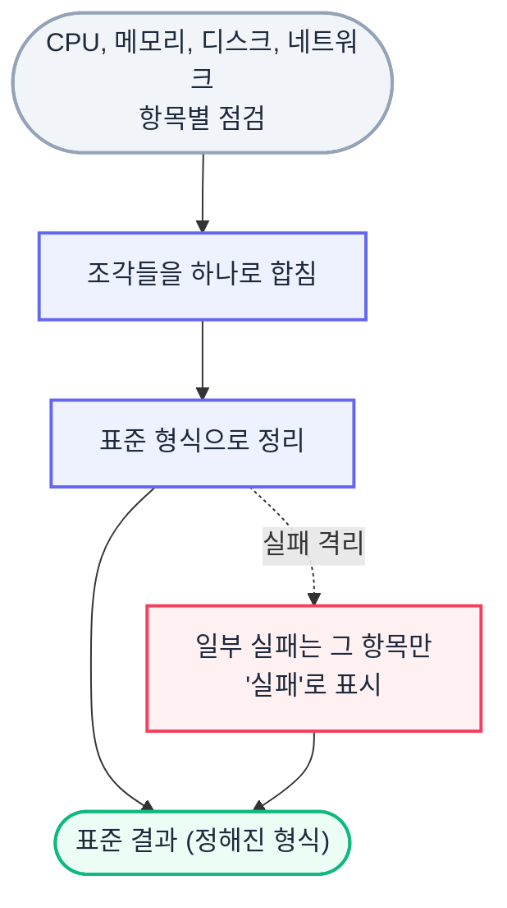

</details>

**이 구조에서 강조하고 싶은 것 세 가지:**

- **점검 하나를 추가해도 다른 점검을 건드리지 않는다.** 새 섹션은 그 섹션 점검 파일만 쓰면 됩니다. 병합 엔진이 약속된 다섯 개 fragment 변수만 누적하므로 조립 코드 전체를 고칠 필요가 없습니다.
- **한 섹션이 실패해도 나머지는 정상이다.** 실패한 섹션만 failed나 not_supported로 표시되고, 다른 섹션 수집은 그대로 진행됩니다.
- **누가 무엇을 채웠는지 추적된다.** 각 점검이 자기 조각만 만들기 때문에, 한 점검이 다른 점검의 데이터를 덮어쓰는 오염이 생기지 않습니다.

### 4.3 Adapter 자동 선택 — 제조사 차이를 코드 밖에서 고른다

제조사와 모델, 펌웨어 차이는 설정 파일(adapter YAML)에 담았습니다. 점검 본체 코드에는 "Dell이면 이렇게" 같은 제조사 분기가 없습니다. 대신 감지된 제조사 정보로 점수를 매겨 가장 잘 맞는 설정 파일을 고릅니다.

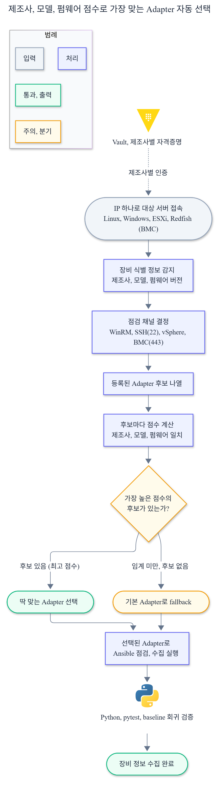

<details>
<summary>Mermaid 코드 (클릭하여 열기)</summary>

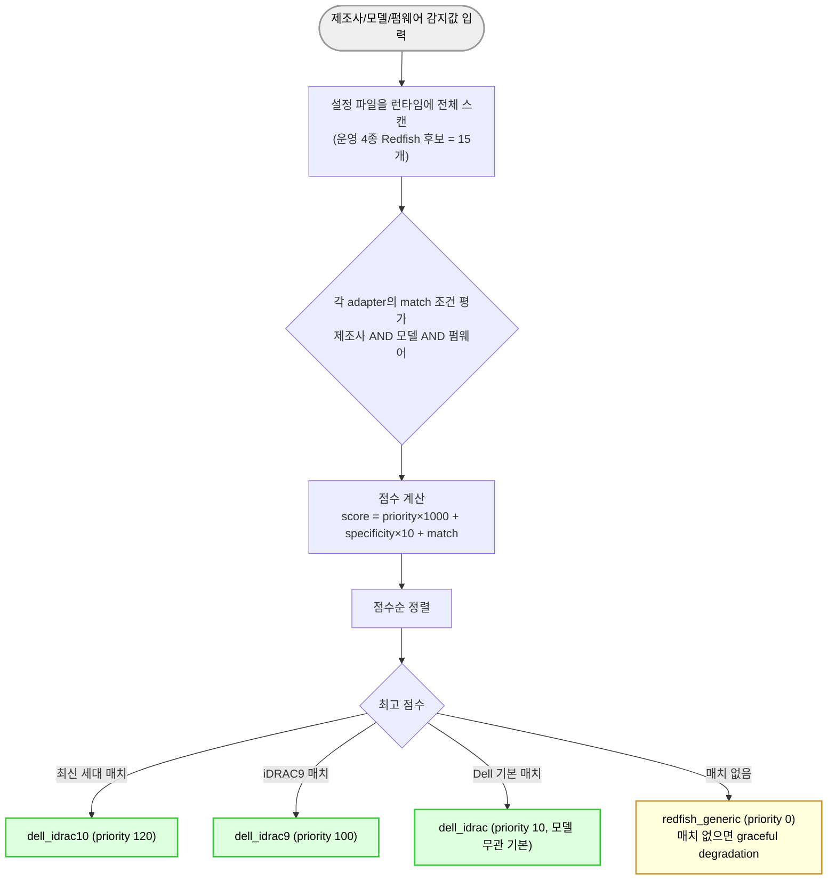

</details>

점수는 `priority × 1000 + specificity × 10 + match`로 계산합니다(공식은 `module_utils/adapter_common.py`에 있습니다). 우선순위는 세대가 올라갈수록 계단식으로 높입니다. Dell을 예로 들면 범용 fallback 0, Dell 모델 무관 기본(dell_idrac) 10, iDRAC8 50, iDRAC9 100, iDRAC10 120입니다. HPE iLO와 Lenovo XCC도 같은 계단을 씁니다(iLO7과 XCC3가 각각 120). 어떤 설정 파일과도 매치되지 않는 새 제조사가 들어와도 범용 fallback이 최소한의 점검을 시도하고 "표준 미준수" 상태로 결과를 돌려줍니다. 점검이 통째로 멈추지 않습니다.

#### 새 제조사가 들어오면

운영 대상은 Dell, HPE, Lenovo, CSUS 네 종류지만, 같은 점검으로 다른 제조사도 받을 수 있게 설계했습니다. 새 제조사가 추가될 때 점검 본체 코드와 파이프라인 진입점(site.yml)은 수정하지 않습니다. 세 가지만 더합니다. 제조사 이름 매핑 한 줄을 `vendor_aliases.yml`에 넣고, 설정 파일(adapter YAML)을 만들고, 필요하면 제조사 고유 점검(OEM tasks)을 디렉터리에 둡니다. adapter 자동 선택 로직이 설정 디렉터리를 런타임에 스캔하므로 새 파일을 알아서 인식합니다. 실장비가 lab에 없는 제조사는 공식 문서와 DMTF Redfish 표준을 근거로 설정을 만들고 출처 URL을 주석에 남긴 뒤, 실측 검증과 기준선 추가를 후속 작업 목록에 등록합니다.

#### 새 세대가 나오면

같은 제조사에서 새 세대(예: iLO8, iDRAC11)가 나오면, 그 세대 설정 파일을 다음 우선순위 계단으로 추가합니다. iLO7이 120이면 iLO8은 그 위 단계를 받습니다. 기존 세대 설정 파일은 건드리지 않습니다. 추가만 하고 기존 path는 수정하지 않는 원칙이라, 이미 검증된 세대의 점검이 깨질 위험이 없습니다. 펌웨어 매칭 패턴을 세대별 설정에 명시해서, 같은 모델이라도 펌웨어 버전으로 최신 세대가 먼저 선택되게 했습니다. 실제로 CSUS를 추가할 때 이 방식을 썼습니다. CSUS는 HPE의 기존 서버와 같은 OEM namespace(Oem.Hpe)를 쓰기 때문에, 제조사 설정과 OEM 점검은 기존 HPE 것을 그대로 재사용하고 모델 인식 정규식만 더했습니다. 다만 CSUS는 RMC 한 컨트롤러가 여러 파티션과 섀시를 묶는 구조라, 단일 노드를 가정한 기존 수집으로는 첫 파티션만 잡히는 결함이 있었습니다. 이때도 기존 단일 노드 경로를 고치지 않고, 전 파티션과 매니저, 섀시를 수집하는 data.multi_node 컨테이너를 더하는 방식으로 풀었습니다. 자세한 내용은 §8.1에 적었습니다.

### 4.4 사전 진단(precheck) — 본 점검 전에 4단계로 막는다

본 점검을 시작하기 전에 ping, port, protocol, auth 4단계를 순서대로 확인합니다. 각 단계에서 막히면 어디서 막혔는지 진단 결과에 기록합니다.

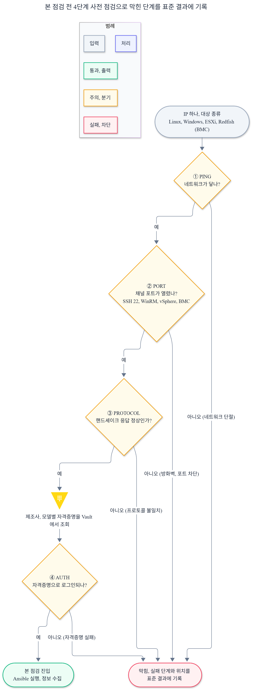

<details>
<summary>Mermaid 코드 (클릭하여 열기)</summary>

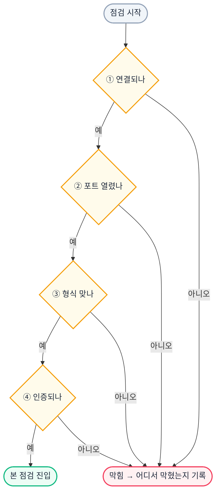

</details>

순서가 중요합니다. ping이 실패하면 port를 시도할 이유가 없고, protocol이 안 맞으면 인증을 시도할 이유가 없습니다. 무의미한 timeout을 쌓지 않으려고 단계를 끊었습니다. 어느 단계에서 막혀도 결과는 표준 형식으로 나오고, 진단 항목에 "여기서 막혔다"를 남깁니다.

### 4.5 Vault 2단계 로딩 — 제조사를 모른 채로 자격증명을 먼저 정하지 않는다

서버 하드웨어 점검(Redfish)은 제조사별로 자격증명이 다릅니다. 그런데 점검 시작 시점에는 그 IP가 어느 제조사인지 모릅니다. 그래서 무인증으로 제조사를 먼저 알아낸 뒤, 그 제조사에 맞는 암호화 자격증명을 로드합니다.

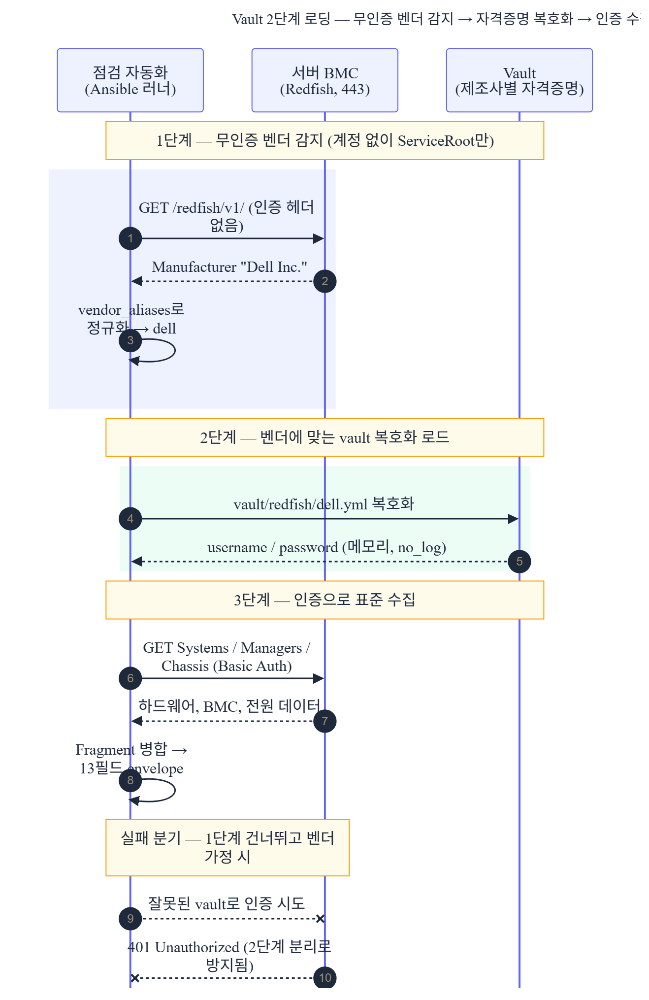

<details>
<summary>Mermaid 코드 (클릭하여 열기)</summary>

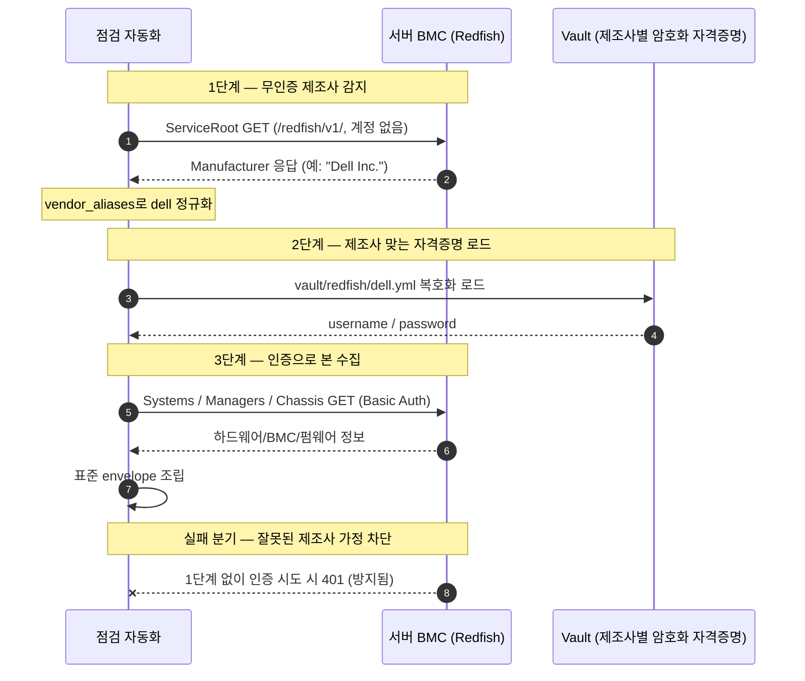

</details>

제조사를 가정하고 자격증명부터 던지면, 가정이 틀렸을 때 인증 실패로 끝납니다. 무인증 감지를 1단계로 두면 알려지지 않은 펌웨어가 들어와도 일단 제조사를 식별할 수 있습니다. 호출자는 IP만 넘기고, 자격증명은 자동화가 알아서 고릅니다.

### 4.6 Jenkins 파이프라인 — 4단계 게이트와 포털 콜백

Jenkins 파이프라인은 2종입니다. 표준 점검용과 사내 클라우드 포털 연동용입니다. 둘 다 Validate, Gather, Validate Schema까지 같고 4번째 단계만 다릅니다.

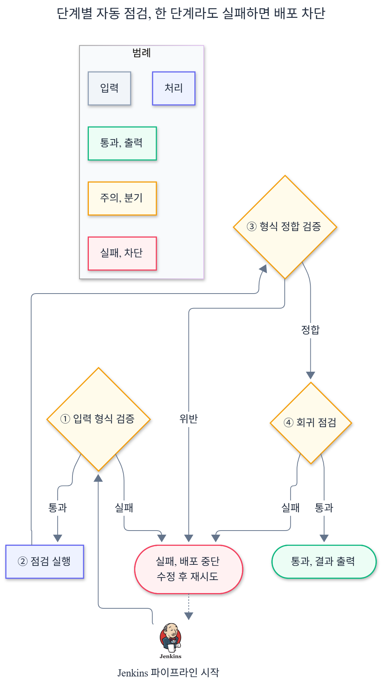

<details>
<summary>Mermaid 코드 (클릭하여 열기)</summary>

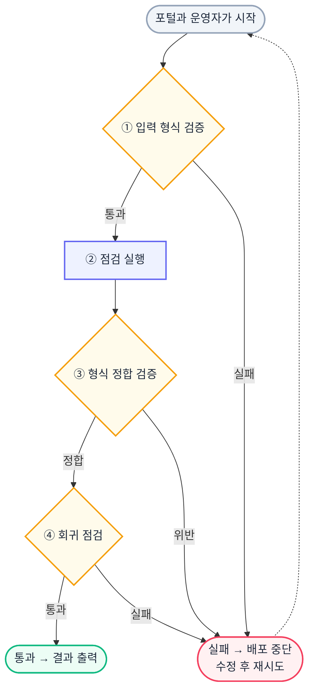

</details>

포털 연동 파이프라인은 망이 분리된 환경을 위해 따로 설계했습니다. 점검은 사이트 에이전트에서 돌리고, 결과를 망 구간 건너 중앙으로 모은 뒤 포털에 HTTP로 콜백합니다.

**이 파이프라인에서 강조하고 싶은 것 두 가지:**

- **앞 3단계는 공유하고 4단계만 다르다.** Validate, Gather, Validate Schema까지 두 파이프라인이 같고, 표준은 회귀 검증으로, 포털은 콜백으로 갈립니다. 공통 부분을 두 번 만들지 않습니다.
- **점검 성공과 통보 실패를 분리한다.** 콜백이 실패해도 점검이 성공했으면 빌드는 실패가 아니라 "통보만 못한 상태"입니다. 통보 실패를 점검 실패로 묻으면 멀쩡한 결과를 통째로 버리게 됩니다.

### 4.7 사이트 분기 — 위치 라우팅과 점검 로직을 나눈다

어느 사이트에서 실행할지는 Jenkins 파라미터로 정합니다. loc 값이 지역 A면 지역 A 에이전트, 지역 B면 지역 B 에이전트를 고릅니다.

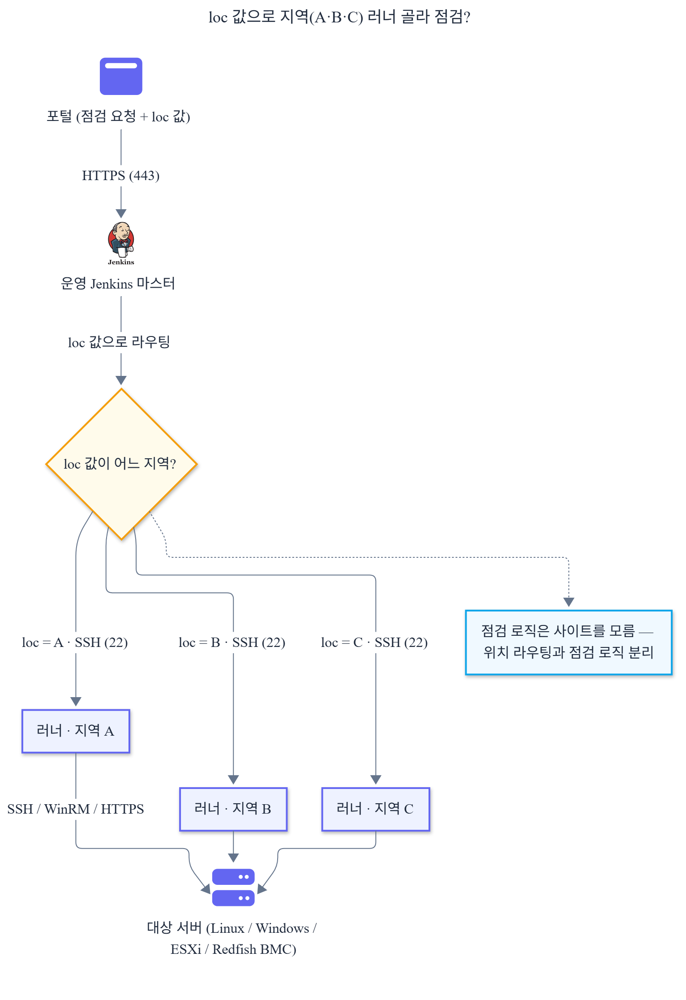

<details>
<summary>Mermaid 코드 (클릭하여 열기)</summary>

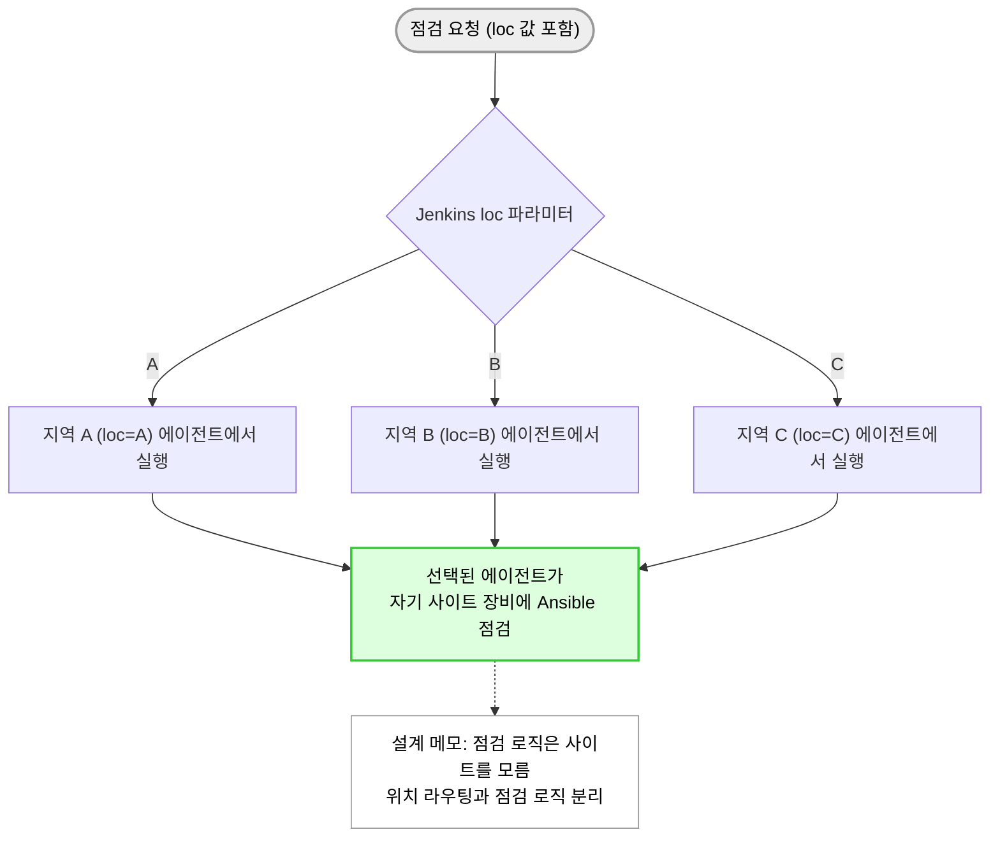

</details>

사이트 결정은 파이프라인 단계에서 끝납니다. 점검 로직(Ansible)은 자기가 어느 사이트에서 도는지 모르고 단순하게 유지됩니다. 위치 라우팅을 파이프라인이 맡고 점검 로직과 분리한 설계입니다. 사이트가 늘어도 점검 코드는 그대로입니다.

### 4.8 Linux 2단계 점검 — Python이 구버전이면 raw로 떨어진다

리눅스 점검은 Ansible의 setup 모듈을 쓰는데, 이 모듈은 원격 서버에 Python 3.9 이상이 있어야 동작합니다. RHEL 8.10처럼 기본 Python이 3.6인 서버에서는 setup 모듈이 실패합니다. 그래서 점검 전에 Python 버전을 먼저 확인해 경로를 가릅니다.

| 모드 | 조건 | 점검 방식 |
|------|------|----------|
| python_ok | Python 3.9 이상 | `setup` / `shell` / `command` / `getent` 모듈 (원격에 Python 필요) |
| raw fallback | Python 미설치 또는 3.8 이하 | `ansible.builtin.raw` 모듈만 사용 (원격에 Python 불필요) |

raw fallback이 쓰는 모듈은 `ansible.builtin.raw`입니다. 이 모듈은 원격 서버에 Python을 요구하지 않고 SSH로 셸(bash) 명령을 직접 실행한 뒤, 그 표준출력 텍스트를 점검을 실행하는 쪽(controller)에서 `set_fact`와 Jinja2로 파싱합니다(실제 코드는 `os-gather/tasks/linux/preflight.yml`). 즉 "원격에서는 bash만 돌리고, 해석은 점검 노드가 한다"는 구조입니다. raw 경로는 느리고 파싱이 복잡하지만 운영체제 채널이 지원하는 6개 섹션(시스템, CPU, 메모리, 저장장치, 네트워크, 사용자)을 모두 수집하고, 표준 JSON 형식을 그대로 유지합니다. BMC, 펌웨어, 전원 같은 나머지 섹션은 OS 안에서 읽을 수 없어 서버 하드웨어(Redfish) 채널이 맡습니다. 즉 점검 섹션 카탈로그 전체는 10개이고, 그중 운영체제 채널이 다루는 6개를 raw 경로에서도 빠짐없이 수집한다는 뜻입니다. 진단 항목에 `gather_mode`와 `python_version`을 남겨서, 호출자가 "이 서버는 raw로 떨어졌다"를 알 수 있게 했습니다. RHEL 8.10, RHEL 9.2, 9.6, Rocky 9.6, Ubuntu 24.04에서 검증했습니다.

---

## 5. 핵심 해결 과정 5개

각 항목을 같은 7단계로 풉니다. 어떤 문제가 있었는지, 어떤 선택지를 검토했는지, 왜 이 방식을 골랐는지, 무엇을 만들었는지, 언제 자동으로 검증되는지, 실패하면 어떻게 처리하는지, 결과적으로 무엇이 줄었는지입니다.

결과만 보면 답을 하나로 정해 두고 시작한 것 같습니다. 아닙니다. a와 b를 먼저 해보고 깨지는 지점을 본 뒤에야 c로 옮긴 경우가 많습니다. 검토한 선택지와 버린 이유를 함께 적은 건 그 과정을 드러내려는 것입니다. 각 항목의 구조 그림은 대부분 §4의 해당 절에 있어 여기서는 가리키기만 하고, §5.5만 자체 그림을 둡니다.

### 5.1 점검 진입을 IP 하나로 통일

**1) 어떤 문제가 있었는가**

운영자가 장비 종류별 절차를 외워 손으로 점검했습니다. 한 대에 5분에서 30분이 걸렸습니다(현장 추정). 제조사가 다르고, 같은 제조사라도 세대가 다르고, 운영체제면 리눅스인지 윈도우인지에 따라 접속 방식이 갈렸습니다. 점검 진입점이 어디에도 정리돼 있지 않아, 새 운영자가 들어오면 그 절차를 처음부터 다시 익혀야 했습니다.

**2) 검토한 선택지**

- (a) 제조사별 점검 진입 스크립트를 따로 두고 운영자가 맞는 것을 고름
- (b) 포털이 점검 전에 제조사를 미리 판별해 종류를 지정
- (c) IP와 대상 종류만 받고, 자동화가 접속 포트를 탐지해 경로를 고름 — 채택

**3) 왜 이 방식을 선택했는가**

(a)를 택해도 운영자가 외워야 할 게 줄지 않습니다. 스크립트만 늘어날 뿐입니다. (b)는 제조사를 알아내는 책임을 포털로 떠넘기는 셈이라, 제조사가 추가될 때마다 포털을 또 손봐야 합니다. (c)는 호출자가 제조사도 운영체제도 모른 채 IP만 넘기면 되고, 새 장비가 들어와도 진입점은 그대로입니다.

**4) 내가 만든 기준 / 구조**

IP와 대상 종류(os/esxi/redfish)를 받으면 접속 포트를 탐지해 운영체제, 가상화, 서버 하드웨어 세 경로로 가릅니다. 운영체제 경로는 포트로 윈도우와 리눅스를 한 번 더 나눕니다. 포털이 넘기는 IP 목록(inventory_json)은 직접 만든 Ansible 동적 인벤토리 스크립트(`inventory.sh`)가 받아 IPv4 형식과 중복을 검증한 뒤 점검 대상 호스트로 펼칩니다. 분기 구조는 §4.1 그림과 같습니다.

**5) 어느 시점에서 자동으로 검증되는가**

사전 진단(precheck) 1, 2단계에서 포트 응답으로 채널을 확정합니다. 포트가 닫혀 있으면 본 점검으로 넘어가지 않습니다.

**6) 실패하면 어떻게 처리되는가**

포트가 응답하지 않으면 precheck 단계에서 막고, status를 failed로 두되 13 필드를 모두 채워 어디서 막혔는지 진단에 남깁니다.

**7) 결과적으로 무엇이 줄었는가**

호출자는 점검 대상이 어떤 제조사인지, 어떤 OS인지 미리 알 필요가 없습니다. 포털에 등록된 자산을 그대로 점검 대상으로 연결하는 고리가 됐습니다.

### 5.2 제조사 차이를 점검 코드 밖으로 분리

**1) 어떤 문제가 있었는가**

제조사마다 점검 스크립트를 따로 짜면 장비 종류가 늘수록 코드가 비례해서 늘어납니다. 새 펌웨어가 나오면 어느 스크립트를 고쳐야 하는지 추적하기 어렵고, 한 제조사 응답 형식이 바뀌면 그 스크립트만 조용히 깨집니다. Dell, HPE, Lenovo, CSUS에 세대까지 곱하면 점검해야 할 조합이 빠르게 불어났습니다.

**2) 검토한 선택지**

- (a) 제조사와 세대별로 점검 스크립트를 따로 작성
- (b) 점검 코드 안에 if 분기로 제조사를 나눔
- (c) 제조사 차이를 설정 파일(adapter YAML)로 빼고, 점수로 가장 맞는 설정을 고름 — 채택

**3) 왜 이 방식을 선택했는가**

(a)는 장비 종류만큼 코드가 늘고 유지보수 지점이 흩어집니다. (b)가 처음엔 제일 빨라 보였습니다. 그런데 점검 본체에 "Dell이면 이렇게"가 한 번 박히면, 한 제조사 분기를 손댈 때 옆 제조사 점검이 같이 흔들렸습니다. 제조사가 늘 때마다 본체를 고쳐야 했습니다. (c)는 점검 본체가 제조사를 모릅니다. 새 제조사나 세대는 설정 파일만 더하면 끝입니다.

**4) 내가 만든 기준 / 구조**

운영 4종을 점검하는 설정 파일은 26개입니다(서버 하드웨어 Redfish 15, 운영체제 7, 가상화 4). 서버 하드웨어 15개가 Dell, HPE, Lenovo, CSUS의 세대와 모델을 덮습니다. 감지된 제조사와 모델, 펌웨어로 `priority × 1000 + specificity × 10 + match` 점수를 매겨 가장 높은 설정을 고르는 로직을 lookup 플러그인으로 뺐습니다. 새 제조사는 이름 매핑 한 줄(vendor_aliases)과 설정 파일 하나, 필요하면 제조사 고유 점검(OEM tasks)만 더합니다. 점수 계단과 선택 과정은 §4.3 그림과 같습니다.

**5) 어느 시점에서 자동으로 검증되는가**

점검 시작 시 lookup 플러그인이 설정 디렉터리를 런타임에 스캔해 점수로 설정을 확정합니다. 매치되는 설정이 없으면 범용 fallback(priority 0)이 선택됩니다.

**6) 실패하면 어떻게 처리되는가**

알려지지 않은 제조사가 들어와도 범용 fallback이 최소한의 점검을 시도하고 "표준 미준수" 상태로 결과를 돌려줍니다. 점검이 통째로 멈추지 않습니다.

**7) 결과적으로 무엇이 줄었는가**

제조사와 세대가 늘어도 고칠 코드 위치가 없습니다. 실제로 CSUS를 받을 때도 이름 매핑 한 줄과 설정 파일 하나만 더했고, 점검 본체는 한 줄도 건드리지 않았습니다.

### 5.3 응답을 표준 형식으로 고정

**1) 어떤 문제가 있었는가**

점검 결과 형식이 점검자와 제조사마다 제각각이라, 사내 클라우드 포털이 그대로 받아 화면에 뿌리기 어려웠습니다. 포털은 제조사 수만큼 해석 분기를 둬야 했고, 점검이 실패하면 무엇이 실패인지조차 형식이 달라 사람이 다시 봐야 했습니다.

**2) 검토한 선택지**

- (a) 제조사별 응답을 그대로 넘기고 포털이 각각 해석
- (b) 성공 응답만 표준화하고 실패는 별도 에러 형식으로
- (c) 성공이든 실패든 같은 13 필드 JSON으로 고정 — 채택

**3) 왜 이 방식을 선택했는가**

(a)는 포털 해석 코드가 제조사 수만큼 늘어납니다. 제조사 하나 추가에 포털을 또 고쳐야 합니다. (b)는 성공과 실패의 형식이 갈리는 게 문제였습니다. 포털이 두 갈래 파싱을 떠안게 됩니다. (c)는 한 가지 해석 코드로 성공도 실패도 받습니다. 실패가 같은 구조라 사람이 끼지 않아도 다음 동작이 정해집니다.

**4) 내가 만든 기준 / 구조**

분석용 6개(status, sections, data, errors, meta, diagnosis), 라우팅과 식별용 5개(target_type, collection_method, ip, hostname, vendor), 추적용 2개(correlation, schema_version)로 13 필드를 고정했습니다. 점검 범위는 10개 섹션(시스템, 하드웨어, BMC, CPU, 메모리, 저장장치, 네트워크, 펌웨어, 사용자, 전원)입니다. 각 점검은 자기 조각(fragment)만 만들고 공통 병합 엔진과 빌더 6종이 이 형식으로 조립합니다(§4.2 그림). 각 필드 의미는 사전 파일(field_dictionary)에 한국어와 영어로 정리했고, 등록 항목은 83개, 그중 호출자가 반드시 알아야 하는 필수 필드가 39개입니다.

**5) 어느 시점에서 자동으로 검증되는가**

파이프라인 3단계(Validate Schema)에서 field_dictionary 정합을 검사하고, 어긋나면 FAIL 게이트로 막습니다.

**6) 실패하면 어떻게 처리되는가**

점검이 실패해도 13 필드를 모두 채웁니다. data는 비우고 sections는 not_supported로 채우되, status와 diagnosis.failure_stage, errors에 어디서 왜 막혔는지를 남깁니다(실제 출력은 §9.5).

**7) 결과적으로 무엇이 줄었는가**

포털은 사전 파일을 한 번 로드해 제조사 수와 무관하게 단일 해석으로 받습니다. 성공과 실패가 같은 구조라 실패한 점검 결과도 자동으로 라우팅됩니다.

### 5.4 포털 콜백 파이프라인 분리

**1) 어떤 문제가 있었는가**

사내 클라우드 포털은 망이 분리된 환경에 있어 점검 에이전트가 결과를 직접 넘길 수 없었습니다. 또 점검은 됐는데 통보만 막힌 경우를 어떻게 다룰지 정해야 했습니다. 이걸 실패로 묶으면 멀쩡한 점검 결과를 버리게 됩니다.

**2) 검토한 선택지**

- (a) 표준 파이프라인 하나로 점검과 콜백을 같이 처리
- (b) 콜백을 메시지 큐로 보장(재시도 큐, DLQ)
- (c) 망분리 포털용 파이프라인을 따로 두고, 콜백 실패와 점검 실패를 분리 — 채택

**3) 왜 이 방식을 선택했는가**

(a)는 망분리 환경과 표준 환경의 요구가 달라, 한 파이프라인에 억지로 합치면 둘 다 복잡해집니다. (b)는 과합니다. 망이 분리된 곳에 큐 인프라를 새로 들이는 비용이 큰데, 점검 결과는 로그와 아티팩트로 회수하면 됩니다. (c)는 점검과 통보를 떼어놨습니다. 통보가 막혀도 점검 결과는 남습니다.

**4) 내가 만든 기준 / 구조**

앞 3단계(Validate, Gather, Validate Schema)는 표준 파이프라인과 공유하고, 4번째 단계만 표준은 회귀 검증(E2E Regression), 포털은 콜백으로 다르게 뒀습니다(§4.6 그림). 점검은 사이트 에이전트에서 돌고, 결과는 망 구간을 건너 중앙으로 모인 뒤 포털에 HTTP로 콜백합니다. 콜백 URL은 보내기 전에 공백과 후행 슬래시를 정리해 잘못된 endpoint로 가는 사고를 막습니다.

**5) 어느 시점에서 자동으로 검증되는가**

포털 파이프라인 4단계에서 콜백을 보내고 200 응답을 확인합니다. 실패하면 3회까지 재시도합니다.

**6) 실패하면 어떻게 처리되는가**

3회 재시도 후에도 콜백이 실패하면, 점검 결과를 로그와 아티팩트에 남기고 빌드는 성공으로 유지합니다. 빌드 로그에 "통보만 실패"를 명시합니다.

**7) 결과적으로 무엇이 줄었는가**

"점검 성공"과 "결과 통보 실패"가 구분됩니다. 통보가 막혀도 점검 결과를 회수할 수 있어, 멀쩡한 결과를 실패로 버리는 일이 없어졌습니다.

### 5.5 회귀 게이트로 배포 전 차단

**1) 어떤 문제가 있었는가**

코드나 설정, 응답 형식을 바꿨을 때 기존 점검 결과가 의도치 않게 달라질 수 있었습니다. 사람이 일일이 비교하면 놓치기 쉽고, 한 제조사 응답 형식 변경이 다른 제조사 점검까지 조용히 깨뜨릴 수 있었습니다.

**2) 검토한 선택지**

- (a) 사람이 배포 전에 수동으로 결과를 비교
- (b) 운영 반영 후 모니터링으로 회귀를 감지
- (c) 회귀 기준선과 pytest로 배포 전 자동 차단 — 채택

**3) 왜 이 방식을 선택했는가**

(a)는 비교 대상이 많아지면 사람이 놓칩니다. 기준도 사람마다 다릅니다. (b)는 이미 운영에 나간 뒤라, 깨진 점검을 사용자가 먼저 겪습니다. (c)는 배포 전에 기준선과 자동으로 맞춰봐서, 깨지는 변경을 운영에 닿기 전에 막습니다.

**4) 내가 만든 기준 / 구조**

운영 4종 회귀 기준선 8종과 pytest 699개, fixture 353개로 검증합니다. 파이프라인 마지막 단계(E2E Regression)가 이 회귀를 돌려 실패하면 빌드를 멈춥니다. 차이가 나면 두 갈래로 나눕니다. 외부 시스템이 바뀐 거면 기준선을 갱신하고 검증 기록을 남기고, 코드 버그면 코드를 고칩니다. 기준선은 실장비 검증이 있을 때만 갱신해, 회귀의 기준점을 임의로 흔들지 않습니다.

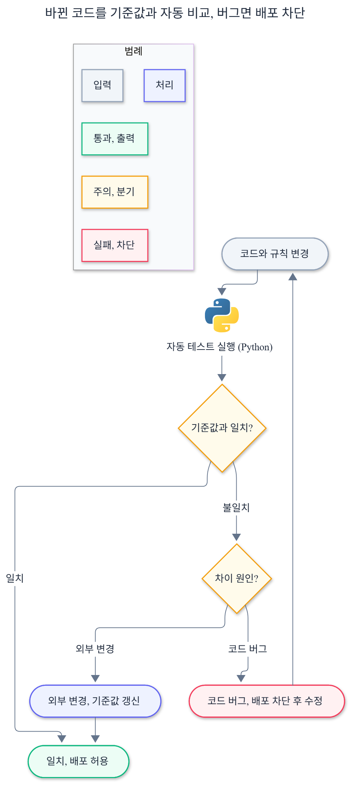

<details>
<summary>Mermaid 코드 (클릭하여 열기)</summary>

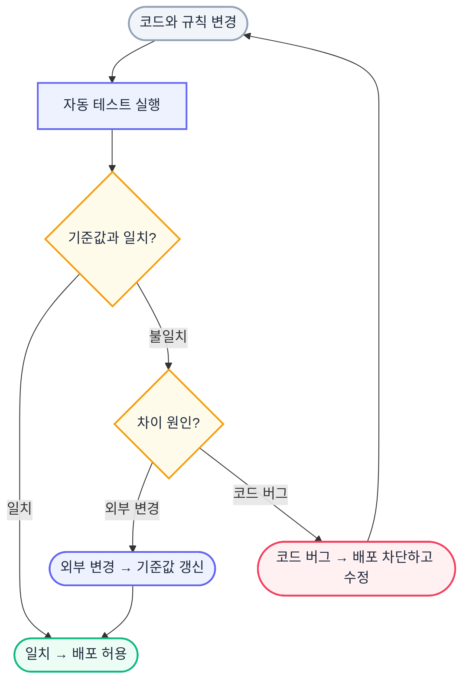

</details>

**5) 어느 시점에서 자동으로 검증되는가**

파이프라인 4단계(E2E Regression). 표준 파이프라인의 마지막 FAIL 게이트입니다.

**6) 실패하면 어떻게 처리되는가**

회귀가 깨지면 빌드를 멈추고, 차이 원인을 외부 계약 변경과 코드 버그로 가릅니다. 코드 버그면 수정 후 재실행하고, 외부 변경이면 실측 evidence와 함께 기준선을 갱신합니다.

**7) 결과적으로 무엇이 줄었는가**

코드 변경이 기존 점검을 깨뜨리는지를 배포 전에 자동으로 잡습니다. 실측 없는 기준선 변경을 막아 회귀가 의미를 잃지 않습니다.

표준 응답이 성공이든 실패든 같은 13 필드로 나오는 실제 출력 예시는 §9.5에 있습니다. 실패해도 `status`, `diagnosis.failure_stage`, `errors`가 채워져 있어, 포털이 "어디서 막혔는지"를 사람 개입 없이 읽고 다음 동작을 정할 수 있습니다.

---

## 6. 결과

### 핵심 결과

수천 대 규모 서버를 단일 표준으로 점검합니다. 손으로 하면 한 대당 5분에서 30분이 드는 일을(현장 추정), 대상 목록을 받아 한 번의 파이프라인 실행으로 대체했습니다. 운영 대상은 Dell, HPE, Lenovo, CSUS 네 종류이고, 새 제조사나 새 세대가 들어와도 코드 수정 없이 설정 파일 추가만으로 점검 대상에 넣습니다.

### Before / After

| 항목 | Before | After |
|------|--------|-------|
| 점검 진입 | 제조사/OS별 절차를 운영자가 외워 손으로 | IP 하나와 대상 종류만 넘기면 자동 분기 |
| 제조사 추가 | 점검 스크립트를 제조사마다 새로 작성 | 설정 파일 1개 + 이름 매핑 1줄, 본체 코드 수정 0 |
| 응답 형식 | 점검자/제조사마다 제각각 | 13 필드 JSON 고정, 성공/실패 동일 구조 |
| 포털 해석 | 제조사 수만큼 해석 분기 | 사전 파일 1회 로드로 단일 해석 |
| 점검 실패 처리 | 어디서 막혔는지 사람이 추적 | 4단계 진단에 차단 지점 기록 |
| 코드 변경 검증 | 사람이 수동 비교 | baseline 8종 + pytest 699개로 배포 전 자동 차단 |

### 정량 결과

- 점검 채널 3개(운영체제, 가상화, 서버 하드웨어), 운영 4종 설정 파일 26개, 표준 응답 13 필드, 점검 섹션 10개
- 운영 하드웨어 4종(Dell, HPE, Lenovo, HPE CSUS) + 범용 fallback. 새 제조사와 세대는 설정 추가만으로 확장되는 구조
- 회귀 기준선 8종(운영 4종), pytest 699개(테스트 함수 375, 파일 42), fixture 353개
- 커스텀 Ansible 플러그인 4종, Redfish 수집 엔진 3,812줄(Python 표준 라이브러리만)
- 공개 GitHub 커밋 335개 중 본인 327개(97.6%, Administrator 8개는 본인/동료 구분 불명으로 보수적 제외)

---

## 7. 기술적 의사결정

| 결정 | 근거 |
|------|------|
| 제조사 차이를 코드가 아니라 설정 파일로 흡수 | 제조사마다 스크립트를 따로 두면 장비 수만큼 코드가 늘고, 새 펌웨어가 나오면 어느 스크립트가 깨지는지 추적이 어려움. 설정 파일은 본체 수정 없이 장비를 늘림 |
| 점검은 자기 조각(fragment)만 만들고 공통 엔진이 병합 | 점검 하나가 다른 점검의 데이터를 직접 건드리면 누가 무엇을 채웠는지 추적 불가. 자기 영역만 만들면 한 섹션 실패가 다른 섹션을 오염시키지 않음 |
| Redfish 엔진은 Python 표준 라이브러리만 사용 | 점검 에이전트에 외부 라이브러리가 빠지면 핵심 수집이 통째로 실패. urllib, ssl, socket만 쓰면 환경 의존이 없음 |
| 하드웨어 정보 수집은 읽기 전용 GET만 | 점검 도구가 서버 상태를 바꾸면 안 됨. 정보 수집 경로는 GET만 쓰고, 일부 펌웨어를 crash시키는 If-Match 헤더와 파괴적 OEM Action(SystemErase, ClearCMOS 등)은 쓰지 않음. 자격증명 복구용 쓰기 경로(POST/PATCH/DELETE)는 1차 인증이 실패해 복구(break-glass) 계정으로 수집한 경우에만 동작하는 별도 경로다. Python 모듈 기본값은 dryrun(시뮬레이션)이고, lab 검증 후 사용자 승인으로 운영 실행을 켰으며(2026-04-30), 동작이 idempotent(이미 존재 시 PATCH skip)라 반복 실행해도 안전 |
| 제조사 감지를 먼저, 자격증명은 나중 | 제조사를 가정하고 자격증명부터 던지면 가정이 틀렸을 때 인증 실패. 무인증 감지가 먼저면 알려지지 않은 펌웨어도 식별 가능 |
| 커밋 전은 차단, 콜백 실패는 빌드 성공 유지 | 형식 위반이나 회귀는 배포 전에 막아야 함. 반대로 점검은 됐는데 통보만 막힌 경우를 실패로 처리하면 멀쩡한 결과를 버림 |
| 위치 라우팅(파이프라인)과 점검 로직(Ansible) 분리 | 사이트 분기를 점검 코드에 넣으면 사이트가 늘 때마다 코드가 비대해짐. 파이프라인 파라미터로 끝내면 점검 로직이 단순 |
| 기준선은 실장비 검증이 있을 때만 갱신 | 기준선은 회귀의 기준점. 실측 없이 바꾸면 회귀 검사가 의미를 잃음 |
| CSUS 멀티노드는 기존 경로를 고치지 않고 Additive 컨테이너로 | CSUS는 RMC 한 컨트롤러가 여러 파티션과 섀시를 묶는 구조라, 단일 노드 가정으로 짠 기존 수집은 첫 파티션만 잡았음. 기존 경로를 고치는 대신 data.multi_node Additive 컨테이너를 더해 전 파티션, 매니저, 섀시를 수집. 표준 13 필드 형태와 다른 제조사 출력은 변하지 않음 |
| Jenkins 마스터에 Redis fact 캐싱 1대 집중 | 동일 호스트를 반복 점검할 때마다 운영체제 fact를 SSH/WinRM으로 다시 긁는 비용을 줄이려고, 마스터에 Redis 1대를 두고 모든 사이트 에이전트가 거기에 붙도록 함. Ansible setup 모듈 결과를 24시간 캐싱하고 `gathering = smart`로 캐시 적중 시 재수집을 생략. 서버 하드웨어(Redfish)와 가상화 수집은 캐시 대상이 아니라 효과 범위는 운영체제 채널 반복 점검으로 한정. 설정과 측정 방법은 §9.6 |

### 검토했다 버린 대안

판단의 근거를 분명히 하려고, 같은 문제를 풀 수 있었던 다른 선택지와 버린 이유를 함께 적습니다.

- **제조사마다 점검 스크립트를 따로 작성** → 버림. 장비 종류가 늘수록 코드가 비례해서 늘고, 새 펌웨어가 나오면 어느 스크립트가 조용히 깨지는지 추적이 어렵습니다. 그래서 점검 본체는 하나로 두고 제조사 차이를 설정 파일로 흡수하는 쪽을 택했습니다.
- **requests나 redfish 같은 외부 라이브러리 사용** → 버림. 점검 에이전트가 3개 사이트에 분산돼 있어 한 곳에 패키지가 빠지면 수집이 통째로 실패하고, 새 에이전트를 띄울 때마다 설치 단계가 늘어납니다. urllib/ssl/socket 같은 표준 라이브러리만 써서 환경 의존을 0으로 만들었습니다.
- **콜백을 메시지 큐로 보장(재시도 큐/DLQ)** → 버림. 망이 분리된 환경에 큐 인프라를 새로 들이는 비용이 큰데, 점검 결과를 로그와 아티팩트로 회수할 수 있으면 그걸로 충분했습니다. 그래서 3회 재시도 후에도 실패하면 결과를 남겨 두고 빌드는 성공으로 유지합니다.
- **사이트 분기를 점검 코드 안에 넣기** → 버림. 사이트가 늘 때마다 점검 코드가 비대해집니다. 위치 라우팅은 Jenkins 파라미터(loc)로 끝내고, 점검 로직은 자기가 어느 사이트에서 도는지 모르게 단순히 유지했습니다.

---

## 8. 한계점, 향후 계획, 확장 가능성

### 8.1 알려진 한계

면접에서 깊이 묻는 분이 있을 수 있어 솔직히 적습니다.

- **실측 검증 범위와 CSUS lab 부재**: 운영 4종 중 Dell, HPE, Lenovo는 2026-05-07 사이트 BMC로 실측 검증했습니다(Dell iDRAC10 5대, HPE iLO7 1대, Lenovo XCC3 1대, 검증 commit `0a485823`). HPE CSUS는 개발 lab에도 사이트에도 아직 점검 가능한 실장비가 없어, HPE 공식 문서와 DMTF Redfish 표준으로 설정 파일(priority=96)과 기준선을 만들고 출처 URL을 주석에 남겼습니다. CSUS 실측 검증은 장비 도입 후로 남겨 두었고 후속 작업 목록에 등록했습니다. 추정으로 만든 부분은 "추정"으로 표시하고 실측으로 격상하지 않았습니다.
- **CSUS 멀티노드 RMC 지원(lab 없이 web 근거로)**: CSUS는 RMC 한 컨트롤러가 여러 파티션과 섀시, 매니저를 묶는 대형 스케일업 구조입니다. 처음에는 점검 엔진이 단일 노드를 가정해 첫 파티션만 수집하는 결함이 있었습니다. HPE 공식 관리 가이드와 Server Management Portal, sdflexutils 공개 코드, DMTF 표준을 근거로 전 파티션과 매니저, 섀시를 수집하는 data.multi_node 컨테이너를 더했습니다(점검 엔진 redfish_gather.py에 약 340줄 추가 — `git show --numstat 0b29b9d2` 기준 +340/-4, 기존 단일 노드 경로와 표준 13 필드는 그대로). 실장비가 없어 합성 mock(3파티션 × 4매니저 × 3섀시) 7종으로 회귀를 검증했고, RMC가 꺼져 있어 응답이 없는 경우의 진단 메시지까지 넣었습니다. 다만 이 전체가 실장비가 아니라 web 근거와 mock 기반이라, 사이트 도입 후 실측 검증이 필요합니다.
- **세대 커버리지 차이**: 같은 제조사라도 실측한 세대는 한정적입니다. Dell iDRAC10, HPE iLO7, Lenovo XCC3는 실측했지만 그 아래 세대(iDRAC8/9, iLO5/6, XCC 등)는 설정 파일과 mock 기반입니다. 사이트에 해당 세대가 들어오면 실측으로 갱신합니다.
- **OEM 확장은 placeholder**: 제조사 고유 정보(OEM) 점검 항목은 일부 placeholder 상태입니다. 운영 요구가 생기면 확장합니다.
- **수동 대비 절감 정밀 미측정**: 수동 점검 한 대당 5분에서 30분은 현장 추정치입니다. 자동화 후 대당 실행 소요(초/분 단위)는 정밀하게 측정하지 않았습니다.
- **Redis fact 캐싱 효과 미실측**: Jenkins 마스터 Redis + `gathering = smart` 설정은 적용과 확인을 마쳤지만(에이전트 `ansible.cfg` 실측), 콜드/웜 캐시의 `Gathering Facts` 단계 소요 차이는 아직 이 시스템에서 정밀 측정 전입니다. 측정 방법과 업계 벤치마크 기반 예상 범위(추정, 미검증)는 §9.6에 정리했고, 실측값은 측정 후 채웁니다.
- **vSphere 점검은 외부 컬렉션 의존**: 가상화 점검은 community.vmware 컬렉션에 의존합니다. 점검 에이전트에 설치돼 있어야 합니다.

### 8.2 향후 계획

- CSUS 실장비 도입 후 실측 검증과 기준선 갱신
- 미실측 세대(iDRAC8/9, iLO5/6, XCC 등) 사이트 도입 시 실측 격상
- OEM 점검 항목 확장(운영 요구 기준)
- 자동화 전후 대당 실행 소요 정량 측정
- Redis fact 캐싱 콜드/웜 효과 정량 측정(§9.6 방법으로 사이트 실측)

### 8.3 다른 프로젝트 적용 가능성

점검 본체와 제조사별 설정 파일이 분리돼 있어, 골격은 다른 인프라에 재사용할 수 있습니다. 제조사 이름 매핑과 설정 파일을 교체하고, 자격증명 vault 경로를 맞추면 다른 서버 풀에도 같은 구조를 적용할 수 있습니다. Fragment 정규화 파이프라인, adapter 점수 선택, 4단계 사전 진단은 그대로 가져갑니다.

---

## 9. 부록

### 9.1 실측 수치 카탈로그

면접에서 출처를 물으면 답할 수 있는 재현 명령을 함께 둡니다. 기준 측정일은 2026-05-30이며, 커밋 `1ce24f34`("HBA/InfiniBand 전 채널 수집 + CSUS 3200 개편") 반영 후 main 기준입니다.

| 지표 | 값 | 재현 명령 (server-exporter 루트) |
|------|----|------|
| 설정 파일 합계 | 26 (서버 하드웨어 15 / 운영체제 7 / 가상화 4) | `ls adapters/redfish/dell_*.yml adapters/redfish/hpe_ilo*.yml adapters/redfish/hpe_csus_3200.yml adapters/redfish/lenovo_*.yml adapters/redfish/redfish_generic.yml adapters/{os,esxi}/*.yml \| wc -l` |
| 서버 하드웨어 설정 (Redfish) | Dell 4세대(idrac/8/9/10) + HPE 5세대(ilo/4/5/6/7) + CSUS 3200 1 + Lenovo 4(bmc/imm2/xcc/xcc3) = 14, + 범용 1 = 15 | `ls adapters/redfish/dell_*.yml adapters/redfish/hpe_ilo*.yml adapters/redfish/hpe_csus_3200.yml adapters/redfish/lenovo_*.yml adapters/redfish/redfish_generic.yml \| wc -l` |
| 점검 채널 | 3 | `os-gather`, `esxi-gather`, `redfish-gather` 디렉터리 |
| 점검 섹션 | 10 | `schema/sections.yml` |
| 표준 응답 필드 | 13 필드 envelope | `common/tasks/normalize/build_output.yml` |
| 필드 사전 등록 | 83 (필수 39 / 권장 38 / 생략 6) | `grep -c 'priority: must' schema/field_dictionary.yml` 등 |
| 회귀 기준선 | 8 (서버 하드웨어 4: dell/hpe/hpe_csus_3200/lenovo + 운영체제와 가상화 4: rhel810/ubuntu/windows/esxi) | `ls schema/baseline_v1/{dell,hpe,hpe_csus_3200,lenovo,rhel810_raw_fallback,ubuntu,windows,esxi}_baseline.json` |
| pytest | 699 수집 (테스트 함수 375 / 파일 42 / fixture 353) | `python -m pytest tests/ --collect-only -q \| tail -1` |
| 커스텀 플러그인 | 4종(역할 기준) | callback/lookup/filter/module_utils 디렉터리. 파일은 5개 — filter에 진단 매핑과 JEDEC(메모리 제조사 ID) 매핑 2개 |
| Redfish 엔진 | 3,812줄, 표준 라이브러리만 | `wc -l redfish-gather/library/redfish_gather.py` |
| 커밋 | 335, 본인 327 (97.6%) | `git log --oneline \| wc -l` (335), `git shortlog -sn HEAD` (hshwang1994 326 + 황형섭 1, Administrator 8 제외) |
| Jenkins 파이프라인 | 2 (표준 / 포털) | `ls Jenkinsfile*` |

### 9.2 용어 글로서리

| 용어 | 풀이 |
|------|------|
| BMC | 서버 하드웨어 원격 관리 컨트롤러. 서버 본체가 꺼져 있어도 하드웨어 상태를 원격으로 읽는 별도 칩 |
| Redfish | 서버 하드웨어를 표준 방식으로 관리하는 업계 표준 관리 API |
| iDRAC / iLO / XCC | 각각 Dell / HPE / Lenovo의 BMC 제품명 |
| CSUS / RMC | CSUS는 HPE Compute Scale-up Server 3200(대형 스케일업 서버), RMC는 그 랙 관리 컨트롤러 |
| WinRM | 윈도우 원격 관리 프로토콜 |
| SSH | 리눅스 원격 접속 프로토콜 |
| vSphere | VMware 가상화 플랫폼 관리 API |
| Day1 / Day2 | Day1은 서버 최초 구축, Day2는 구축 이후 점검과 운영 |
| Adapter | 제조사와 모델 차이를 담은 설정 파일. 본체 코드를 안 바꾸고 장비를 추가하는 단위 |
| Fragment | 각 점검이 자기 영역만 채우는 데이터 조각 |
| Vault | 자격증명을 암호화해 보관하는 Ansible 기능 |
| 표준 응답 형식(envelope) | 점검 결과를 성공/실패 상관없이 같은 구조로 돌려주는 13 필드 JSON |
| 콜백 | 점검이 끝난 뒤 결과를 호출자(포털)에게 다시 보내는 통보 |

### 9.3 표준 응답 13 필드

분석용 6개(status, sections, data, errors, meta, diagnosis), 라우팅/식별용 5개(target_type, collection_method, ip, hostname, vendor), 추적용 2개(correlation, schema_version). 점검이 실패해도 13 필드를 모두 채워서 돌려줍니다. CSUS처럼 RMC 한 컨트롤러가 여러 파티션을 묶는 장비는 data 안에 multi_node 컨테이너를 더해 전 파티션, 매니저, 섀시를 담습니다. 단일 노드 장비에서는 이 컨테이너가 비어 있어 13 필드 형태는 변하지 않습니다.

### 9.4 점검 채널별 경로

| 대상 종류 | 점검 경로 | 실행 단위 |
|-----------|-----------|-----------|
| 운영체제 | SSH(리눅스) 또는 WinRM(윈도우), 포트 탐지로 자동 분기 | os-gather |
| 가상화 | vSphere API | esxi-gather |
| 서버 하드웨어 | Redfish API + 제조사 자동 판별 | redfish-gather |

### 9.5 표준 응답 실제 예시 (축약과 마스킹)

실제 출력 형태를 보여드립니다. IP와 시리얼은 마스킹했고 data는 일부만 발췌했습니다. 핵심은 **성공이든 실패든 같은 13 필드**가 나온다는 점입니다.

성공 (Dell iDRAC, 일부 섹션 미지원):

```json
{
  "target_type": "redfish",
  "collection_method": "redfish_api",
  "ip": "10.x.x.x",
  "hostname": "SRV-EXAMPLE-01",
  "vendor": "dell",
  "status": "success",
  "sections": {
    "system": "success", "hardware": "success", "bmc": "success",
    "cpu": "success", "memory": "success", "storage": "success",
    "network": "success", "firmware": "success", "power": "success",
    "users": "not_supported"
  },
  "diagnosis": {
    "reachable": true, "port_open": true, "protocol_supported": true,
    "auth_success": true, "failure_stage": null,
    "details": { "channel": "redfish", "adapter_candidate": "redfish_dell_idrac9", "selected_port": 443 }
  },
  "meta": { "duration_ms": 106000, "adapter_id": "redfish_dell_idrac9", "ansible_version": "2.20.3" },
  "correlation": { "serial_number": "(마스킹)", "bmc_ip": "10.x.x.x", "host_ip": "10.x.x.x" },
  "errors": [],
  "data": { "bmc": { "name": "iDRAC", "firmware_version": "...", "health": "OK" }, "cpu": { "...": "..." } },
  "schema_version": "1"
}
```

실패 (인증 단계에서 차단 — 같은 13 필드를 모두 채워서 반환):

```json
{
  "target_type": "redfish",
  "collection_method": "redfish_api",
  "ip": "10.x.x.x",
  "hostname": "10.x.x.x",
  "vendor": null,
  "status": "failed",
  "sections": {
    "system": "not_supported", "hardware": "not_supported", "bmc": "not_supported",
    "cpu": "not_supported", "memory": "not_supported", "storage": "not_supported",
    "network": "not_supported", "firmware": "not_supported", "power": "not_supported",
    "users": "not_supported"
  },
  "diagnosis": {
    "reachable": true, "port_open": true, "protocol_supported": true,
    "auth_success": false, "failure_stage": "auth", "failure_reason": "401 Unauthorized",
    "details": { "channel": "redfish", "selected_port": 443 }
  },
  "meta": { "duration_ms": 4200 },
  "correlation": { "host_ip": "10.x.x.x" },
  "errors": [ { "section": "auth", "message": "Redfish 인증 실패 (401)" } ],
  "data": {},
  "schema_version": "1"
}
```

실패해도 `status`, `diagnosis.failure_stage`, `errors`가 채워져 있어, 포털이 "어디서 막혔는지"를 사람 개입 없이 읽고 다음 동작을 정할 수 있습니다.

### 9.6 Redis fact 캐싱 — 설정과 효과 측정 방법

동일 호스트를 반복 점검할 때 운영체제 채널의 OS fact 재수집을 줄이려고, Jenkins 마스터(10.x.x.153)에 Redis 1대를 두고 모든 사이트 에이전트가 거기에 붙도록 했습니다. Ansible의 `gather_facts`(setup 모듈) 결과를 호스트 단위로 Redis에 캐싱하고, 24시간 안에 같은 호스트를 다시 점검하면 SSH/WinRM으로 OS fact를 다시 긁지 않고 캐시를 재사용합니다.

설정값(에이전트 공통 `/etc/ansible/ansible.cfg`, 실측 reference `tests/reference/agent/.../cmd_ansible_cfg.txt`):

| 항목 | 값 | 의미 |
|------|----|------|
| `gathering` | `smart` | 캐시에 있고 만료 전이면 setup을 건너뜀. **이 값이 있어야 캐싱이 실제 속도로 반영됨** |
| `fact_caching` | `redis` | fact 저장소로 Redis 사용 |
| `fact_caching_connection` | `마스터IP:6379:0:****` | Jenkins 마스터의 Redis (비밀번호 마스킹) |
| `fact_caching_timeout` | `86400` | 캐시 24시간 유지 |

**적용 범위(정직하게)**: 이 캐싱이 줄이는 건 Ansible setup 모듈의 OS fact 수집 단계입니다. 서버 하드웨어(Redfish)와 가상화(ESXi) 수집은 별도 커스텀 모듈이라 fact_caching 대상이 아닙니다. 효과가 나타나는 곳은 "운영체제 채널에서 동일 호스트를 24시간 내 반복 점검"하는 경우의 `Gathering Facts` 단계로 한정됩니다.

**측정 방법**: 같은 플레이북을 캐시 비운 직후(콜드)와 그 직후 재실행(웜)으로 두 번 돌려, Ansible의 `profile_tasks` 콜백이 찍는 `Gathering Facts` task 소요 시간을 비교합니다. 공유 Redis이므로 전체를 비우는 `FLUSHDB` 대신 **대상 호스트 키만** 지워 다른 점검 작업에 영향을 주지 않습니다.

```bash
# 단일 호스트 기준, 에이전트에서 실행. <HOST>=점검 대상, <MASTER>=Jenkins 마스터 IP
# 1) 콜드 — 대상 호스트의 캐시만 삭제 (공유 Redis라 FLUSHDB로 전체를 비우지 않음)
redis-cli -h <MASTER> -a '****' -n 0 KEYS 'ansible_facts*'         # 현재 적재 키 확인
redis-cli -h <MASTER> -a '****' -n 0 DEL 'ansible_facts<HOST>'     # 대상 호스트 키만 삭제
ANSIBLE_CALLBACKS_ENABLED=profile_tasks \
  ansible-playbook os-gather/site.yml ...   # 인벤토리/파라미터는 사이트 호출 방식에 맞춤
#   → 출력 말미 "Gathering Facts ----------- N.NNs" 기록 (콜드)

# 2) 웜 — 곧바로 재실행 (24h 이내, 캐시 적중)
ANSIBLE_CALLBACKS_ENABLED=profile_tasks \
  ansible-playbook os-gather/site.yml ...
#   → 같은 task 소요 기록 (웜). gathering=smart 면 setup을 건너뛰어 줄어듦
```

콜드와 웜의 `Gathering Facts` 소요 차이가 곧 캐싱 효과입니다. 다수 호스트의 누적 효과를 보려면 같은 인벤토리를 콜드/웜으로 두 번 돌려 플레이 전체 wall-clock을 비교합니다.

**예상 범위(추정 — 업계 일반 벤치마크 기반, 이 시스템 미검증)**

쉽게 말하면, 점검 때 서버에 "CPU와 메모리가 무엇이냐"를 묻는 OS fact 수집을 한 번 받아 Redis에 적어두고, 24시간 안에 같은 서버를 다시 점검하면 다시 묻지 않고 적어둔 값을 재사용하는 것입니다. 일반적으로 OS fact 수집은 호스트당 약 2~5초(SSH 기준)이고, Windows/WinRM은 더 느려 5~15초로 알려져 있습니다. 웜 캐시에서는 이 단계를 통째로 건너뛰므로(`gathering = smart`) 24시간 내 동일 호스트 재점검 시 다음 정도를 기대합니다.

| 구분 | 콜드(캐시 없음) | 웜(캐시 적중) | 재점검당 절감(추정) |
|------|----------------|--------------|---------------------|
| 리눅스/SSH 호스트 1대 `Gathering Facts` | 약 2~5초 | 거의 0(수십 ms) | 약 2~5초 |
| 윈도우/WinRM 호스트 1대 `Gathering Facts` | 약 5~15초 | 거의 0 | 약 5~15초 |
| 다수 호스트 누적(`forks=20`, 예: 200대) | 배치마다 가산 | 거의 0 | 인벤토리당 수십 초 규모 |

**효과 범위 주의(정직)**: 이 절감은 운영체제 채널에만 적용됩니다. Ansible fact 캐싱이 저장하는 건 OS가 자기 자신을 본 정보(`setup` 모듈의 ansible_facts)뿐입니다. 서버 하드웨어(Redfish) 수집은 `setup`이 아니라 직접 만든 커스텀 모듈이 **매번 BMC에 실시간 HTTP GET**을 보내 가져오므로 캐싱 메커니즘이 닿지 않고, 애초에 하드웨어 상태와 헬스는 매 점검마다 최신이어야 해 캐싱하면 안 되는 데이터입니다. 그래서 §9.5 예시의 Redfish 1대 수집 약 106초(`duration_ms`)는 캐싱과 무관하게 그대로입니다. 위 수치는 전부 **업계 일반 벤치마크 기반 추정이며 이 시스템에서 실측한 값이 아닙니다**. 단일 % 수치로 단정하지 않는 이유는, 절감폭이 (운영체제냐 Redfish냐), (재점검이 24시간 이내냐), (윈도우냐 리눅스냐)에 따라 0%에서 수십 %까지 갈리기 때문입니다.

**실측 상태**: 위 측정 방법은 재현 가능하지만, 이 시스템의 콜드/웜 실측 수치는 아직 정밀 측정 전입니다(§8.1, §8.2). 사이트에서 위 절차로 측정하면 아래 표에 실측값을 채웁니다(추정 표와 별도 관리).

| 측정 항목 | 콜드 캐시 | 웜 캐시 | 측정일 |
|-----------|-----------|---------|--------|
| `Gathering Facts` 소요 (단일 호스트) | (측정 예정) | (측정 예정) | — |
| 인벤토리 전체 wall-clock (다수 호스트) | (측정 예정) | (측정 예정) | — |
