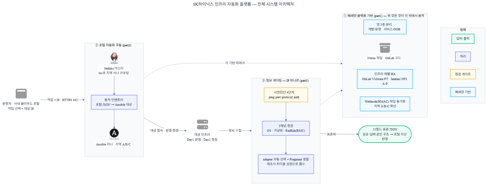
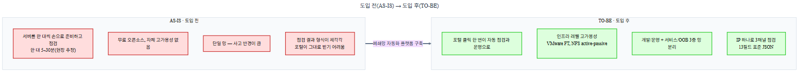

# SK하이닉스 인프라 자동화 플랫폼

> 인터넷이 없는 폐쇄망에 자동화 기반을 세우고, 사내 포털 클릭 한 번을 Ansible 실행으로 잇고, IP 하나로 멀티벤더 서버를 표준 형식으로 수집하는 **세 레이어 인프라 자동화 플랫폼**을 설계·구축했습니다.

---

## 1. 30초 요약

| 구분 | 내용 |
|------|------|
| **포지션** | 인프라 자동화·플랫폼 엔지니어링 — 폐쇄망 인프라 자동화 플랫폼 설계·구축·운영 |
| **문제** | 신규 반도체 클러스터로 인프라 급증. 장비 준비 시간, 운영 인력 비용, 반복 수작업의 휴먼 에러를 줄여야 했음. 환경은 인터넷 없는 폐쇄망 + 자체 고가용성 없는 무료 오픈소스 + 개발/운영·지역(A/B/C) 분리 |
| **핵심 설계** | ① 폐쇄망 플랫폼 기반(3중 망 분리, 무료 오픈소스 HA를 인프라 레벨로, Webhook 파일 동기화) ② 포털 → Jenkins → 동적 인벤토리 → Ansible 구동 ③ IP 하나로 3채널 점검, 13필드 표준 JSON |
| **대표 결과** | 포털 클릭 한 번으로 멀티벤더 서버 점검·운영 자동화. **2026년 7월 체결 목표로 14.9억 규모 본계약 추진 중** |
| **기여** | 세 레이어의 아키텍처 설계와 핵심 구현을 단독 주도 |
| **기술** | Redfish, vSphere API, GitLab, Jenkins, Ansible, Nexus, Redis, Python |

> 수치는 각 저장소 2026-06-01 실측값입니다. 망 분리·고가용성·본계약 규모는 운영 환경 기준 실제값이며, 14.9억 본계약은 체결 전 **추진 단계**입니다.

---

## 2. 전체 시스템 아키텍처

세 레이어가 이렇게 맞물립니다.

- **① 폐쇄망 플랫폼 기반** — 인터넷 없는 폐쇄망에 자동화 기반을 세웁니다. Nexus(파일·아티팩트), Jenkins(실행 엔진), GitLab(코드)을 깔고, 개발/운영과 서비스/OOB로 망을 나누고, 무료 오픈소스의 고가용성 부재를 인프라 레벨(VMware FT, NFS active-passive)로 메웁니다. 나머지 둘이 이 위에서 동작합니다.
- **② 포털 자동화 구동** — 포털에서 작업과 대상 서버를 고르면, 그게 Jenkins를 거쳐 Ansible 실행으로 이어집니다. 포털 JSON을 Ansible 인벤토리로 바꾸는 동적 인벤토리가 다리 역할을 합니다.
- **③ 정보 개더링** — IP 하나만 넘기면 서버 종류를 스스로 알아내 OS·가상화·서버 하드웨어 정보를 수집하고, 성공이든 실패든 같은 13필드 JSON으로 돌려줍니다. 그 결과가 포털의 자산이 됩니다.

> 용어: **BMC**는 서버가 꺼져 있어도 하드웨어를 원격으로 읽는 관리 칩, **Redfish**는 그 BMC를 표준 HTTP로 다루는 프로토콜, **OOB(Out-of-Band)망**은 그 하드웨어 관리 트래픽을 위한 별도 망입니다.

---

## 3. 추진 배경

신규 반도체 클러스터가 들어오면서 관리할 인프라가 빠르게 커졌습니다. 서버를 한 대씩 손으로 준비하고 점검하면 준비 시간이 길고, 운영 인력 비용이 늘고, 반복 작업에서 휴먼 에러가 납니다. 이걸 줄이려고 인프라를 코드로 다루는 자동화 플랫폼을 만들었습니다.

환경이 까다로웠습니다. 인터넷이 없는 폐쇄망이라 설치 자원을 전부 외부에서 들고 들어와야 했고, GitLab과 Jenkins는 자체 고가용성이 없는 무료 오픈소스였으며, 개발망과 운영망이 갈리고 데이터센터도 지역 A·B·C로 떨어져 있었습니다. 그래서 자동화를 떠받칠 기반을 짓고, 그 위에서 포털로 자동화를 돌리고, 그 과정에서 서버 정보를 표준 형식으로 수집하는 세 레이어로 나눠 풀었습니다.

---

## 4. 레이어 ① 폐쇄망 플랫폼 기반

> 무료 오픈소스(GitLab·Jenkins)의 고가용성 부재를 인프라 레벨로 우회하고, 3중 망 분리와 Webhook 파일 동기화로 폐쇄망 자동화 기반을 세웠습니다.

### 핵심 기술 결정

| 문제 | 결정 | 왜 |
|------|------|-----|
| 무료 GitLab·Jenkins는 자체 고가용성 없음. 폐쇄망이라 상용 제품 도입 불가 | GitLab은 VMware FT로 무중단, Jenkins 마스터는 `JENKINS_HOME`을 NFS 공유 스토리지(/data1)에 두고 active-passive 이중화 + fencing | 애플리케이션 코드를 안 건드려 버전 업그레이드가 단순. 라이선스 비용 없이 가용성 확보 |
| 개발 변경이 운영 장비를 건드리면 사고. OS 트래픽과 BMC 관리(OOB)를 섞으면 보안 경계 흐림 | 개발/운영 → 각 망 안에서 서비스(OS·앱)/OOB(BMC·파일) 2단 분리. 경계마다 방화벽, 지역 간 전용선만 연결 | 사고 반경을 망 경계 안에 가둠. `loc`+`target_type` 라벨 라우팅으로 잘못된 경로 차단 |
| active-passive에 상태 공유가 필요하지만, Redis fact 캐시처럼 두 마스터가 동시에 건드리면 깨지는 데이터가 있음 | 살려야 할 상태(credentials·job 이력·identity)는 /data1, 동시 접근 시 깨지는 캐시·로그는 VM 로컬 | failover 후 credentials·job 이력은 그대로 살고, 캐시 손상은 방지 |
| 주 데이터센터 Nexus의 대용량 파일(최대 50GB)을 지역 A/B/C에 일관되게 배포. 각 지역이 직접 받으면 전용선 트래픽 3배 | Nexus 업로드 → Webhook(HMAC 검증) → 지역 대표(seed) 한 대가 받고 같은 지역 안에서 rsync 확산. 주기 reconcile(30분·1일)로 누락 자동 보정 | 전용선을 한 번만 건너 대역폭 절약. 실시간 + 주기 재정합으로 일관성 확보 |

**규모**: shell 스크립트 47개, Jenkins 파이프라인 4개, Ansible playbook 7개, OOB 러너 12대(운영·개발 각 지역 2대씩), 검증 Round 8.1까지. 구성 버전: Jenkins LTS 2.528.3, GitLab CE 18.10.1, Nexus 3.91.0, PostgreSQL 16 (모두 무료).

---

## 5. 레이어 ② 포털 자동화 구동

> 사내 포털의 작업 요청을 Ansible 실행으로 잇는 동적 인벤토리와 작성 표준을 만들어, 호스트가 1대든 100대든 같은 경로로 처리되게 했습니다.

### 핵심 기술 결정

| 문제 | 결정 | 왜 |
|------|------|-----|
| 포털은 호스트를 JSON 배열로 보내지만 Ansible은 자기 인벤토리 형식만 읽음. 호스트 조합이 매번 달라 사전 생성 불가 | 동적 인벤토리 `my_inventory.sh`로 런타임 변환 (hostname→표시 이름, service_ip→ansible_host, 나머지→hostvars) | 포털과 Ansible을 느슨하게 분리. 호스트 수와 무관하게 같은 실행 경로 |
| 개발자마다 Jenkinsfile을 제각각 작성하면 포털 파라미터와 어긋나거나 자격증명을 코드에 박는 사고 | 파라미터 3개 고정(`loc`, `target_type`, `inventory_json`), 러너 선택은 `loc && target_type` 라벨, 자격증명은 ansible-vault + Jenkins Credentials 경로 강제 | 표준 자체에 포털 호환성을 내장 — 규칙만 따르면 자동 정합, 매번 검토 불필요 |
| 문서로만 규칙을 설명하면 처음 쓰는 사람이 실제 작성법을 잡기 어려움 | 동작 예제 6개(NTP·패치·디스크 점검·기본 구성·sshd 안전 재시작·nginx 헬스체크) + 연습 슬롯 10개 + 문법 데모 12개 + 가이드 4편 | 복사해서 고치며 배우게 함. block/rescue 롤백·tags 다단계를 동작 코드로 제시 |

**규모**: 저장소 커밋 58개 중 본인 57개(98.3%).

---

## 6. 레이어 ③ 정보 개더링

> IP 하나로 멀티벤더 서버(Dell·HPE·Lenovo·CSUS) 4종을 점검하고, 성공이든 실패든 같은 13필드 JSON으로 돌려줍니다. 점검 본체는 제조사를 모르고, 설정 파일이 차이를 흡수해 **새 장비를 추가해도 본체 코드 수정은 0**입니다.

### 핵심 기술 결정

| 문제 | 결정 | 왜 |
|------|------|-----|
| 제조사·세대마다 점검 방식과 응답 형식이 달라, 제조사 수만큼 스크립트를 두면 코드가 비례해 늘어남 | 점검 본체는 제조사를 모르게 두고, 설정 파일(adapter YAML) 26개가 차이를 흡수. `priority×1000 + specificity×10 + match` 점수로 런타임에 최적 설정 자동 선택 | 장비 종류가 늘어도 코드가 안 늘어남. 새 제조사는 설정 1개 + 이름 매핑 1줄로 확장 |
| 점검 결과 형식이 제각각이라 포털이 제조사 수만큼 해석 분기. 실패는 형식이 더 제각각 | 성공·실패 항상 같은 13필드(분석 6 + 라우팅 5 + 추적 2). 실패도 `status`·`diagnosis.failure_stage`·`errors`로 막힌 지점 명시 | 포털은 단일 해석으로 모든 제조사 처리. 실패도 같은 구조라 사람 개입 없이 자동 라우팅 |
| 한 섹션(CPU) 실패가 다른 섹션(메모리) 수집을 오염시켜 전체 결과 손실 | 각 점검(gather)은 자기 fragment만 만들고 공통 merge 엔진이 누적. 조립은 표준 builder 6종 | 점검 추가·수정이 다른 점검을 안 건드림. 한 섹션 실패가 나머지 정상 수집을 보장 |
| 제조사를 미리 가정하고 자격증명부터 던지면 가정이 틀렸을 때 인증 실패 | 본 점검 전 4단계 사전진단(ping→port→protocol→auth). 자격증명은 2단계 로딩 — 무인증으로 제조사 감지 후, 맞는 암호화 자격증명 로드 | 알려지지 않은 펌웨어도 식별. 어디서 끊겼는지 진단에 명시, 무의미한 timeout 누적 방지 |
| 폐쇄망 에이전트마다 환경이 달라, 외부 라이브러리가 빠진 곳에선 점검이 통째로 실패 | Redfish 엔진을 Python 표준 라이브러리(urllib·ssl·socket·json)만으로 구현 — 3,812줄, 외부 의존 0 | 환경 차이로 인한 수집 실패 없음. 새 에이전트 배포 시 패키지 설치 단계 제거 |

**규모**: 커밋 335개 중 본인 327개(97.6%), 설정 파일 26개(서버 하드웨어 15 + OS 7 + 가상화 4), 점검 채널 3개·섹션 10개, 회귀 기준선 8종, pytest 699개(테스트 함수 375개). 코드/설정 변경은 파이프라인 4단계 회귀 검사에서 기준값과 자동 비교해, 차이가 외부 변경이면 기준선을 갱신하고 코드 버그면 배포를 막습니다.

---

## 7. 본인 기여와 결과

세 레이어의 아키텍처를 설계하고 핵심 부분을 직접 구현했습니다.

- **① 플랫폼 기반**: 3중 망 분리·방화벽 설계, 무료 오픈소스 HA를 인프라 레벨로 우회, /data1 데이터 경계, Webhook 기반 OOB 파일 동기화 엔진
- **② 포털 자동화 구동**: 포털 JSON을 Ansible 대상으로 바꾸는 동적 인벤토리, Jenkinsfile·Playbook 작성 표준, 동작 예제·가이드 — 커밋 57/58(98.3%)
- **③ 정보 개더링**: IP 하나로 3채널 점검, 제조사 차이를 설정으로 흡수, 13필드 표준 JSON — 커밋 327/335(97.6%), Redfish 엔진 3,812줄

**결과**: 포털 클릭 한 번으로 멀티벤더 서버를 점검·운영하는 자동화 플랫폼을 세웠고, 이 플랫폼으로 **2026년 7월 체결을 목표로 14.9억 규모 본계약을 추진 중**입니다(체결 전 추진 단계).

---

## 8. 면접 예상 질문

**Q. 무료 오픈소스(GitLab·Jenkins)를 운영 환경에서 어떻게 고가용성으로 만들었나?**
라이선스 비용 없이 인프라 레벨로 풀었습니다. GitLab은 VMware FT로 가상화가 무중단을 책임지고, Jenkins 마스터는 `JENKINS_HOME`을 NFS 공유 스토리지에 두고 active-passive + fencing으로 구성했습니다. 애플리케이션은 단일 인스턴스처럼 동작하고 버전 업그레이드도 단순합니다. active-passive는 인계에 짧은 공백이 있다는 트레이드오프를 감수한 선택입니다.

**Q. 3중 망 분리를 하면서 개발·운영 두 Jenkins 마스터를 어떻게 라우팅하나?**
포털은 하나로 두되 개발/운영만 구분해 해당 마스터로 보냅니다. 마스터 이하는 `loc`(지역 A/B/C) + `target_type`(서비스 os·esxi 또는 OOB redfish) 라벨로 러너를 고릅니다. 방화벽은 경계마다(외부↔포털, 개발↔운영, 서비스↔OOB) 둬서 잘못된 경로를 원천 차단하고, 지역 간은 전용선만 씁니다.

**Q. 포털 JSON을 어떻게 Ansible이 쓰게 했나?**
동적 인벤토리 스크립트(`my_inventory.sh`)로 포털 JSON을 런타임에 Ansible 인벤토리로 바꿉니다. 포털이 필드를 추가해도 인벤토리 형식은 고정이라 자동화 코드 수정이 없고, 호스트가 1대든 100대든 같은 경로로 처리됩니다.

**Q. Dell·HPE·Lenovo·CSUS 4종을 점검 코드 비대화 없이 어떻게 처리했나?**
제조사 차이를 설정 파일(adapter YAML)로 흡수했습니다. 점검 본체는 제조사를 모르고, 감지한 제조사·모델·펌웨어에 맞는 설정을 `priority×1000 + specificity×10 + match` 점수로 고릅니다. 새 제조사나 세대가 들어와도 설정만 추가하고 본체 코드 수정은 0입니다.

**Q. 점검이 실패해도 포털이 다음 동작을 정할 수 있게 한 방법은?**
성공이든 실패든 같은 13필드 JSON으로 답합니다(분석 6 + 라우팅 5 + 추적 2). 실패면 `data`는 비우되 `status`·`failure_stage`·`errors`에 어디서 왜 막혔는지 남겨서, 포털이 사람 개입 없이 라우팅합니다.

**Q. Redfish 엔진을 외부 라이브러리 없이 만든 이유는?**
폐쇄망에 분산된 에이전트 환경이 제각각이라, `requests` 같은 외부 라이브러리가 빠진 곳에선 점검이 통째로 실패합니다. `urllib`·`ssl`·`socket`·`json` 표준 라이브러리만으로 HTTP·TLS·파싱을 직접 구현했습니다. 3,812줄, 외부 의존 0이라 환경 차이로 수집이 실패하지 않습니다.

**Q. 한 점검(CPU)이 실패해도 다른 점검(메모리)을 살리는 구조는?**
각 점검은 자기 fragment만 만들고 공통 merge 엔진이 누적합니다. CPU 점검은 cpu만, 메모리 점검은 memory만 채웁니다. 한 섹션 실패가 다른 섹션 데이터를 직접 건드리지 않아 오염이 없고, 누가 무엇을 채웠는지 추적됩니다.

**Q. 이 설계에서 가장 위험한 순간과 방어는?**
Jenkins 마스터 두 대가 동시에 떠서 상태를 깨뜨리는 경우입니다. fencing으로 동시 기동을 차단하고, NFS 마운트가 준비된 뒤에만 Jenkins를 올려 빈 상태로 뜨는 걸 막습니다. Webhook 파일 동기화는 재시도 3회·디스크 여유 사전 차단·삭제 전 격리(quarantine)·단계마다 sha256 검증으로 방어합니다.
